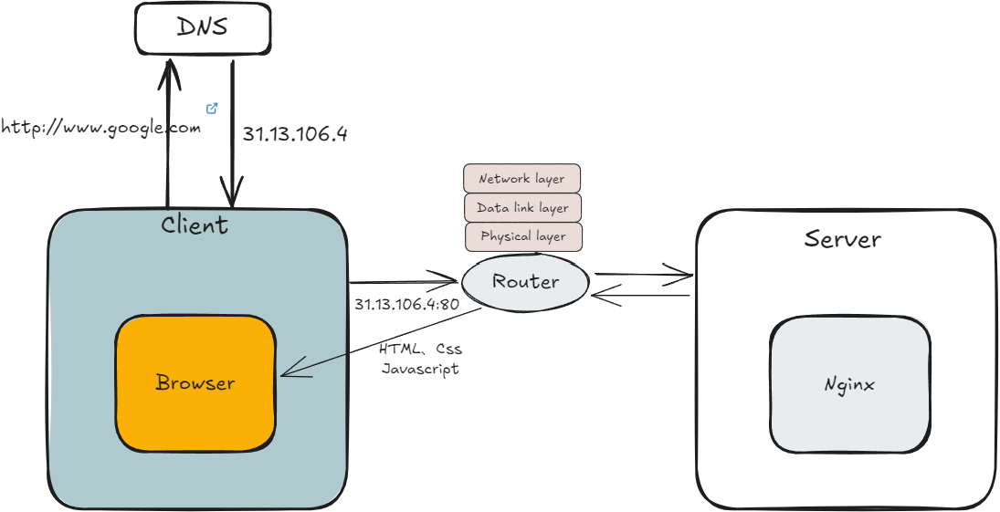

任何联通的计算机网络都可以是一个internet（互联网）

当今互联网泛指：以TCP/IP协议族为基础的全球最大的internet；

## BS架构交互

浏览器工作原理： https://github.com/yacan8/blog/blob/master/posts/%E6%B5%8F%E8%A7%88%E5%99%A8%E5%B7%A5%E4%BD%9C%E5%8E%9F%E7%90%86.md

## 客户端渲染（CSR）

1. 用户输入域名，浏览器查询缓存或到DNS进行域名解析，浏览器执行HTTP请求；
2. 服务器解析URI，返回需要的资源文件；浏览器获取到HTML；
3. 现代浏览器使用多进程的方式执行客户端渲染（渲染进程、插件进程、网络进程、GPU进程）
	- HTML完整的渲染过程大致为：
	- `构建Dom` -> `计算样式` -> `计算布局` -> `分层` -> `绘制` -> `分块` -> `光栅化` -> `合成`
4. 解析期间可能继续请求额外的文件，期间需要暂停DOM树的构建；
	- 遇到CSS，需要再次请求下载CSS资源，以构建样式规则；
	- 遇到JS脚本，需要请求下载JavaScript脚本并执行；
5. DOM树和样式规则构建完成后，由渲染进程继续执行以下操作：
	- 渲染；
	- 布局；
	- 绘制；
	- 分层；（栅格化）
6. 完成后，则由GPU进程显示页面给用户；
7. 用户可以看到网页并进行交互，用户操作后，整个过程重新开始（期间可能存在使用缓存：DNS缓存、静态资源缓存等等）

## 服务端渲染（SSR）

SSR：由服务端构建出完整的HTML后，返回给客户端，直接显示；

早期BS架构交互几乎是纯服务端渲染方式：JSP、php、asp等服务端模板技术；
纯服务端渲染的缺陷：
- 页面的小变动，都需要重新请求一次页面，开销大；
- 需要更多服务端负载；
- 工程上代码复杂度增加，维护困难；
- 前后端分离后，单页应用（SPA）发展起来，CSR为主流；

## 混合渲染

CSR + SSR

## Dom构建过程

Dom树构建：按照接收到的HTML的结构，顺序加载，借助Token栈，构建DOM树；
- Dom树构建期间，遇到需要再次请求的网络资源（CSS、JavaScript）需暂停解析，请求资源；
- Dom树构建期间，遇到需要执行的`JavaScript`需暂停解析，先执行脚本，因为脚本可能修改Dom结构；

