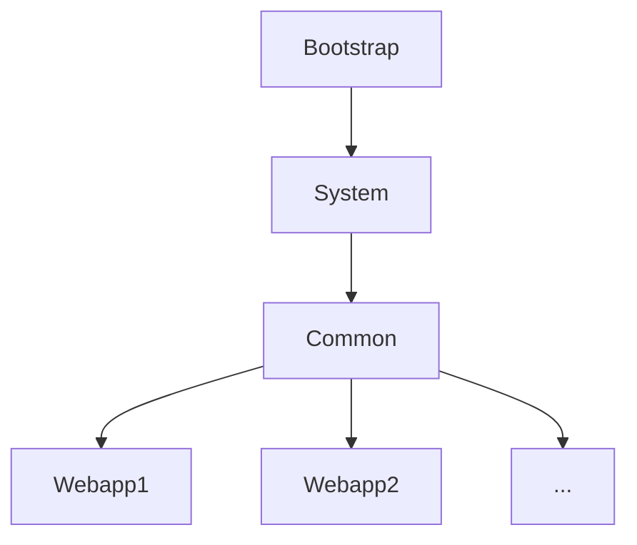

- [javac编译](#javac编译)
- [类何时被加载](#类何时被加载)
- [类何时被卸载](#类何时被卸载)
- [类加载过程](#类加载过程)
  - [1. Loading加载(对应findClass()方法)](#1-loading加载对应findclass方法)
  - [2. Linking连接](#2-linking连接)
  - [3. Initialization初始化()](#3-initialization初始化)
- [类加载器](#类加载器)
  - [类加载器行为](#类加载器行为)
  - [类加载器的分类：](#类加载器的分类)
  - [核心类加载方法](#核心类加载方法)
- [双亲委派机制](#双亲委派机制)
  - [为什么需要双亲委派](#为什么需要双亲委派)
  - [双亲委派的缺陷](#双亲委派的缺陷)
- [双亲委派机制下类的可见性](#双亲委派机制下类的可见性)
- [打破双亲委派](#打破双亲委派)
- [JDBC利用TCCL破坏双亲委派](#jdbc利用tccl破坏双亲委派)

# javac编译

javac 命令会将.java文件编译为字节码文件；

编译期间进行词法分析、语法分析等；

# 类何时被加载
Java应用程序将会**动态的加载类**，使用到时才会触发类加载：

1、new一个对象时；

2、访问类的静态变量、静态方法时；

3、使用反射时；

4、main方法所在类；在虚拟机启动时触发；

# 类何时被卸载

1、JVM自带的类不会卸载，跟随JVM的生命周期；

2、当类的对象不再可达，其在堆内存的Class对象也会结束，被GC回收，同时方法区的此类的数据也被回收；

# 类加载过程

**类加载分为三个部分：加载，连接，初始化；**

类的生命周期：字节码 ➡️ 类加载 ➡️ 链接 ➡️ 初始化 ➡️ 使用 ➡️ 卸载


## 1. Loading加载(对应findClass()方法)

- 通过一个类的全类名，读取.class文件，获取定义此类的二进制字节流；(可以是文件、网络流、动态生成的class)，这个动作由类加载器完成；
- 根据字节码文件，将其转化为静态数据结构存储在方法区中(元空间)；
- 在Heap内存中生成一个代表这个类的java.lang.Class对象，作为元空间这个类的各种数据的访问入口，方便用户调用；
- **此过程使用`loadClass`方法，执行双亲委派模型，直到找到能够加载的类加载器；**

## 2. Linking连接

连接由三步组成：验证、准备、解析

**验证**：保证字节码文件的正确性；一般有四种校验：
  
  - 验证`.class`文件格式是否正确；
  
  - 验证元数据是否正确；

  - 字节码校验；
  
  - 符号引用验证
    
    能否通过这个全限定类名的字符串找到这个类；
    
    类的字段的访问性是否合适，就是访问控制关键字；

**准备**：给类变量分配内存，并设置**零值**，并非用户自定义的值；()
- 对应defineClass()方法，将字节码文件实例化为class对象；
- `final`修饰的类变量在编译时就分配了，在这里会直接初始化；

**解析**：将符号引用替换成直接引用；

- 符号引用：当类之间存在依赖，但是又没有同时加载，就通过符号引用进行标记，而非实际内存地址，比如用字符串标记；
- 直接引用：使用内存地址指针引用；可以运行时调用；
- 但是如果是多态的情况，引用的对象是一个接口，并不明确其具体的实现，这种情况是在栈帧中调用时，动态绑定的；

## 3. Initialization初始化()

**Class层面的初始化：static变量、static代码块、属性的初始值等等；**

- 执行类构造器方法`clinit()`，执行所有类变量、静态代码块的赋值动作；根据代码，将用户定义的值，赋值给静态变量；

- 如果有父类，则先初始化父类；

- `clinit()`方法多线程下加锁执行；保证一个类只会被初始化一次；

触发初始化的5种情况：

1. 为一个类型创建一个新的对象实例时(比如new、反射、序列化)
2. 读取、设置一个类的静态字段，调用类的静态方法；
3. 使用反射对类进行调用的时候，如果没有进行过初始化，则触发初始化；
4. 初始化一个类，发现其父类还没有初始化，那么会初始化其父类；
5. 虚拟机启动，需要指定主类，那么这个主类，会被首先初始化；


# 类加载器

目的：通过类的全限定名获取该类的二进制字节流，加载进内存；

## 类加载器行为

- 每个classLoader都绑定自己要加载的资源的目录，且只会加载自己目录下的资源；
- 一个类由类加载器A加载，那么其依赖类也应该由相同的类加载器加载；
- 上下ClassLoader之间是组合关系，非继承关系；由其`parent`属性指定；
- 并不是完全的自下而上，如果其`parent == null`则其父类加载器直接指向bootstrapClassLoader；

## 类加载器的分类：

1、Java虚拟机自带类加载器
  
- **启动类加载器**(Bootstrap ClassLoader)：**JVM层面的实现**
  
  加载`rt.jar`，或者被`-Xbootclasspath`参数限定的类
  
  如：Object.class

- **扩展类加载器**(Extension ClassLoader)：**Java应用层实现，JDK9之后为了模块化被`PlatformClassLoader`取代**
  
  加载`\lib\ext`，或者被`java.ext.dirs`系统变量指定的类
  
  如：DNSNameService.class

- **应用程序类加载器**(Application ClassLoader)：**Java应用层实现**
  
  - 加载`ClassPath`中的类库,**一般自己写的代码都由此加载器加载**；
  - 以及用户程序依赖的类库；

- URLClassLoader：JDK提供的类加载器，父加载器为AppClassLoader；(JDK9之后被`BuiltinClassLoader`取代)
  
  提供本地文件、URL可以方便的从本地、网络上加载类；

- 线程上下文类加载器：JDK提供的类加载器，**加载双亲委派模型无法加载的类**
  
  Java提供了很多服务接口，供第三方实现(SPI、JDBC)，但是启动加载器无法找到SPI的实现类，它只加载Java核心类库，同时也无法委托其他类加载器，因为它是顶层类加载器；
  
  总结：父加载器访问不到子加载器的类；
  
  因此出现：ContextClassLoader，实现可以设置当前线程的类加载器，使得父类加载器在加载不到实现类时，通过设置类加载器，完成加载；
  
  如：JDBC

2、用户自定义类加载器：
- 继承java.lang.Classloader
- 默认父加载器AppClassloader
- 构造器：指定加载的文件目录，指定其父类加载器()

- 覆盖`findClass`方法，不可覆盖loadClass方法；

## 核心类加载方法

loadClass、findClass、defineClass

1、loadClass是一个委派的方法，通过`parent.loadClass()`委派给父类加载器；

2、当父类加载器无法加载，则由当前类加载器加载，一般**重写findClass，来获取字节码文件**；

3、findClass中获取字节码文件后，通常**使用`defineClass`来将字节数组转化为类对象；**

```java
protected Class<?> loadClass(String name, boolean resolve) throws ClassNotFoundException {
    synchronized (getClassLoadingLock(name)) {
        // 检查是否已经加载完成，已经加载了直接返回，native方法由C++实现
        Class<?> c = findLoadedClass(name);
        if (c == null) {
            try {

                if (parent != null) {
                    // 委托给父类加载器加载
                    c = parent.loadClass(name, false);
                } else {
                    // 没有父类说明是顶层的bootStrap类加载器，调用native方法进行加载
                    c = findBootstrapClassOrNull(name);
                }
            } catch (ClassNotFoundException e) {
                // 
            }
            if (c == null) {
                // 父类都加载不了，尝试自己加载
                long t1 = System.nanoTime();
                // 此时真正执行类加载
                c = findClass(name);

                // this is the defining class loader; record the stats
                PerfCounter.getParentDelegationTime().addTime(t1 - t0);
                PerfCounter.getFindClassTime().addElapsedTimeFrom(t1);
                PerfCounter.getFindClasses().increment();
            }
        }
        if (resolve) {
            resolveClass(c);
        }
        return c;
    }
}
```

# 双亲委派机制
针对一个类进行加载时，从最底层的类加载器开始：

- **自底向上委派**，直到顶层类加载器，检查是否能够加载；
- **自顶向下尝试加载**，直到加载成功，都不能加载则抛出异常；
- **如果一个类是由类加载器A加载，那么其依赖的类也需要由相同的类加载器加载**；所以当运行时需要加载一个类时，则由调用方的类加载器对其执行类加载；

## 为什么需要双亲委派

1. 避免类的重复加载；（前提是在同一个命名空间下）
   
2. 保证Java核心类库的安全性，不会被修改；

3. 符合设计原则，上层不应依赖下层；所以双亲委派规定依赖的类由同一个类加载器加载；

## 双亲委派的缺陷

对外暴露的接口，当需要由第三方进行实现时；接口是内置的加载器进行加载，但是第三方实现却无法加载；(**父类加载器无法访问子类加载器加载的类**)

# 双亲委派机制下类的可见性


类加载器和它的父类加载器，构成了一个命名空间，在同一命名空间下，同名类只会加载一次，只会存在一个；
- **每个Webapp单独使用一个类加载器，它们之间是共享了父类加载器加载的类；但是他们自己加载的类是隔离的**；
- 子类加载器可以访问父类加载器的类；
- 父类加载器不可以访问子类加载器的类；(这就是为什么SPI机制必须破坏双亲委派，否则无法访问)

见：[Tomcat-class-loader](https://tomcat.apache.org/tomcat-9.0-doc/class-loader-howto.html)
# 打破双亲委派

双亲委派规定：同一个类及其依赖的类，由同一个ClassLoader加载；此规定在代码中的实现是loadClass方法中向上寻找父类

打破：

1、重写loadClass；双亲委派的逻辑在LoadClass中，重写即可破坏；

2、SPI机制，不使用调用方的类加载器进行加载，而是使用线程上下文类加载器(TCCL)；从而破坏双亲委派；
- 如下方法即JDBC使用TCCL，进行驱动加载
- Driver是BootstrapClassLoader加载，而第三方驱动是应该由AppClassLoader加载；
```java
// 获取接口所有实现
ServiceLoader<Driver> loadedDrivers = ServiceLoader.load(Driver.class);
Iterator<Driver> driversIterator = loadedDrivers.iterator();

public static <S> ServiceLoader<S> load(Class<S> service) {
    // 获取线程上下文类加载器
    ClassLoader cl = Thread.currentThread().getContextClassLoader();
    return new ServiceLoader<>(Reflection.getCallerClass(), service, cl);
}
```

那如果实现JDK对外提供的接口，接口本身由BootStrap加载，第三方实现需要由其他ClassLoader加载，就破坏了双亲委派；

JDK提供了**SPI机制**来破坏双亲委派，使用**线程上下文类加载器ContextClassLoader**来加载第三方的实现；

JDBC就是利用SPI来破坏双亲委派模型；

# JDBC利用TCCL破坏双亲委派

`java.sql.driver`是由 BootstrapClassLoader 加载；

而其实现类：`com.mysql.cj.jdbc.Driver`，会置于用户程序的ClassPath中，由AppClassLoader加载；


类加载器只能自下而上进行委托，无法自上而下进行委托；

数据库Driver是`java.rt`核心类库的接口，由Bootstrap类加载器加载，其实现类由厂商提供，将会无法加载；