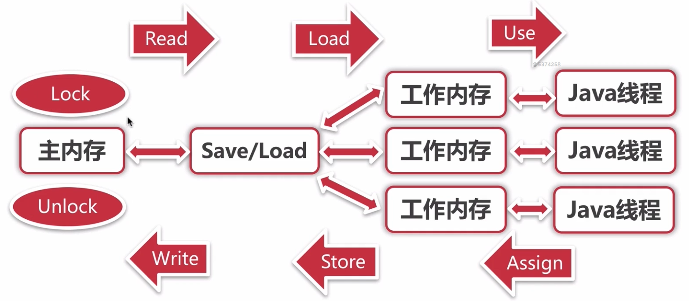

- [并发安全问题](#并发安全问题)
  - [并发存在安全问题的条件](#并发存在安全问题的条件)
  - [并发场景问题根源](#并发场景问题根源)
    - [1. 原子性](#1-原子性)
    - [2. 可见性](#2-可见性)
    - [3. 有序性](#3-有序性)
  - [排他锁不能保证有序性](#排他锁不能保证有序性)
- [JMM](#jmm)
- [happens-before原则](#happens-before原则)
- [as-if-serial](#as-if-serial)
- [volatile](#volatile)
  - [指令重排序](#指令重排序)
  - [volatile解决的问题](#volatile解决的问题)
  - [JSR内存屏障](#jsr内存屏障)
  - [必须加volatile的场景](#必须加volatile的场景)

# 并发安全问题

## 并发存在安全问题的条件
同时满足以下三个条件时，存在并发安全问题
1、多线程并发执行；

2、存在共享数据；

3、共享数据存在写操作；

## 并发场景问题根源
并发场景存在的并发安全性问题，根本上是线程对共享内存的操作，不满足以下3点特性：

### 1. 原子性
保证一系列操作是不可分割的整体；
即：保证了共享变量在被一个线程访问开始和结束的中间是一个操作，而非一系列操作，对其他线程来说此变量要么是操作前的，要么是操作后的值，没有中间状态；

- 排他锁保证原子性

### 2. 可见性
可见性是CPU的多级缓存引出的问题：

同时有两个线程在两个CPU中，读取了同一个变量，A线程修改了变量，对B线程是不可见的，B线程所使用的缓存不失效，就一直使用的脏数据；

### 3. 有序性
有序性是编译器优化引发的问题；

如果不存在多线程操作共享变量，代码指令重排序，不会影响操作结果；

但是并发修改共享变量情况下，代码的执行顺序会影响结果；

- volatile保证有序性；(禁止指令重排序)

## 排他锁不能保证有序性

排他锁仅仅保证了同时只有一个线程操作共享变量，如果共享变量仅仅在加锁代码块中操作，那就不存在安全问题；

**如果共享变量同时可以被不加锁的其他线程访问到，就会存在安全问题；**

这就是为什么双重校验锁下的单例模式，必须加上`volatile`才能保证安全；因为锁外访问了共享变量；

# JMM

JMM(Java Memory Model)模型的意义：统一抽象出一个能够支持并发安全的内存模型，能够兼容各种系统，并能够屏蔽底层操作系统的细节，使得编程更加友好；

对上层开发提供：数据的可见性、有序性、原子性的提供规则和保障：

# happens-before原则

**happens-before**：JMM定义了一些规范，保证在这些规则下**前一个操作，对后一个操作可见**：

1、程序顺序规则：在线程中，前面的操作happens before于后续的操作；

2、监视器规则：锁的解锁 happens before 于后续的加锁；

3、volatile规则：对一个volatile变量的写 happens before 于后续任意的对这个变量的读；

4、传递性：如果A happens-before B，且B happens-before C，那么A happens-before C；

5、start规则：保证线程start()启动，先于线程内的任意代码的执行；

6、join规则：线程A内执行：`B.join()`，那么A线程等待B线程执行完毕；

# as-if-serial

`as-if-serial` 语义：无论编译器和处理器如何进行重排序，单线程程序的执行结果不会改变；

# volatile

## 指令重排序
CPU为了性能优化，可能对指令进行重排序，在单线程的情况下可以保证是安全的；
- **CPU重排序**：CPU执行过程中动态的修改指令顺序，可能是缓存miss，需要等待，但是后续代码不依赖缓存，可能就乱序先执行了；
- **编译器优化**：编译器在编译期间静态的对代码进行分析，如果保证正确且可以优化，有可能对代码进行顺序调整；编译器优化的灵活度远高于CPU重排序，可以优化的范围很大；

但是在多线程的场景下，这类优化可能产生不可预知的问题；

## volatile解决的问题

1、通过在volatile变量前后插入**JSR内存屏障**(跟操作系统的内存屏障毫无关系)，使得编译器不会对volatile修饰的变量进行指令重排序；**只是禁止编译器优化，volatile无法触碰到CPU级别的重排序问题；**

2、x86架构下下，volatile转换为指令后，会增加`#lock前缀指令`，会使用总线锁，对volatile变量所在的缓存行加锁，保证的可见性；

## JSR内存屏障
JSR规范中定义了4种内存屏障
- LoadLoad：对于这样的语句Load1;LoadLoad;Load2，在Load2及后续的读操作要读取的数据被访问前，保证Load1要读取的数据被读取完毕；
- StoreStore：对于这样的语句Store1;StoreStore;Store2，在Store2及后续的写操作执行前，保证Store1的写入操作对其他处理器可见；
- LoadStore：对于这样的语句Load1;LoadStore;Store2，在Store2及后续的写入操作被刷出前，保证Load1要读取的数据被读取完毕；
- StoreLoad：对于这样的语句Store1;StoreLoad;Load2，在Load2及后续的读操作要读取的数据被访问前，保证Store1的写入操作对其他处理器可见；

JMM规定在编译时，会对volatile变量的读写操作前后，加上内存屏障：
- `volatile` **写之前插入一个StoreStore**，**写入以后插入一个StoreLoad**
- `volatile` **读之前插入一个LoadLoad**，**读取之后插入一个LoadStore**

## 必须加volatile的场景

共享变量在同步代码块内/外，都存在访问的可能，就必须加volatile；

即使在同步代码块外部仅仅是读，在多核CPU下，可能存在缓存不一致，同步代码块内的变量已经被修改，其他读取共享变量的线程的缓存可能没有被失效；因此必须加volatile；本质是：加锁只能保证原子性；
