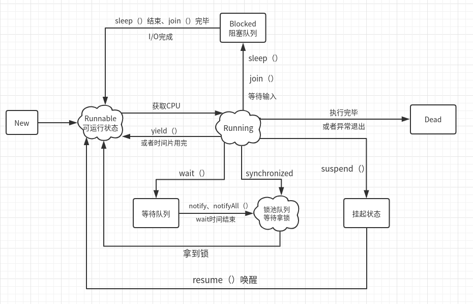

- [创建线程](#创建线程)
- [线程状态](#线程状态)
- [如何中断线程](#如何中断线程)
- [异步线程](#异步线程)
  - [异步线程的回滚](#异步线程的回滚)

## 创建线程
本质都是实现Runnable接口，实现run方法，来创建线程任务；

1、继承Thread
- 缺点：Java只有单继承，占用了继承的位置；

2、实现Runnable
- 无返回值的线程任务；
- 创建Thread，传入Runnable接口，也可以实现线程；

3、实现Callable
- 有返回值的线程任务：Future<T>

4、利用线程池
- 向线程池提交Runnable、Callable任务；

## 线程状态


1、new：新建；

2、Runnable：可执行；等待CPU调度；

3、Running：正在执行；

4、Blocked：等待获取一个排他锁；

5、Waiting：无限等待状态；线程可以主动进入Waiting；并等待被唤醒；

6、Time Waiting：等待固定时长状态，无需其他线程唤醒，超时后自动唤醒；

7、Terminated：任务执行完毕/抛出异常后的死亡状态；

## 如何中断线程

1、暴力中断：stop():x:禁止使用，直接杀死线程；

```java
@Test
public void stop_thread(){
    CustomThread thread = new CustomThread();
    thread.start();
    thread.stop();  // native 方法暴力中断，不可把控
}
```

2、使用Thread自带的中断标志位，到达自定义的安全点中断：

```java
@Test
public void interrupted_thread() throws InterruptedException {
    CustomThread thread = new CustomThread();
    thread.start();
    TimeUnit.MILLISECONDS.sleep(100);
    thread.interrupt();
    TimeUnit.SECONDS.sleep(1);
}

class CustomThread extends Thread {
    @Override
    public void run() {
        while (!Thread.interrupted()) {
            System.out.println("running");
        }
        System.out.println("thread is stopped"); // quit
    }
}
```
3、线程内部自行中断：`interrupt()`，设置线程中断标志位为true；仅仅是改变中断状态，不会中断正在运行的线程；

- 真正要中断，还是需要手动判断中断标志位，退出线程；
- 如果线程处于阻塞状态，则会抛出异常；

4、自定义标志位，与2相同

```java
@Test
public void interrupted_thread() throws InterruptedException {
    CustomThread thread = new CustomThread();
    thread.start();
    TimeUnit.MILLISECONDS.sleep(100);
    thread.cancel();
    TimeUnit.SECONDS.sleep(1);
}

class CustomThread extends Thread {
    private boolean cancel;
    @Override
    public void run() {
        while (!cancel) {
            System.out.println("running");
        }
        System.out.println("thread is stopped"); // quit
    }

    public void cancel() {
        this.cancel = true;
    }
}
```

## 异步线程

主业务中某些不影响主业务，且耗时的操作可以使用异步的方式执行；

异步执行的方式：
1、直接创建一个线程执行；

2、提交到线程池；

3、如果需要获取执行结果，使用
- Future：通过`get()`阻塞等待结果
- ==CompletableFuture==：通过回调的方式处理结果；

### 异步线程的回滚
1、手动回滚
```java
CompletableFuture.supplyAsync(()->{
    // 异步任务
}).exceptionally(throwable -> {
    // 这里异步回调，拿到异常，手动回滚；
}
```
2、

