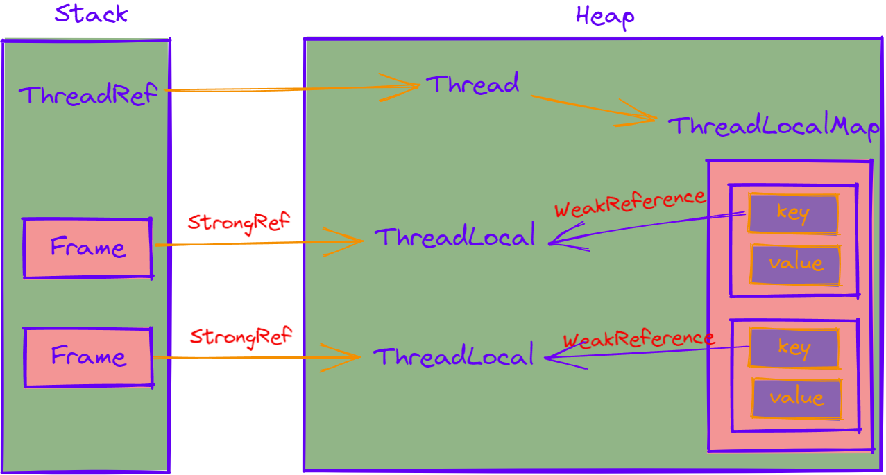

ThreadLocal：以**空间换时间**的方式为**每个线程提供一个独立的变量副本**；隔离多线程下对一个有状态的对象的数据访问冲突；

# 适用场景
1、为**解决线程安全性问题**。通过ThreadLocal隔离临时对象；
2、为了在不同方法中**传递上下文信息**；

# 常用方式
- `T initialValue()`: 给定一个初始值，并且延迟加载，直到get()才会触发初始化；
- `void set(T t)`: 为这个线程设置一新值
- `T get()`: 得到这个线程对应的value；
- `void remove()`: 删除这个线程得到的值；

# ThreadLocal运行流程

1、线程对象会持有一个ThreadLocalMap对象；(每个线程最多有一个)
- Thread销毁，ThreadLocalMap才会回收；

2、ThreadLocalMap：是一个Entry数组；
- 一个Entry对应存放一个ThreadLocal引用的值；
- Entry中的key持有ThreadLocal的**弱引用**；

3、线程执行过程中，可以执行ThreadLocal的set、get来操作其引用的Entry对象，来set、get值；

4、当线程结束，对ThreadLocal的引用也就释放；
此时ThreadLocal，仅持有一个Entry的弱引用key；
当发生GC，key就会被回收；

# 弱引用的作用

非线程池的线程，是不会存活太久的，使用线程本地变量，也应该随线程回收，所以使用弱引用，如果线程死亡，应当回收掉其本地内存；

# 内存泄露条件
#### 内存泄漏本质上跟弱引用没关系
如果key使用强引用，依然会内存泄漏；

只要线程存在，并且上一个线程任务已经结束，其保存的临时变量不会再使用了，并且没有清除，但是**线程没有销毁**，仍然有对其引用，**不再使用的临时变量**不会被清空，造成的内存泄漏；

#### 造成内存泄漏的2个条件：
1、线程没有调用`ThreadLocal.remove()`移除Entry；

2、线程仍然存在(线程池)
- ThreadLocalMap的生命周期和当前线程一样；

即：线程不销毁，且不使用ThreadLocal时，就存在内存泄漏，无法回收那个已经不使用的Entry；
但是当线程池的线程再次运行，并再次使用ThreadLocal时，执行set()，会触发清除动作，依然可以正常使用；
