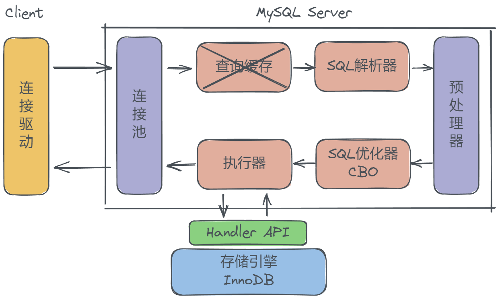
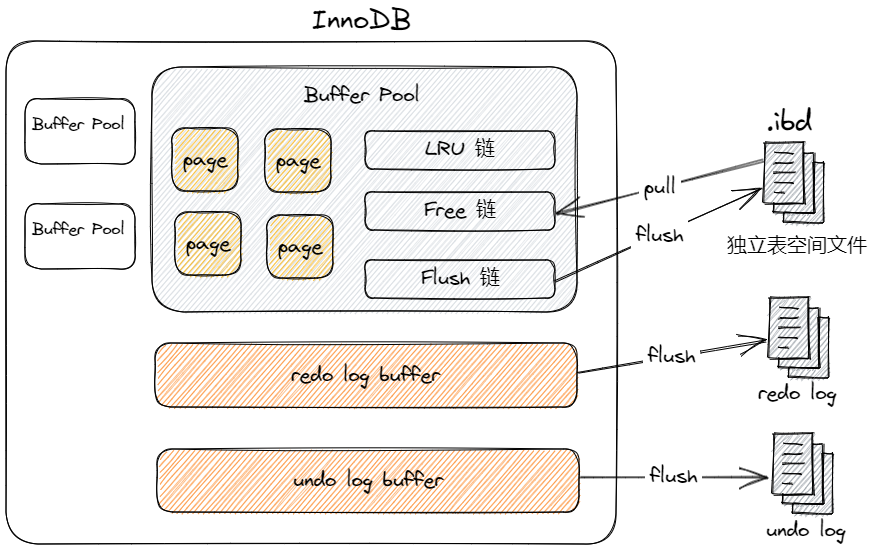

- [Server层](#server层)
- [MyISAM](#myisam)
- [InnoDB](#innodb)
  - [BufferPool](#bufferpool)
  - [自适应哈希索引](#自适应哈希索引)
  - [InnoDB日志](#innodb日志)

参考[MySql中SQL执行原理_bilibili](https://www.bilibili.com/video/BV1mg411s7Ej/?spm_id_from=333.337.search-card.all.click&vd_source=ce67cf212f4a949cf75348b5404c5e27)

# Server层

**客户端**：应用程序(JDBC连接驱动)，向MySQL服务端发送SQL字符串；

**连接器**：管理连接、验证权限等；

~~查询缓存~~：8.0之后取消；
- 每次查询都要查缓存；
- 一旦表更新，缓存失效；

**分析器**：对SQL字符串进行词法分析、语法分析，生成AST抽象语法树；
- 词法分析：标记SQL关键词、非关键词；
- 语法分析：对SQL进行正确性验证，解析为语法树

**预处理器**：缓存SQL模板，后续相同SQL，只需要提交参数即可；

**优化器**：MySQL中主要有两个优化器：
- RBO基于规则的优化器
- **CBO**基于代价的优化器(主流)：计算IO、CPU成本；

> 优化器有时会判定全表扫描比索引更快：
> 索引执行需要按页读取数据，全表扫描则是以块读取，并可以顺序读；
> 当通过索引查询的数据量比较大，可能IO的代价比全表扫描更大，优化器可能选择全表扫描；

**执行器**：操作存储引擎，执行SQL，获取结果，返回客户端；

**存储引擎**：
不同的存储引擎，决定了数据存储、读取、写入的策略；向上层提供Handler API，响应交互；
- ==InnoDB==(主流)：B+树、redo/undo log，支持事务；
- MyISAM：使用B树，只有哈希索引；不可范围查询；不支持事务；

# MyISAM

使用B+树作为索引数据结构，只不过叶子节点保存数据记录的地址，而非数据记录；

1、支持哈希索引、全文索引；

2、**不支持事务和行级锁定，只有表锁**

3、读操作性能非常高效；适合读多场景；索引支持范围查询，但可以扫表来范围查询；

# InnoDB

## BufferPool
- 大小由：`innodb_buffer_pool_size`决定；
- 个数由：可以有多个，提升并发性能；由`innodb_buffer_pool_instances`决定，各实例间隔离；
- 内存操作单元为：对应InnoDB页(16KB + 页描述信息)

**LRU链**
双向链表缓存热点数据，并使用LRU算法(近期最少使用)进行内存管理；当内存不足时，淘汰不常使用的页，将其刷入磁盘；
- 由于LRU机制，尽量不要查询不需要的列，挤占内存，导致LRU缓存命中率降低；

**Free链**
即空闲缓存页，InnoDB需要从磁盘加载新的页时，会从Free链中取空白页，装载数据；

**Flush链**
脏页链，存放被修改的脏页，放入链表尾部，由后台线程顺序刷入磁盘中；刷入完成后，将空页加入Free链；

## 自适应哈希索引
InnoDB会针对BufferPool的热点页，建立自适应的哈希索引(索引的索引)；对后续相同查询条件进行加速；

优点：
- 命中时，效率非常高；
- 自适应；

缺点：
- 因为是哈希索引，只能命中等值查询；
- 会占用BufferPool内存；

## InnoDB日志

**redo log**：InnoDB的数据最终存储在磁盘，如果直接写入磁盘，就会以**随机IO**的方式写入；因此Innodb的数据写入`BufferPool`中时，就算是写入成功了；但是宕机会丢失，因此使用`redolog`来以**顺序IO**的方式最快的进行持久化；保证宕机仍能够从`redolog`中恢复数据；

**undo log**：InnoDB中以链表的形式，存放数据的历史版本；用于回滚数据和MVCC事务隔离；

