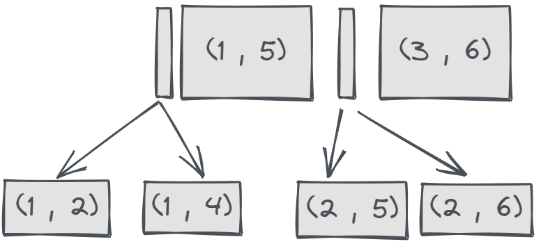
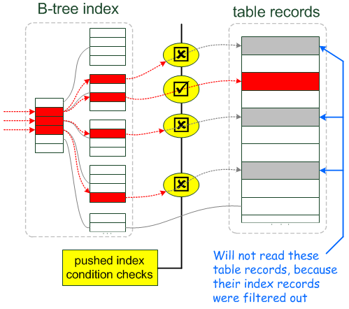

- [索引覆盖](#索引覆盖)
- [索引回表](#索引回表)
- [最左前缀匹配](#最左前缀匹配)
- [索引下推 ICP](#索引下推-icp)
  - [ICP执行过程](#icp执行过程)
      - [无ICP](#无icp)
      - [有ICP](#有icp)
  - [ICP条件](#icp条件)
- [索引膨胀/碎片/整理](#索引膨胀碎片整理)

# 索引覆盖
查询所需的所有数据列，是索引数据列的子集，即只需要一次索引即可返回所需数据，称为覆盖索引；
- 覆盖索引只需一次索引，不需要回表，减少磁盘IO，效率高；

# 索引回表
查询所需的所有数据列，不能全部从索引中获取时，MySQL将回到表中，根据已获得的主键，读取相应的行数据，并进行额外的磁盘I/O操作。即回表；
- 回表的性能影响取决于回表的数据量；
- 少数据量的回表无伤大雅；
- 大数据量的回表，不仅影响当前查询，还会导致缓存池脏页增多，对数据库整体性能产生影响；

# 最左前缀匹配
联合索引的索引结构如下：(index1, index2)

1、WHERE条件必须按照联合索引顺序依次过滤才能使用到联合索引；

因为只有前一个索引确定的情况下，后一个索引才是有顺序的；

2、假设索引为：(index1, index2, index3)，都为INT类型；

以下查询条件可以使用索引：
- `WHERE index1=2 AND index2=3 AND index3=4`，key_len = 12
- `WHERE index1=2 AND index2=3`，key_len = 8
- `WHERE index1=2`，key_len = 4

以下查询条件不会使用索引：
- `WHERE index2=2 AND index3=3`
- `WHERE index2=2`
- `WHERE index3=2`

但是通常经过优化器优化，会自动改变WHERE条件的顺序，也是会用到索引的；

但是，范围查询是不可行的：
- `WHERE index1=2 AND index2>10 AND index2<100 AND index3 = 4`

key_len = 8，只能使用到前两个列；index3不会使用索引，因为要满足index2的条件下，index3不是循序的；

# 索引下推 ICP
ICP： Index Condition Pushdown Optimization

参考：[MYSQL官网-ICP](https://dev.mysql.com/doc/refman/8.0/en/index-condition-pushdown-optimization.html)

官方描述：
> For InnoDB tables, ICP is used only for secondary indexes. The goal of ICP is to reduce the number of full-row reads and thereby reduce I/O operations. For InnoDB clustered indexes, the complete record is already read into the InnoDB buffer. Using ICP in this case does not reduce I/O.

**即：ICP仅用于二级索引，目的是减少回表数据量，进而减少IO；对于聚簇索引，不存在回表，不会使用ICP**；

使用ICP时，通过联合索引获取主键id时，会尽可能使用这个B+树上能够用到的列，来减少主键回表的数量；

Pushdown：下推的是索引，将索引过滤条件下推到存储引擎执行，如果存在非索引查询条件，仍需在server层过滤；

## ICP执行过程
例如：当前有一个普通二级索引，包含列`(index1, index2)`；

执行：`SELECT * FROM t WHERE index1 > 10 AND index1 < 20 AND index2 = 7 and index3 = 8`

#### 无ICP

只能根据index1获取主键id，回表查询，返回server层，在server层完成index2、3的过滤；

- extra：`using where`

#### 有ICP

1、当根据index1通过b+树获取查询所有满足条件的记录，再回表之前，通过index2的条件，过滤掉一部分主键id，减少回表的主键id个数；

2、回表后获取所有数据，返回server端，再次过滤index3；

- extra：`using where, using index condition`

如果查询条件为：`SELECT * FROM t WHERE index1 > 10 AND index1 < 20 AND index2 = 7`

如果没有index3这个条件，则只有`using index condition`，在server层不会再过滤了；

## ICP条件
1、只存在于联合索引；且没有使用覆盖索引；

2、子查询不能使用到ICP；

3、存储函数不能用ICP；存储引擎没法调用存储函数，Server层才能调用；

# 索引膨胀/碎片/整理