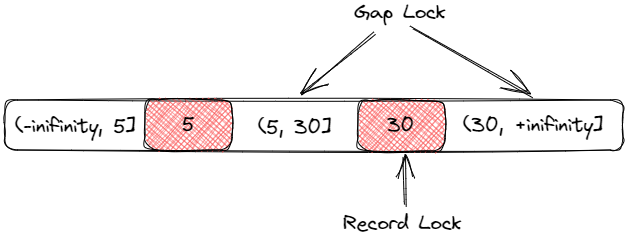
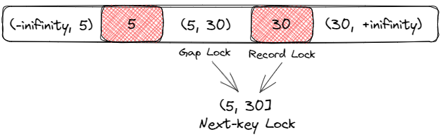

- [参考](#参考)
- [MySQl提供的锁机制](#mysql提供的锁机制)
  - [锁的类型](#锁的类型)
  - [触发加锁情况](#触发加锁情况)
  - [触发表锁的情况](#触发表锁的情况)
  - [避免锁表](#避免锁表)
- [全局锁](#全局锁)
- [表锁](#表锁)
  - [1. Intention Locks](#1-intention-locks)
  - [2. AUTO-INC Locks](#2-auto-inc-locks)
  - [3. 元数据MDL锁(公平锁)](#3-元数据mdl锁公平锁)
    - [MDL死锁](#mdl死锁)
- [行级锁](#行级锁)
  - [1. Record Locks](#1-record-locks)
  - [2. Gap Locks(仅RR)](#2-gap-locks仅rr)
  - [3. Next-key Locks临键锁(仅RR)](#3-next-key-locks临键锁仅rr)
    - [触发原则](#触发原则)
    - [例子](#例子)
      - [等值场景](#等值场景)
      - [范围场景](#范围场景)
- [锁实现](#锁实现)
  - [读写锁 \& 排他锁](#读写锁--排他锁)
  - [乐观锁 \& 悲观锁](#乐观锁--悲观锁)
- [死锁场景分析](#死锁场景分析)

# 参考
官方文档：[MySQL 8.0 Reference Manual :: 15.7.1 InnoDB Locking](https://dev.mysql.com/doc/refman/8.0/en/innodb-locking.html)

好文：[把MySQL中的各种锁及其原理都画出来](https://zhuanlan.zhihu.com/p/149228460)

[美团—Innodb中的事务隔离级别和锁的关系](https://tech.meituan.com/2014/08/20/innodb-lock.html)

举例：[Next-key例子](https://blog.csdn.net/qq_40008535/article/details/110941911)

>MySQL底层提供了多种锁机制，来保证并发安全下，尽可能提高性能，大多数的锁机制都是底层实现，用户只能通过优化索引、SQL语句来

让InnoDB尽可能高效地利用底层的锁机制；
- 锁机制分为：**表锁机制、行锁机制**；
- 用户可以使用的锁实现有：**共享锁、排他锁**；

# MySQl提供的锁机制

## 锁的类型
锁粒度分：
- 全局锁；
- 表锁；
  - MDL锁；
  - 意向锁；
  - 自增锁；
- 行锁
  - 记录锁；
  - 间隙锁；
  - Next-Key Lock；

**表锁、行锁又可分为共享锁，排他锁**；

## 触发加锁情况
1、FOR UPDATE
- 当查询条件走索引时，触发行锁；
- 当查询条件没有索引，触发表锁；

2、INSERT、UPDATE、DELETE：
- 走索引：获取行级写锁；
- 不走索引：锁表；

3、LOCK TABLES [table] read/write：锁表；
- 读锁锁表：其他事务可读，不可写；
- 写锁锁表：其他事物不可读，不可写；
- 解锁：`UNLOCK TABLES;`

## 触发表锁的情况
1、DDL中重建表、重新组织索引的时候，会锁表；

2、大事务：占用过多资源、执行大量的insert、update等语句，提交前，会锁柱大量数据；

3、未使用索引进行update、delete；

## 避免锁表
1、事务中，减少insert、update、delete等执行到commit之间的时间，只有发生当前读才会加锁；

2、尽量减少事务大小；

3、更新操作，尽量使用唯一索引；

# 全局锁
执行全局锁，**整个数据库就处于只读状态，阻塞读以外所有DML、阻塞DDL**；
```sql
# 加全局锁
flush tables with read lock
# 释放
unlock tables
```

用处：可以用来做快照备份，通过开启事务 + 全局锁，可以生成一个ReadView进行数据读取备份，不影响其他事务的DML；

# 表锁
锁表：即其他事务需要等待表锁释放，才能访问表；

## 1. Intention Locks
当表内已有行锁正在执行，现在要执行一个表锁，需要检查表内是否有行锁，需要全表遍历，很耗时；

意向锁：每次加锁都先在表上加上意向锁，当需要判断表内是否有锁，就**只需要判断表上是否有意向锁**；

意向锁加在表上的，是表级别的锁；
- 读意向锁（IS）
- 写意向锁（IX）

## 2. AUTO-INC Locks
自增锁：当插入数据时，表内有自增字段，会先加自增锁锁表，保证生成唯一的自增值，阻塞其他事务的插入；
- 自增值一旦分配，即使回滚，自增值也继续增加；

配置：`innodb_autoinc_lock_mode` 实现三种自增锁模式：
- **传统模式**：保证insert连续递增；插入必然加表锁；
- **连续模式**：如果insert操作，能够确定数量，则会提前分配id，插入时，不加表锁；但是，如果不能确定，如下，则仍然表锁；
```sql
INSERT INTO ... SELECT ...	-- 确定行(行锁)
INSERT..... ON DUPLICATE KEY UPDATE	-- 不确定行(表锁)
```
- **交叉模式**：可能生成有间隙的自增id，即非连续自增；但是降低了表锁的概率；当insert能确定数量时，可以生成连续的自增id；

设置自增模式配置项：

```cnf
innodb_autoinc_lock_mode = 0/1/2 (传统/交叉/连续)
```
## 3. 元数据MDL锁(公平锁)

元数据锁：MySQL5.5之后引入，为了防止DDL、DML并发执行时，产生不可预知的错误；

- MDL锁是一个公平锁，通过队列，如果当前有读锁，写锁会进行排队，并阻塞后续读锁；
- 对一张表进行 CRUD 操作时，加的是 **MDL读锁**，CRUD可以并发执行；
- 对一张表做结构变更操作的时候，加的是 **MDL写锁**，阻塞CRUD操作和其他DDL操作；

### MDL死锁

当线上SQL变更，执行DDL时，有可能发生死锁；

1、当前存在事务正在执行DML，持有MDL共享锁；

2、由于公平锁特性，DDL的排他锁，需要排队；

3、因为有独占锁排队，后续的读写事务，都需要排队；相当于串行化；如果事务又比较耗时，就会发生类似死锁现象；

因此DDL变更，尽量业务低峰；


# 行级锁
行锁：**锁的是索引**，即必须走索引，才能锁行，否则表锁；
- 同一条记录，使用索引A生成的行锁，不会阻塞使用索引B进行操作；
- 如果使用的索引A涉及到回表，那么A索引和主键索引都会被锁；
- 行锁不会影响其他数据行的操作；粒度小；
- `WHERE`条件索引失效，行锁变表锁；

## 1. Record Locks
当SQL通过索引，执行了当前读，就会对其加上记录锁；(锁行)

不走索引的当前读，就会全表扫描，先对全表加上记录锁，再逐步过滤，释放那些不满足WHERE条件的记录的锁；(先锁表，后锁行)

**因此：update操作请务必走索引；**

## 2. Gap Locks(仅RR)

当执行当前读对一个或多个记录加行锁时，会自动对记录的间隙进行加锁；防止插入操作；
- 降低了并发度；
- 提高了数据一致性；
- 仅存在于【RR隔离级别及以上】，目的是解决幻读；

```sql
UPDATE t SET name = 'Lucy' WHERE id = 30;
```
<div align="center">

</div>

## 3. Next-key Locks临键锁(仅RR)
`Next-key Locks(临键锁) = Record Lock + Gap Lock`，是一个**左开右闭区间**；
- RC级别：当通过WHERE过滤数据时，只锁满足条件的；(不存在间隙锁)
- RR级别：当通过WHERE过滤数据时，锁住期间扫过的所有行；(间隙锁)

<div align="center">

</div>
<br/>

### 触发原则
- 在RR隔离级别下，只考虑Next-key锁，不再考虑记录锁；**一切锁都为区间**；再根据条件考虑退化；
- 根据查询条件和使用的索引类别，Next-key可能降级为记录锁或间隙锁；
- 等值查询时：
  - 使用唯一索引，不会锁间隙，退化为记录锁；
  - 使用普通索引，会锁两边间隙；
- 范围查询时，终点值不等于最近的一条记录时：
  - **如果使用主键索引**：Next-key退化为间隙锁；因为不等于就不需要右闭了；【例子2】
  - **如果使用唯一索引**：不会退化，仍然锁住右侧的值，即使没有在查询条件内；【例子3】
  - 理论上主键也是唯一索引，可能是版本问题；
- 范围查询时，终点值正好是一条记录，Next-key退化为行锁；【例子2、3】

### 例子
有`t_stock`表，主键为`id`，唯一索引为`user_id`，普通索引：`order_id`；
```sql
CREATE TABLE `t_stock` (
  `id` bigint NOT NULL,
  `user_id` bigint DEFAULT NULL,
  `order_id` bigint DEFAULT NULL,
  `stock` bigint DEFAULT NULL,
  PRIMARY KEY (`id`),
  UNIQUE KEY `uk_user_id` (`user_id`),
  KEY `idx_order_id` (`order_id`)
) ENGINE=InnoDB DEFAULT CHARSET=utf8mb4;

mysql> select * from t_stock;
+----+---------+----------+-------+
| id | user_id | order_id | stock |
+----+---------+----------+-------+
|  1 |       1 |        1 |  1000 |
|  5 |       5 |        5 |  1000 |
| 30 |      30 |       30 |  1000 |
| 35 |      35 |       30 |  1000 |
| 40 |      40 |       40 |  1000 |
+----+---------+----------+-------+
```
#### 等值场景
1、**记录不存在，无论什么索引，退化为间隙锁**
`UPDATE t_stock SET stock = 20 WHERE id = 10`
- 可以锁的Next-key区间有：(5, 30]；退化间隙锁：(5, 30)

2、**记录存在的唯一索引**
`UPDATE t_stock SET stock = 20 WHERE user_id = 30`
- 不需要担心再次插入30的值，所以Next-key(5, 30]，退化为记录锁：30；

3、**记录存在的普通索引**
`UPDATE t_stock SET stock = 20 WHERE order_id = 30`
- `order_id`为普通索引，有可能再次插入30的值，所以Next-key不会退化；锁：(5, 30], (30, 35)；

#### 范围场景
1、**主键索引，范围终点非记录，退化间隙锁**
`SELECT * FROM t_stock WHERE id >= 5 AND id < 29 FOR UPDATE`
- 可以锁的区间有：(-∞, 5]、(5, 30]，因为终点值5是一条记录，退化行锁，29不到30，退化间隙锁；
- `id`为主键索引：**锁[5, 30)**

2、**普通索引，范围终点非记录，膨胀到最近的记录**
`SELECT * FROM t_stock WHERE order_id >= 5 AND order_id < 29 FOR UPDATE`
- `order_id`为普通索引，无论回表与否：**锁[5, 30]**
- 但是不影响使用唯一索引`user_id = 30`进行`UPDATE`；

3、唯一索引的特殊情况，不合理
`SELECT * FROM t_stock WHERE user_id >= 5 AND user_id < 29 FOR UPDATE`
- `user_id`为唯一索引：**锁[5, 30]**

4、**普通索引DELETE场景**
```sql
-- SESSION-1 先执行DELETE
DELETE FROM t_stock WHERE order_id = 30;

-- SESSION-2 执行插入：阻塞；
INSERT INTO t_stock VALUES (25, 25, 25, 1000);

-- SESSION-3 执行插入：阻塞；
INSERT INTO t_stock VALUES (31, 31, 31, 1000);

-- SESSION-4 执行更新：正常执行；
UPDATE t_stock SET stock = 20 WHERE order_id = 40;
```
- 锁：(5, 30], (30, 40)

5、**唯一索引DELETE场景**
```sql
-- SESSION-1 先执行DELETE
DELETE FROM t_stock WHERE user_id = 30;

-- SESSION-2 执行插入：阻塞；
INSERT INTO t_stock VALUES (25, 25, 25, 1000);

-- SESSION-3 执行插入：阻塞；
INSERT INTO t_stock VALUES (31, 31, 31, 1000);

-- SESSION-4 执行更新：正常执行；
UPDATE t_stock SET stock = 20 WHERE user_id = 40;
```
- 退化为记录锁：30，因为唯一索引，不会存在多条记录，不需要锁范围；


# 锁实现

根据锁粒度：表锁/行锁；

行锁：共享锁/排他锁；

## 读写锁 & 排他锁
共享锁：允许多个读操作获取共享锁，阻止任意一个写操作/获取排他锁；
```sql
select ... from ... lock in share mode;
select ... from ... for share;
```

排他锁：仅一个事务能够获取排他锁，阻止其他事物任意的读写操作；
```sql
insert ...
update ...
delete ...
select ... from ... for update;
```

## 乐观锁 & 悲观锁
乐观锁：通过版本号机制，实现更新操作；非阻塞；

- 常用于多线程更新，最先完成的成功，其余失败，再重试；
```sql
update table_name 
set ... and version = version + 1 
where version = old_version and ...;
```
悲观锁：同排他锁；


# 死锁场景分析

https://www.xiaolincoding.com/mysql/lock/show_lock.html#%E5%87%86%E5%A4%87%E5%B7%A5%E4%BD%9C
间隙锁 死锁：https://developer.aliyun.com/article/283419

存在才删除，尽量不去删除不存在的记录。
