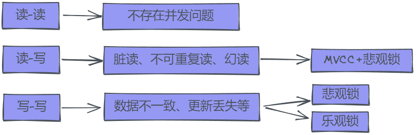
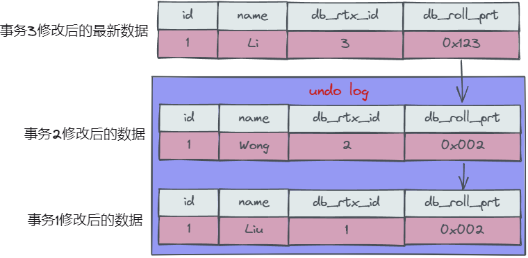
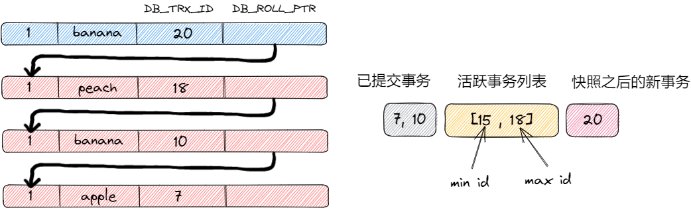

- [并发场景](#并发场景)
  - [MySQL中有两种读操作](#mysql中有两种读操作)
- [MVCC](#mvcc)
  - [数据版本](#数据版本)
  - [ReadView](#readview)
    - [何时生成](#何时生成)
    - [如何生成](#如何生成)
- [临键锁解决当前读下的幻读](#临键锁解决当前读下的幻读)
- [幻读本质](#幻读本质)

# 并发场景


## MySQL中有两种读操作

- **当前读**：一些操作在真正执行前需要读取最新的数据；以下操作都会执行当前读；当前读再并发环境下，需要以加锁的方式读取；
```sql
UPDATE ...
INSERt ...
SELECT ... FOR UPDATE;
SELECT ... IN SHARE MODE;
SELECT ... FOR SHARE;
```
- **一致性读(Consistent read)**：读取历史版本数据；当在事务中执行`SELECT`操作，会触发快照读，可能读取到的是非最新数据，但是不用加锁；
```sql
SELECT * FROM t_table WHERE ...;
```

# MVCC
MVCC：通过**数据版本**，解决**读-写场景**中，读取数据可能存在不一致的现象；写操作仍然使用悲观锁；

**通过快照，提高读的数据一致性和并发度；**

MySQL的MVCC每次读操作通过**ReadView**和**可见性算法分析**，来判断当前的读操作是否应该读到最新的数据；

## 数据版本
对事务中的每行数据增加**隐藏字段**，控制其数据历史版本；
- DB_TRX_ID：最后修改此数据的事务Id；
- DB_ROLL_PTR：指向前一个数据版本的指针；



## ReadView

### 何时生成

1、RR隔离级别：事务开启后，**首次SELECT生成READ VIEW，直到下次触发当前读之前不会再生成**；
- 解决不可重复读、部分幻读；
- 混合执行当前读、快照读，还是可能幻读；

2、RC隔离级别：事务开启后，**每次SELECT都会生成新的READ VIEW**，存在不可重复读、幻读；
- 每次读都会生成新的，可以读到其他事务期间修改完提交的数据，因此不可重复读，并且存在幻读；

### 如何生成



当事务触发一致性读，会以当前timepoint时刻生成ReadView；

1、将当前活跃事务加入到一个列表中；(事务id是按开始顺序递增的)

2、获取要查询的数据行，并获取每行记录的**最新事务id(trx_id)**；

3、判断：
- **当`trx_id`小于列表最小值**：事务已经在当前事务开始前提交了，可以读到最新数据；
- **当`trx_id`在列表的最大、最小值间，再看事务是否在列表中**：
  - 在列表中：说明事务还未提交，不能读到最新数据；
  - 不再列表：说明事务已经提交，可以读取最新数据；
- **当`trx_id`大于列表最大值**：此事务是在当前事务之后生成的，并且已经修改了，不可以读取最新数据；
- **当`trx_id`等于当前事务id**：说明是当前事务自己修改的，可以读到；

4、当不能读取最新数据版本时，根据`DB_ROLL_PTR`回滚指针，在`undo log`中寻找历史版本，**并继续按照3步骤判断**；直到能够读到所有数据；

# 临键锁解决当前读下的幻读
当一个事务A`for update`查询(当前读)，另一个事务B对事务A的查询范围内插入了数据，Next-Key Lock锁阻塞；

# 幻读本质

1、RR级别，只使用快照读，不会发生幻读，ReadView只有一个；

2、RR级别，只使用当前读，不会发送幻读，Next-Key Lock锁会阻塞其中一个事务；

3、RR级别，**混合执行当前读、快照读**，可能发生幻读，具体看执行顺序和数据交集；

如果业务操作是先select，后update，并且存在多线程操作，只能在读的时候加锁防止其他事务插入，强制同步处理；
```sql
SELECT ... FOR UPDATE
```