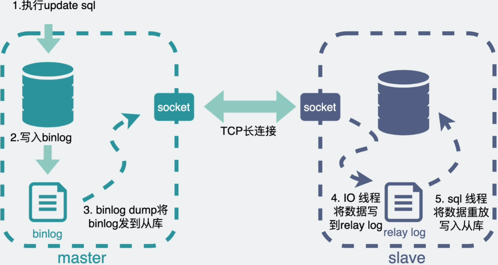
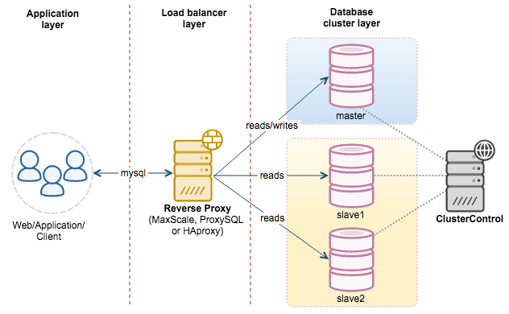

- [主从复制过程](#主从复制过程)
  - [执行过程](#执行过程)
  - [主从同步时延](#主从同步时延)
- [读写分离](#读写分离)
  - [执行方式](#执行方式)
  - [特点](#特点)

# 主从复制过程

 

## 执行过程

1、从服务器启动，先向主节点进行注册；

2、从服务器请求主节点，并携带binlog读取位置；

3、主服务器返回从服务器所请求的binlog，并告知当前binlog的元数据信息；

4、从节点接收到的数据追加到relay log中继日志中，根据收到的元数据，决定下次读取的文件和位置；

1、binlog更新线程：负责将主服务器上的数据更改写入二进制bin log日志中；

2、binlog同步线程：负责从主服务器上读取二进制日志，从服务器接受后，写入中继日志中；

3、SQL线程：在从服务器中负责将relay log中，根据记录的读取的位置，重放SQL，生成数据，完成数据同步；

## 主从同步时延

1、主库可以并发执行DML，但是从库接受主库的DDL、DML后，重放SQL时，只能单线程执行；效率不高；

MySQL 5.6之后，已经能支持并发重放SQL了，基于数据库级别的；多个库可以并发执行；(待考证)

但是同一个库依然是单线程；

2、从库接受binlog线程和binlog重放线程，是两个线程异步执行；不是接收到数据，就立即写入的；

解决：**一致性要求高的场景，直接读主库；**

# 读写分离

通常使用代理的方式，根据命令的类型不同，路由到不同的节点执行；

## 执行方式
- 主服务器：执行写命令；

- 从服务器：执行读命令；

- proxy：负责区分命令类型，路由到不同的节点(主/从)；

## 特点

1、读写分开，能够很好的避免数据竞争，避免加锁的开销；

2、增加了数据冗余；存了两份；

3、从服务器可以定制优化，比如使用MyISAM，提升查询效率；

