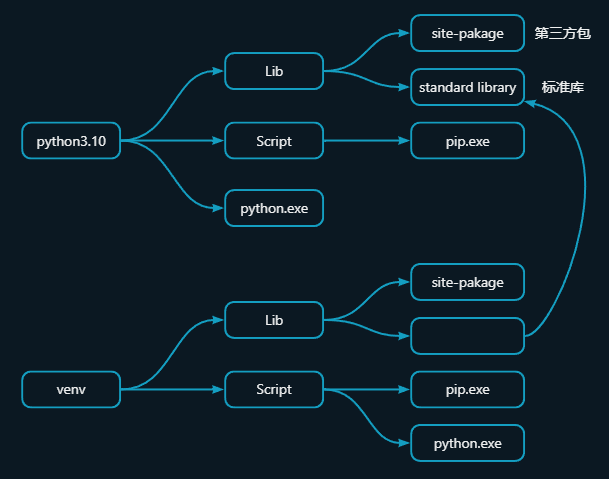

# 环境关系



# 虚拟环境
## 创建一个虚拟环境 

```shell
python -m venv {venv_path}
```

## 激活/退出虚拟环境

```shell
cd {venv_path}

.\Scripts\active

.\Scripts\deactive
```

## 删除虚拟环境

## 生成/安装requirements

```shell
pip freeze > requirements.txt

pip install -r requirements.txt

pip uninstall -r requirements.txt -y
```


## 删除虚拟环境

删除对应的虚拟环境文件夹


