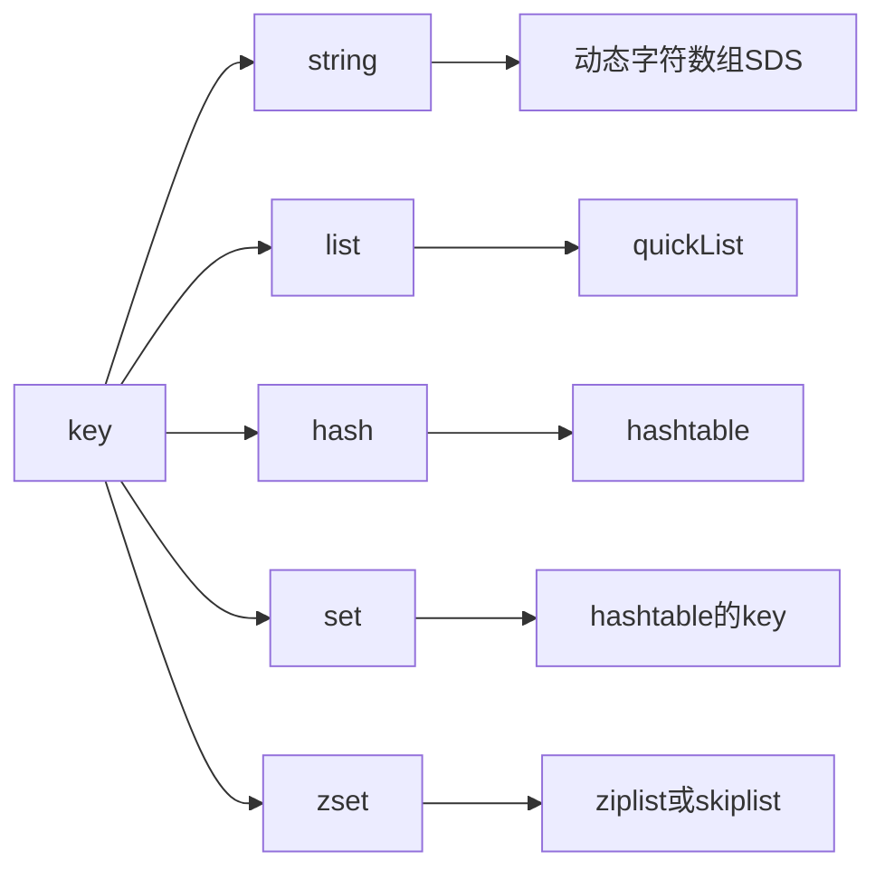

- [基本数据结构](#基本数据结构)
- [string](#string)
    - [底层](#底层)
    - [应用](#应用)
- [hash](#hash)
    - [渐进式ReHash](#渐进式rehash)
    - [应用](#应用-1)
- [list](#list)
    - [底层实现](#底层实现)
    - [应用](#应用-2)
- [set](#set)
    - [底层实现](#底层实现-1)
    - [应用](#应用-3)
- [zset](#zset)
    - [结构](#结构)
    - [应用](#应用-4)
- [stream](#stream)
- [bitmap](#bitmap)
    - [应用](#应用-5)
- [底层数据结构](#底层数据结构)
  - [SDS](#sds)
  - [压缩列表](#压缩列表)
  - [整数集合](#整数集合)
  - [RedisDB](#redisdb)
  - [键空间 hash table](#键空间-hash-table)
    - [key的寻址过程](#key的寻址过程)
  - [RedisObject](#redisobject)
- [Redis执行命令流程](#redis执行命令流程)

[底层数据结构详解](https://pdai.tech/md/db/nosql-redis/db-redis-x-redis-ds.html)

# 基本数据结构

# string

value为字符串类型，通常直接存储json串；

### 底层
底层为c语言可变长的**动态字符数组(char数组)**，容量最大512MB；

- 时间复杂度O(1)：直接根据len，通过索引获取字符串；
- 杜绝缓冲区溢出，动态扩容预分配内存；
- 二进制安全，按长度读取，而非c语言的字符串按照结束标识("\0")判断；(可能被存储的特殊字符误判)
  
```c
struct __attribute__ ((__packed__)) hisdshdr8 {
  uint8_t len; /* buf已使用长度 */
  uint8_t alloc; /* buf总大小 */
  unsigned char flags; /* 标识当前的sds类型：5、8、16、32、64 */
  char buf[];    /* 存储字符数组 */
};
```

### 应用

1、使用json字符串，缓存对象；

2、作分布式锁；

# hash

底层为哈希表；key为field，value为值；

当元素数量少，且不超过64字节，使用listpack数据结构实现；(Redis7.0之后)

- 相比于string类型不需要存储于json中的符号，存储相同的内容，占用空间更少；
- 可以单独操作每个字段，比较灵活；
- 哈希冲突使用链地址法解决；
- 扩容采用渐进式rehash；
- 适用场景：对象、实体缓存；

### 渐进式ReHash

哈希表中的负载因子达到一定值时，就需要对哈希表进行扩容操作，以保证哈希表的性能;

**传统扩容**：一次性拷贝数据到重新分配的内存，这样会在数据量比较大时，消耗大量CPU资源、造成响应延迟、阻塞等情况；

**渐进式Rehash**：逐步被动的迁移数据，在迁移完成后释放原有内存；

- 在扩容同时，不影响响应速度；
- 避免大规模迁移造成的CPU消耗、阻塞等情况；

步骤：
1、当触发扩容，开始启用ht[2]，新增的键值对都插入ht[2]中；

2、后续请求，不断地将旧表ht[1]中的数据迁移到ht[2]；

3、当所有键值对迁移完成，释放ht[1]空间，扩容完成；

### 应用

1、购物车；

# list

list是一个双向链表，支持正反向查找、索引查找、左右pop等；

### 底层实现
- 3.2版本前：zipList(压缩列表) + linkedList
- 3.2版本后：quickList(混合体)双向链表；

使用zipList这种数据结构是为了节省内存，当下面两个条件触发，则转为linkedList：
- 单个元素的值大于64字节；
- 节点个数超过512；

### 应用
- 支持阻塞pop，当列表为空，pop阻塞；可以充当阻塞队列使用(Redis5.0之后使用stream作为消息队列)；
- 支持索引查找、范围查询、支持重复的元素；
- 适用场景：消息队列、存储列表；

命令：
- `llen [key]`：返回元素个数；
- `lpush [key] [value] [value] ...`：创建/头部添加元素；
- `lpop [key]`：删除并返回第一个元素；
- `rpop [key]`：删除并返回最后一个元素；
- `lrange [key] [start] [end]`：返回start-end
- `del [key]`：删除所有元素；

# set

- 无序、唯一、自动去重；
- 适用于：标签、关键字等唯一性场景；

### 底层实现
https://blog.csdn.net/tongkongyu/article/details/124882266

intset：整数数组；
- 头部记录数组长度、编码、每个元素占用的内存；
- intset中每个元素占用相同内存；
- 查询使用二分搜索；

hashtable：哈希表；
- set的值存储为hashtable的key，通过hashtable的key来进行去重；
- value为null；

### 应用

1、点赞；用set存储点赞的用户id，可以去重；

2、关注列表、粉丝列表；

3、抽奖活动；存放中奖用户；

# zset

排序集合，自动去重，在set的基础上增加`score`权重进行排序；

### 结构
底层：ziplist或skiplist；由元素大小和数量决定；
- ziplist：本质是一个数组；
- skipList：跳表 + 哈希表：实现能够排序，并且能够以O(1)复杂度获取score；
  - 跳表对节点进行score排序；
  - 哈希表：key为值，value为score；

[](https://blog.csdn.net/Mind_programmonkey/article/details/116746931)

### 应用
1、排行榜：zset固定大小；

2、点赞排序；

3、延迟队列，score存储执行时间戳；客户端优先消费时间戳小的数据；

# stream

Redis5.0，专门为消息队列设计的数据结构；

1、提供自动生成全局唯一Id功能；

2、具有消费者组的能力；可以重复消费；

3、通过ACK机制；保存消费位置；

https://pdai.tech/md/db/nosql-redis/db-redis-data-type-stream.html

# bitmap

bit数组(位图)；只存储0、1；可以通过偏移量随机访问；使用**二值场景**；

### 应用
1、统计签到；


# 底层数据结构

## SDS


## 压缩列表

## 整数集合

压缩列表和整数集合都使用紧凑的连续内存来存储数据；目的是在元素较少、并且较小的情况下，尽可能节省内存；

但是在数量增加之后，查询的效率会变低；因此zset、list、hash在Redis3.2之前都是用此结构来存储较少的元素；


## RedisDB

RedisDB代表一个数据库对象；存储了当前库下所有数据；

- Redis默认有16个库(RedisDB对象)
- 执行Redis命令需要指定库id；

```c
typedef struct redisDb{ 

    // 键空间：存储了当前库的所有的键值对
    dict *dict; 
    // 过期字典：存储了设置了过期时间的key及其过期时间
    dict *expires; 
    //... 
} redisDb;
```

## 键空间 hash table

```c
typedef struct dict{
    // 指向对哈希表操作的函数
    dictType *type;

    // 私有数据
    void *privdata;

    // ht[1]指向真正的哈希表结构,ht[2]用于备用扩容，指向正在扩容的哈希表
    dictEntry **ht_table[2];

    // rehash标志位，标识是否在rehash：如果不在rehash，此值为-1；
    // 当rehash开始，用trehashidx来记录索引
    int trehashidx;
}
// 实际存储Redis的键值对
struct dictEntry {
    void *key;
    union {
        void *val;
        uint64_t u64;
        int64_t s64;
        double d;
    } v;
    // 同一个桶下的下一个key
    struct dictEntry *next; 
    void *metadata[]; 
};
```

- ht[1]：存储所有的键值对；
- ht[2]：触发rehash时使用；

### key的寻址过程

0、集群状态下，先使用hash slot算法找到key存放的节点；
- hash槽的总大小是固定的16384；
- 根据key的落点，可以找到key所在的集群节点；

1、客户端向此节点发起查询请求；

2、对key进行hash取模，找到对应的值；

## RedisObject

RedisObject是Redis所有数据类型的抽象基类，每一个Redis键值对都是一个RedisObject；

```c
typedef struct redisObject{ 
    //类型 STRING、LIST、SET、HASH、ZSET
    unsigned type:4; 
    //编码 RAW、INT、EMBSTR
    unsigned encoding:4; 
    //指向底层数据结构的指针 
    void *ptr; 
    //引用计数 RedisObject 被多个键所共享时，引用计数会增加
    int refcount; 
    //记录最后一次被程序访问的时间戳，用于实现 LRU 缓存淘汰策略 
    unsigned lru:22; 
}robj
```

- 相当于Java的Object基类；通过type标识，表示不同的数据类型；
- `refcount`可以进行内存管理，当存在引用，则`refcount++`，释放引用则`refcount--`；当其变为0，即可以被回收；并且可以借此防止内存泄漏；

# Redis执行命令流程

