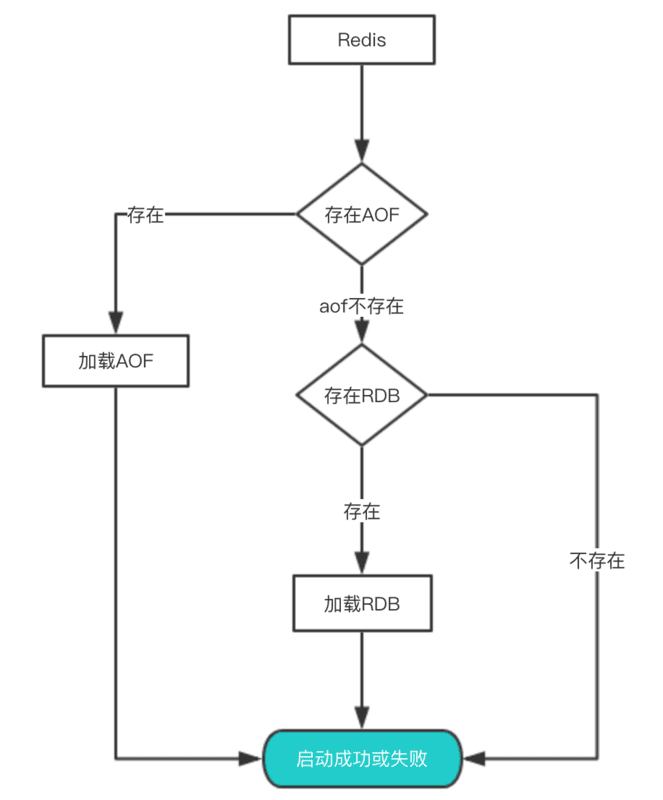

- [Redis持久化目标](#redis持久化目标)
- [三种持久化策略](#三种持久化策略)
  - [RDB快照](#rdb快照)
    - [执行策略](#执行策略)
    - [执行过程](#执行过程)
    - [特点](#特点)
  - [AOF日志](#aof日志)
    - [AOF执行方式](#aof执行方式)
    - [AOF重写机制](#aof重写机制)
    - [特点](#特点-1)
  - [混合持久化](#混合持久化)
    - [执行过程](#执行过程-1)
  - [数据恢复流程](#数据恢复流程)
- [集群持久化策略](#集群持久化策略)

详见：https://pdai.tech/md/db/nosql-redis/db-redis-x-rdb-aof.html

# Redis持久化目标

1、尽可能少地丢数据；

2、尽可能不阻塞主业务逻辑；

3、尽可能在重启时快速地恢复数据；

方案：

1、使用RDB + AOF混合持久化策略；
- **开启RDB快照，在快照间隔中使用AOF进行命令追加；下次生成新的RDB快照，清空AOF**；
- AOF使用`everysec`模式；综合性能考虑；

2、RDB和AOF都采用 `fork`子进程地方式进行**写时复制**持久化；


# 三种持久化策略

## RDB快照

将某个时间点的全量数据，以二进制写入一个临时dump.rdb快照文件；

### 执行策略
- 手动使用命令，创建dump.rdb文件（压缩的二进制文件）
- 自动定期执行；（save配置）
```shell
# (默认配置)
save 900 1 # 900s内，修改了1次，就会执行BGSAVE
save 300 10
save 60 100
# 输出文件
dbfilename dump.rdb
```

### 执行过程
两个命令实现：
- SAVE：阻塞Redis服务器进程，直到RDB文件创建完成；
- BGSAVE：fork一个子进程进行创建RDB文件，主进程可以继续响应客户端；

1、手动/配置触发RDB，主线程fork一个子进程进行RDB快照生成；

2、采用写时复制策略，主线程和子进程共享页表，不会复制物理内存；

3、当主线程执行写命令，要修改数据时，将对应的页的物理内存进行拷贝，再修改；

4、RDB文件生成完成后，再将脏页同步到原内存；

### 特点

1、只有一个dump.rdb文件。二进制序列，节奏紧凑，文件小；

2、性能好：父进程fork一个子进程来进行写操作，主进程可以继续响应客户端，子进程进行持久化；

3、恢复速度块；

4、可靠性差：RDB每隔一定时间进行一次持久化，不保证不会丢数据(持久化间隔间宕机)；

- 时间间隔小，就会引起大量的磁盘IO，影响性能；

- 间隔大，就会存在宕机，丢失数据的风险；

## AOF日志

AOF：将**写命令**以纯文本的方式追加写入日志文件；重启则重放日志的指令，完成数据恢复；

当日志文件达到一定大小，会触发重写；对日志文件进行精简；
  
Redis采用先执行命令，后写日志(同步)；
- 为了性能考虑，避免额外的检查；执行命令时就可以对命令正确性进行检查，不正确也就不需要记录日志了；
- 但是存在丢数据风险；命令执行后，没有写日志完成，宕机；
  
### AOF执行方式
1、`appendfsync everysec`：命令写入缓冲区，每隔1s刷回磁盘(**trade off**)；

2、`appendfsync always`：命令执行完成后，由主线程同步写回磁盘(**耗时影响性能**)；

3、`appendfsync no`：命令写入缓冲区，脏页由操作系统决定刷回磁盘(**性能最高**)；
```shell
# 是否开启
appendonly [no, yes]
# AOF文件名
appendfilename "appendonly.aof"
# 开启后的AOF策略
appendfsync [no, everysec, always]

# 重写触发配置
auto-aof-rewrite-percentage 100
auto-aof-rewrite-min-size 64mb
```
### AOF重写机制

1、当日志文件达到一定大小，触发重写；

2、主线程fork子进程；主子进程共享物理内存，是只读的；主线程继续执行命令；子进程开始将当前的Redis数据，重新写入一个新AOF文件；

3、当主进程执行写命令，需要同时干3个事：
- 【**继续完成数据更新**】：采用写时复制策略，在副本上进行数据更新操作；
- 【**继续执行旧AOF日志记录**】：继续执行原来AOF文件的日志记录
- 【**为新AOF记录写操作到缓冲区**】：同时开辟一个AOF重写缓冲区，为新的AOF文件记录期间发生的写操作；

4、当子进程重写完成，通知主进程重写完成；

5、主进程响应通知，将AOF缓冲区中新的命令，追加到新AOF文件，并重命名新AOF，覆盖掉旧AOF文件，完成AOF重写；

### 特点

1、数据安全，可以每次操作，都同步到aof文件；

2、体积大，文件比较大；数据量大的时候，启动速度比较慢

3、相比RDB，更不容易丢数据，秒级同步；

## 混合持久化

### 执行过程

1、进行全量持久化时，以RDB的形式，写入AOF文件；期间记录写操作到缓冲区；

2、将缓冲区的写命令，以日志的形式追加到AOF文件中；

3、后续每次执行写命令，追加到AOF文件；

此时：AOF文件由两部分组成：RDB二进制内容 + AOF日志；

**使得文件更紧凑，数据恢复速度够快，并且可以做到每s、每次操作都进行持久化，更高的可靠性**；

## 数据恢复流程



- 优先AOF，后RDB；因为AOF数据更完整；

# 集群持久化策略

- Master不要做持久化工作，专注于处理客户端任务；
  
  让某个Slave进行AOF备份数据，策略：每秒同步一次；

- 最好是Master，Slave通过内网链接，速度、稳定性、安全性有保障；
