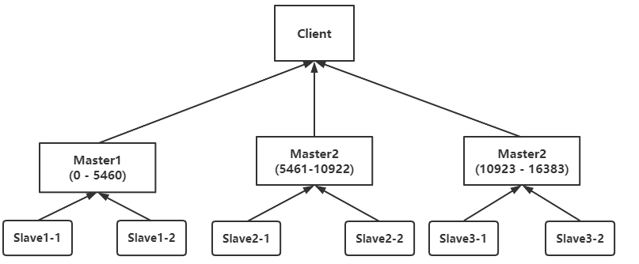
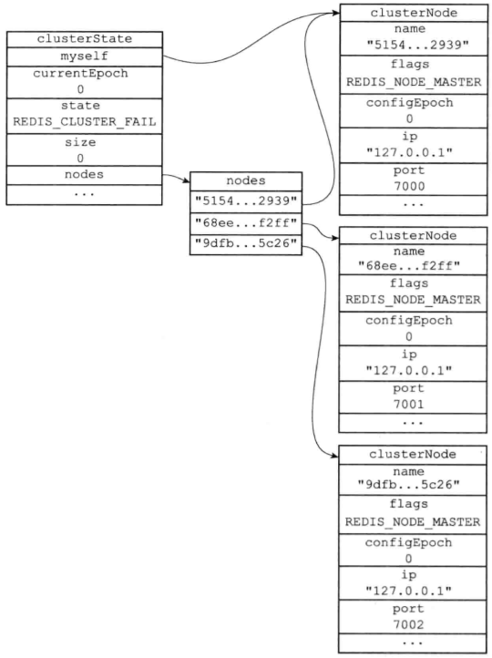
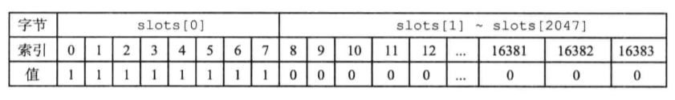
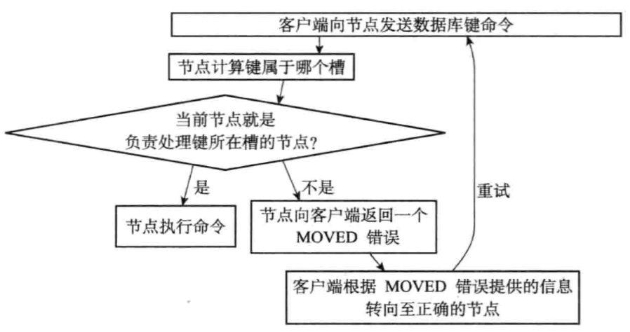

- [高可用演化进程](#高可用演化进程)
- [Redis分片集群](#redis分片集群)
  - [集群启动过程](#集群启动过程)
    - [1、启动节点](#1启动节点)
    - [2、节点握手](#2节点握手)
    - [3、槽指派](#3槽指派)
  - [集群下的查询操作(非SmartClient)](#集群下的查询操作非smartclient)
  - [SmartClient](#smartclient)
  - [集群下的事务操作](#集群下的事务操作)
  - [集群扩缩容](#集群扩缩容)

# 高可用演化进程

1. 数据怕丢失 ➡️ 持久化（RDB/AOF）
2. 恢复时间久 ➡️ 主从副本（副本随时可切，但需要手动切换）
3. 故障手动切换慢 ➡️ 哨兵模式（实现自动故障转移，提升从节点为主节点）
4. 读写存在压力/容量瓶颈 ➡️ 分片集群，横向扩展；

- 分片集群社区方案 ➡️  Twemproxy、Codis（Redis 节点之间无通信，需要部署哨兵，可横向扩容）
- 分片集群官方方案 ➡️  Redis Cluster （Redis 节点之间 Gossip 协议，无需部署哨兵，可横向扩容）
- 业务侧升级困难 ➡️ Proxy + Redis Cluster（不侵入业务侧）

# Redis分片集群

**分片目标：提高性能，负载均衡，提升上限；**

https://pdai.tech/md/db/nosql-redis/db-redis-x-cluster.html

- 横向扩展可达1000节点；
- 无代理模式，使用Gossip协议(p2p)去中心化；[gossip协议](../../DistributedSystem/09_一致性算法.md#gossip协议)



## 集群启动过程

### 1、启动节点

节点启动，会根据配置文件的：`cluster-enabled`来决定是否启动集群模式；

几乎启动方式都跟普通启动一样，只不过会新增2个结构：

- `clusterState`：集群状态信息；

- `clusterNode`：保存集群中所有节点的信息；（包括自己）

  - 包括：IP、端口、节点名、槽信息等；



### 2、节点握手

master之间，通过cluster meet命令在Cluster Bus总线上完成节点握手；

### 3、槽指派

Redis集群通过分片方式，保存数据；

槽：16384个（是一个bit数组），共16384/8 = 2048字节 = 2KB；



- 当前节点所使用的槽的范围，其值置为1；

当所有槽全部指派给所有集群完毕，整个集群才能上线；

## 集群下的查询操作(非SmartClient)



1、客户端向节点发送键命令；（get/set）

2、节点根据key值计算槽

接受命令的服务器，会计算出key所在的槽；

```c
def slot_number(key):

    return CRC16(key) & 16384
```

3、判断槽是否在当前节点：（查看槽数组的值是否为1）

- 在当前节点，直接进行键命令操作；

- 不在当前节点，查询出槽在哪个节点，向客户端返回**MOVED重定向**，引导正确的节点；

- 如果slot不存在，可能正在迁移；则返回**ASK重定向**，引导客户端到正在迁移的目标服务器；

4、客户端重新发送键命令到正确的节点；

## SmartClient

1、客户端会向集群中的一个可用节点，发送命令，获取槽和节点的映射关系

2、在本地维护映射关系，在执行命令时，本地计算所属节点；节省了一次网络开销；

3、当映射关系变动时，客户端执行命令会出错，再次同步刷新映射关系；

## 集群下的事务操作

集群无法执行跨节点的事务，同一事务涉及的key，必须存储在同一个节点上；

要做到这一点，Redis提供了`hash tags`，提供给开发者通过命名key的方式，在分片时，将相关的key分到同一个节点；

`hash tags`：当一个key中包含：`{bussiness-1}.order` 和 `{bussiness-1}.payment`时，相同的tag会分到同一个节点；


## 集群扩缩容

1、启动新的Redis节点；

2、向集群中添加主节点
add-node命令将新Redis节点加入集群；
```shell
./redis-cli --cluster --add-node [新增节点] [集群节点]
```

添加slave节点，并指派主节点：
```shell
# --cluster-master-id [主节点id], [从节点ip], [主节点ip]
./src/redis-cli --cluster add-node --cluster-slave --cluster-master-id db10a9d5c1662d9e3ce 127.0.0.1:7008 127.0.0.1:7007
```

3、给新节点分配hash槽，根据命令提示，指定分配的槽点数量；
```shell
./redis-cli --cluster reshard [新增节点]
```

4、缩容类似；


