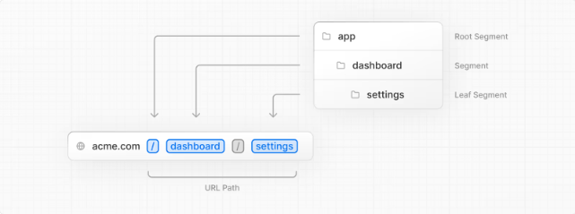
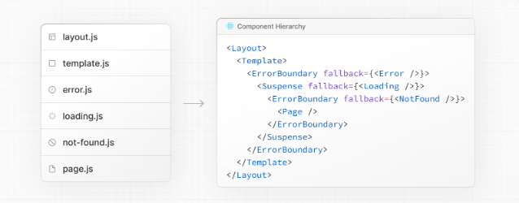

Next.js使用基于文件系统的路由器；
- 目录下创建`page.js` 来公开当前的路由；
- `page.js` 是一个Dom树的叶子；
- 默认是服务端组件（可显式声明为: `use client`）

每个文件夹（segment）下，使用基于约定的特殊文件来嵌套组件；
- UI的渲染路径：`layout.js` -> `template.js` -> `page.js`
- 其中`layout.js` 、 `template.js` 可选；

