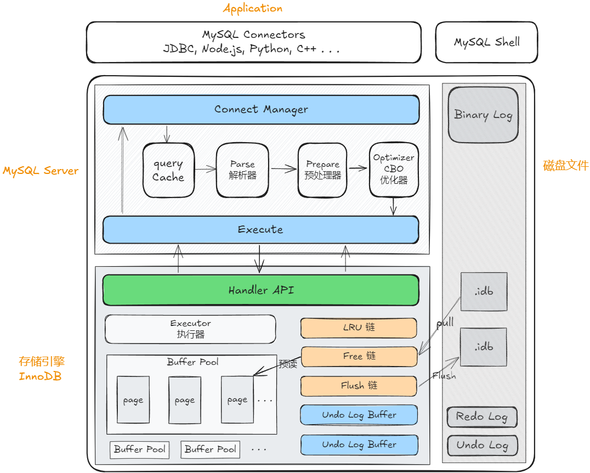

Client：应用程序通常使用JDBC驱动，与MYSQL-Server交互；向MySQL服务器发送要执行的命令及SQL；

连接器：通过TCP连接池管理客户端链接、并处理认证、鉴权等操作；

查询缓存：8.0之后被移除；由于表更新则缓存失效，Server层的缓存就很鸡肋；

分析器：对SQL字符串进行词法分析、语法分析、生成AST抽象语法树；
- 词法分析：标记SQL关键词、非关键词；
- 语法分析：对SQL进行正确性验证，解析为语法树；

预处理器：缓存SQL模板，后续相同的SQL，使用相同的模板，只需提交参数即可；

优化器：对将执行的SQL进行分析、优化，最终生成执行计划(EXPLAIN)，决定了最终的执行策略（索引选择、表的JOIN顺序等）；
MySQL中主要有两种优化器：
- RBO：基于规则的优化器；
- CBO：基于代价的优化器（主流），根据IO成本、CPU成本，优化SQL；
> 优化器有时会判定全表扫描比索引更快： 索引执行需要按页读取数据，全表扫描则是以块读取，并可以顺序读； 当通过索引查询的数据量比较大，可能IO的代价比全表扫描更大，优化器可能选择全表扫描；

执行器：操作存储引擎，调用存储引擎的API，执行SQL，获取执行结果，响应客户端等；

存储引擎：真正执行SQL、存储数据的组件；不同的存储引擎使用不同的存储、读写策略；存储引擎对外暴漏Handler API，进行交互；
- MyISAM：使用B树组织数据，只有哈希索引，不可范围查询、不支持事务；
- InnoDB：使用B+树组织数据，支持多种索引，支持事务；

Binary Log：记录数据的变更，有2种记录模式：
- `binlog_format = statement`：保留完整SQL语句； 
- `binlog_format = row`：记录数据修改前后的状态； 

Buffer Pool：

Page：

Redo Log：

Undo Log：用于事务回滚和MVCC数据版本；会定期清理不再需要的版本数据；（永远不需要读到的版本）

Flush链：更新的脏页，被放入Flush链，异步落库；

Free链：磁盘预读；

LRU链：缓存淘汰策略；