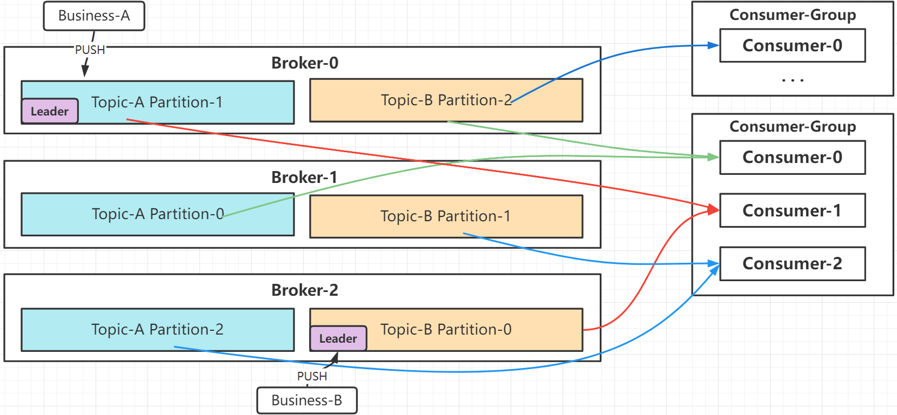

- [Broker](#broker)
- [Topic](#topic)
- [Partition](#partition)
  - [Partition数量和消费者](#partition数量和消费者)
  - [Leader和Follower](#leader和follower)

# Broker
Kafka的基本节点单位，对应一个Kafka进程，由集群内唯一Id进行标识；

# Topic
Topic对应一个业务单元，通常使用kafka的一个Topic对应一类业务消息；

一个Topic对应多个Partition，来增加消费并行度；

# Partition

- 并行度：同一个消费组下消费者可以并行消费Partition；
- 扩展性：offset保证了消息可以被多个业务重复消费；offset维护每个订阅者的消息索引；
- 负载均衡：消息被分配到不同的Partition，并行消费；
- 水平扩展：可以单独对Topic下的Parition进行扩展，提高性能；
- 高可用：Parition有副本机制、ISR机制，保证消息冗余；
- 顺序性：同一Partition的消息保证投递顺序消费；

## Partition数量和消费者

**一个消费者，可以消费多个Partition；一个Partition只能被同组一个消费者消费，可以被不同组多个消费者消费；**
- 这样的设计是避免数据竞争；
- 如果kafka允许同组多个消费者消费同一个Partition，为避免重复消费，必然要加锁；

因此最好是：**消费者数量 == partition分区数量**

## Leader和Follower
一个Partition可以有多个副本；(可以在同一个Broker上)

Broker节点数 = Leader + Follower，两个节点及以上才可以创建副本；

Leader：负责所有的读写任务、生产消费任务；

Follower：仅负责备份；

当Leader故障，通过选举进行故障转移；
