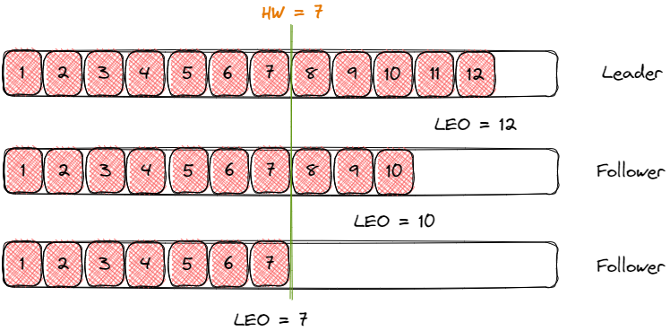

- [AR、ISR、OSR](#arisrosr)
  - [判定ISR](#判定isr)
- [Kafka分区](#kafka分区)
  - [分区扩容](#分区扩容)
- [Kafka副本](#kafka副本)
  - [副本间如何维护Offset](#副本间如何维护offset)
  - [副本数据同步](#副本数据同步)
  - [副本延迟/下线](#副本延迟下线)
  - [副本恢复](#副本恢复)

# AR、ISR、OSR
Kafka每个分区都有一组AR，代表所有副本的集合，包括主副本和备份副本，**AR = ISR + OSR**；

- **ISR**：与Leader保持同步的Follower集合；作为Leader的候选者；
- **OSR**：与Leader副本同步时，延迟过多的副本集合；可能是宕机后重新上线，还未完成offset同步的副本；

相关配置：
- `min.insync.replicas`：ISR最小副本数量，默认1
- `replica.lag.time.max.ms`：在这个时间内，没有追上Leader最新消息的副本，将被移除ISR；
- `replica.lag.max.messages`：已经在0.9x版本被移除，不再以落后的副本数作为ISR参考；

## 判定ISR

每次副本同步到Leader的最新消息，会对此副本刷新一个时间戳；

当时间戳延迟超过 `replica.lag.time.max.ms` 时间而没有再次更新，则认为是不达标的，判定剔除ISR；

# Kafka分区

## 分区扩容

1、使用alter命令，进行重新分区；

2、生成数据迁移计划，并执行数据迁移

3、验证扩容

# Kafka副本

## 副本间如何维护Offset

LEO：每个副本的最大offset；针对每一个副本而言；

HW(High Watermark)：HW以下是已经提交的消息；HW以后是未提交的消息；

- HW：**定义消息的可见性，并且帮助副本完成同步机制**；

- **消费者只能看到HW之前的数据**；防止高于HW的节点都宕机，消息已经消费了，但是丢失了出现的数据不一致；

## 副本数据同步

1、Leader在处理写请求时，对数据进行落盘操作；

2、Follower会向Leader批量拉取消息，Leader通过sendfile同步数据给Follower；

## 副本延迟/下线

1、如果某个Follower副本与Leader之间的网络延迟较大，或者Follower处理能力有限、或下线，导致无法及时跟上Leader的写入速度，那么该副本可能会被从ISR中移除；

重启后会放弃HW以后的数据，但是Leader仍然存有数据，会持续进行备份；

2、Leader宕机，一样重启后，重新从HW开始同步数据，原本高于HW的数据丢失，并且其他副本没有来得及同步的数据可能丢失；（开启`ACK = 1`可以有效减少数据丢失的可能）

## 副本恢复

1、OSR中的副本或上线后的宕机副本，会首先从磁盘恢复HW之前的数据，抛弃HW之后的数据，保证数据一致性，因为HW是消费者能看到的最大数据偏移

2、然后向Leader进行数据同步，追赶Leader；

3、当副本追赶上Leader的数据进度(**同步到整个Partition的HW**)，会被加入ISR候选，Controller会进行检测是否可以将副本重新加入ISR；

4、如果Leader仍然可用，那么就将ISR候选，加入ISR队列；并广播新的ISR向其他节点；