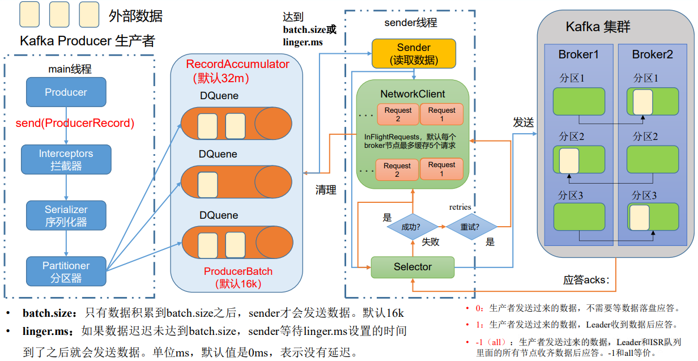
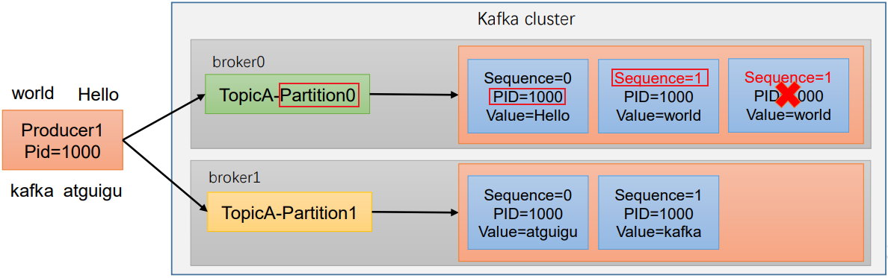

- [消息投递过程](#消息投递过程)
- [生产者消息发送过程](#生产者消息发送过程)
- [ACK应答机制](#ack应答机制)
- [发送端保证数据不丢失](#发送端保证数据不丢失)
- [极端场景丢失数据](#极端场景丢失数据)
- [发送端幂等/生产者事务](#发送端幂等生产者事务)
- [发送端保证数据有序](#发送端保证数据有序)
- [消息路由](#消息路由)

# 消息投递过程

# 生产者消息发送过程

kafka客户端一般通过缓冲区批量发送、压缩消息，来提高吞吐量；

0、对消息进行封装、序列化等操作；

2、对消息进行路由；
- 随机、Hash、顺序路由；
- 指定分区路由；
- 自定义路由策略；spring-kafka中实现`Partitioner`接口；

3、**将消息存入缓冲区等待批量发送**

缓冲区：缓存发送请求；
- RecordAccumulator：缓冲区大小，默认64Mb

批量发送：根据批次大小，发送间隔进行批量发送，二者触发一个即可；
- 批次大小：`batch.size`到达一定容量大小，触发发送；默认16kb
- 发送间隔：`liner.ms`到达间隔，触发发送；默认10ms

2、**数据压缩**

压缩后，一个批次的消息数增大，来提升吞吐量；
- `compression.type`默认使用snappy，支持GZIP、Snappy、LZ4、zstd
- 压缩通过耗时，提高吞吐量，降低带宽；(时间换空间)

注意点：
- broker端默认不会解压消息，会交给消费端解压；
- 如果broker采用了与发送端不同的压缩方式，则会触发解压；
- 如果broker中发生了消息转换，则会触发解压，同时零拷贝失效；
- 以上两种情况发生，则可能导致kafka服务CPU升高；因此，尽量保证全链路数据处理方式一致；
  
# ACK应答机制
指生产者发送消息到broker的确认机制；

1、**ack = 0**；只管发，不管broker是否接收到消息，不等待数据落盘；基本不使用；

2、**ack = 1**；消息发送到Leader就返回响应，不管ISR队列是否同步完成；

3、**ack =-1**；消息发送到Leader，并且同步到ISR队列每个副本后，返回成功;

可能导致生产端发送延迟的问题：

如果Follower宕机，无法同步，导致生产端发送时延提高；

ISR队列内由心跳机制，Follower心跳超时会被踢出ISR队列；

可以降低ISR同步队列的心跳阈值：`replica.lag.time.max.ms`默认30s；

# 发送端保证数据不丢失
1、开启`ack = -1`；保证能落盘，并同步到ISR队列所有follower；最高可靠性保证；

2、分区的副本数 >= 2

3、ISR副本数`min.insync.replicas` >= 2

4、适当设置retries，发送失败时重试(需要Kafka事务，防止重复)；

# 极端场景丢失数据
假设开启 `ack = -1`，且 `replication.factor = 3`、`min.insync.replicas = 2`，这种配置已经能够保证99%的场景不丢数据了；
当Kafka的Partiton的主副本都同步完成，消息写入PageCache后，就会返回ack，表示接收消息成功；
但是此时数据并没有落盘，flush()落盘的操作是操作系统来完成的，一般是30s定时刷一次脏页；
此时所有节点宕机，就会丢数据；

# 发送端幂等/生产者事务
**发送端的事务是由幂等实现的；**

开启生产者事务：`enable.idempotence=true`，会自动开启消息的重试；

1、每一个生产者会分配一个PID(Producer Id)，当发送消息时，消息会携带一个序列号`SeqNumber`，并且自增；

2、服务端每个Partition会为每个Producer，维护最大序列号，以：`PID + PartionId + SeqNumber` 为依据，防止消息的重复；

3、并且

# 发送端保证数据有序

Kafka的分区中的消息顺序是按照投递顺序排列的，因此还是需要发送端根据业务顺序投递，才能保证消费端==单个分区消费是顺序的==；

要保证发送端顺序，可以：
- 只使用一个分区；
- 对需要顺序消费的消息，指定分区分送；

# 消息路由