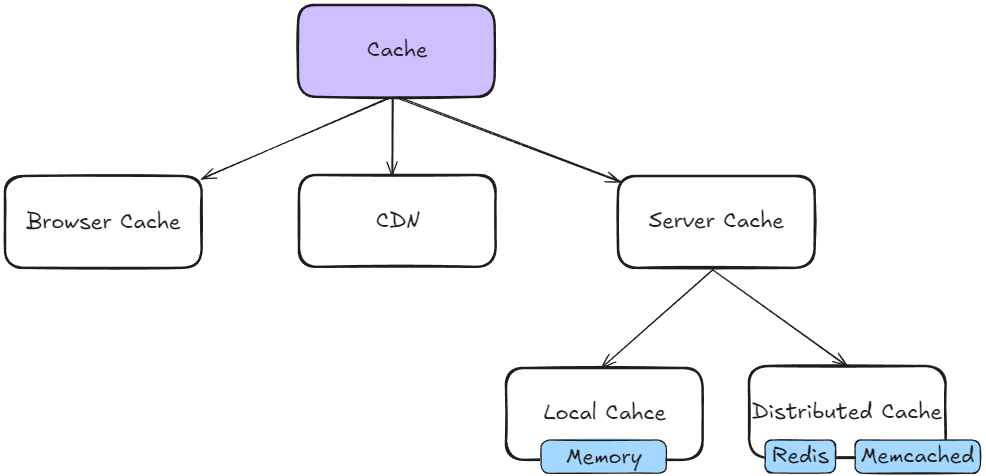

# Why Cache

目的：尽可能缩短网络请求的链路；降低响应时延；减轻服务压力；

副作用：需要额外处理缓存一致性问题；

使用原则：多读少写场景；多写场景不适合缓存；

# Why Cache

Benefit:
- Reduced Latency
- Lowered Server Load
- Improved UX (User Experience)

Disadvantage:
- Data Inconsistent. 
- High server and storage costs. The cache components require more memory, disk, compute resources.

# When to use Cache

1. An application or a functionality needs to frequently read the same data, besides the data is rarely updated.
2. Application scenarios that require low latency and fast response.

# How to use Cache
##  1. Browser Cache

#DOTO

## 2. CDN
Benefits:
- Reduced Latency
- High Availability
- Improved Security
- DDoS Protection

Use CDN when:
- Delivering static assets like images, CSS files, JavaScript files, video content.
- Need high availability and performance for user across different geographical locations.
- Reducing the load on the original server is a priority.
Use Original Server when:
- Serving dynamic content that changes frequently.
- Personalized for individual users.
- Handling tasks that require real-time processing or access to up-to-date data.
- Requires complex server-side logic that cannot be replicated or cached by a CDN.

>何时使用CND服务：
- 传输图片、CSS、JavaScript文件、视频内容等静态文件
- 需要为不同地理位置的用户提供高可用高性能服务
- 优先考虑减轻原始服务器的负载

>使用原始服务器：
- 提供动态内容
- 针对不同用户进行个性化设置
- 处理实时任务或获取最新数据
- 需要复杂的服务端计算逻辑

## 3. Server Cache

#TODO 

