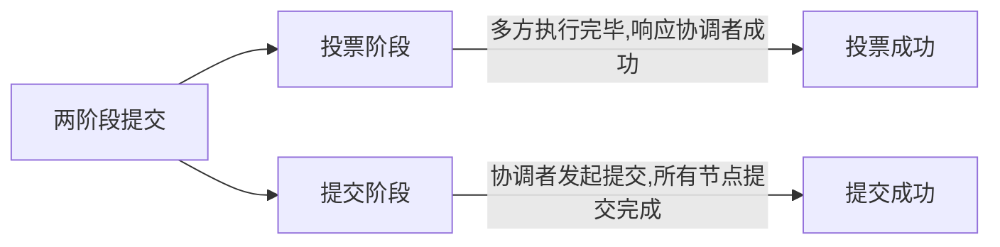
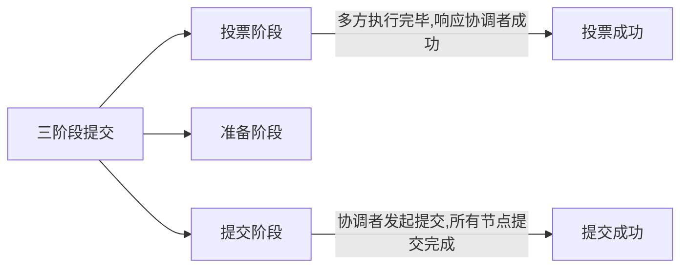

https://pdai.tech/md/arch/arch-z-transection.html

# 两阶段提交
> 2PC：Two Phase Commitment Protocol

解决分布式事务中，多方无法达成一致性，要么全部成功，要么全部失败的问题；

多方讨论是无法达成一致的，需要**第三方协调者**来判断事务应该成功，还是失败；

## 执行流程
所以分为两阶段：先统一执行完，再统一进行提交，期间任意失败，全部回滚；

## 存在问题

协调者发起提交，参与者中有宕机、网络波动，就会导致数据不一致；两阶段协议基本无法使用；

# 三阶段提交

# TCC分布式事务实现

# 消息队列实现分布式事务

需要另一个分布式中间件保存事务状态：Redis、Mysql等；

本质上只能实现：最终一致性；期间的失败需要尝试，否则全部回滚；

1、本地事务A设置事务状态：本地事务A开启状态；

2、本地事务A执行：
- 执行成功则发送消息到MQ；并修改事务状态为：事务A已执行，未提交状态；
- 执行失败，可以重试，或者事务直接失败；

2、服务B消费到数据后，开启本地事务B：并设置为：本地事务B开启状态；

3、检查事务A状态：
- 如果已执行成功，则继续执行事务B；
- 如果执行失败，则不执行事务B，并修改状态为：失败；

4、执行事务B：
- 执行成功则修改事务状态：事务B已执行，未提交状态；
- 执行失败则修改事务状态：事务B失败；并通知事务A进行回滚；此时事务A是未提交的；

5、事务B提交，并通知事务A进行提交；

