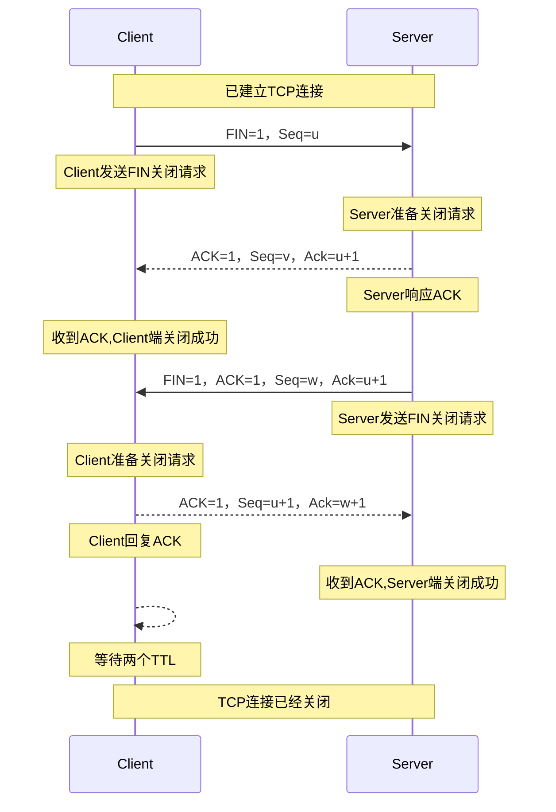

- [TCP三次握手](#tcp三次握手)
  - [连接队列](#连接队列)
  - [半连接队列目的](#半连接队列目的)
  - [SYN泛洪](#syn泛洪)
- [TCP四次挥手](#tcp四次挥手)
  - [TIME-WAIT阶段的作用](#time-wait阶段的作用)
- [TCP的三个窗口](#tcp的三个窗口)
- [TCP保证可靠传输](#tcp保证可靠传输)
  - [1. 序号机制](#1-序号机制)
  - [2. 数据校验](#2-数据校验)
  - [3. 确认机制](#3-确认机制)
  - [4. 重传机制](#4-重传机制)
  - [5. 流量控制](#5-流量控制)
  - [6. 拥塞控制](#6-拥塞控制)
- [ARQ协议](#arq协议)
  - [停等ARQ协议](#停等arq协议)
  - [回退N-ARQ协议](#回退n-arq协议)
- [TCP缓冲区](#tcp缓冲区)
- [TCP保活机制](#tcp保活机制)
- [TCP粘包问题](#tcp粘包问题)
  - [粘包原因](#粘包原因)
  - [解决](#解决)
- [TCP网络编程](#tcp网络编程)

# TCP三次握手
1、客户端向服务器端发送一个SYN标志位为1的数据包，并且随机选择一个初始序号Seq=x；
- ==客户端表示希望建立连接==；
 
2、服务器端收到这个数据包后，会返回一个SYN和ACK都为1的数据包，并且选择自己的初始序号Seq=y，并将确认号码Ack设置为x+1；
- ==服务端表示同意建立连接，并希望与客户端建立连接==；
  
3、客户端接收到了服务器端返回的SYN+ACK数据包，并且确认连接已经建立。客户端同样会选择一个新的序列号Seq=x+1，并且将确认号码设置为y+1；
- 表示同意与服务端建立连接；
- 此时可以携带数据

4、服务端收到后，即：双方都互相建立了连接；可以开始进行数据传输了；


https://zhuanlan.zhihu.com/p/619498204

## 连接队列

1、客户端发起建立连接请求，服务端收到请求时，会将Socket打开，即执行Socket.Accept，Socket进入阻塞状态；

2、服务端响应客户端，并将Socket加入**半连接队列（SYN队列）**；

3、服务端收到客户端的确认后，从半连接队列中获取对应的Socket，Accept结束，将socket加入**全连接队列（Accept队列）**

4、服务端`accept()`在没有可用Socket时会阻塞，当连接队列有socket完成连接建立，accept返回；

## 半连接队列目的

连接队列管理：半连接队列用于管理等待客户端确认的连接请求，保持这些连接的半连接状态，直到三次握手完成或超时。这使得服务器能够在高并发情况下处理大量的连接请求，而不会立即消耗服务器的资源。

## SYN泛洪

攻击者发送大量的连接建立请求，但不响应第二次握手，**导致服务端半连接队列满**，无法处理正常请求的一种攻击；不会窃取信息，但会致使服务不可用；

Linux会重试第二次握手，每次间隔递增，大概需要持续60s左右，非常耗时；

因此Linux提供了**SYNCookie**来解决这种问题，类似于HTTP Cookie，**连接信息不再保存在半连接队列中**，而是将连接信息编码返回给客户端，客户端响应二次握手时，携带，服务端再进行验证，验证通过建立连接；

```shell
# 开启 syncookies
net.ipv4.tcp_syncookies = 1
```

# TCP四次挥手

## TIME-WAIT阶段的作用

确保`被动断开连接的一方能收到确认报文`；

如果没收到，那么会超时重传连接释放报文，那么主动断开一方在`2MSL`内，就能收到这个重传的报文，再次确认；

MSL：（Maximum Segment Lifetime 报文最大生存时间 ）任何报文在网络上存在的最长时间，超过这个时间报文将被丢弃

可以通过开启快速回收time-wait来防止服务端大量不可用的端口问题；

# TCP的三个窗口
窗口的大小都是以`字节`为单位；

1、发送窗口

2、接收窗口

3、拥塞窗口：动态变化；用于控制网络拥塞；

# TCP保证可靠传输

## 1. 序号机制

数据由序号保证有序，并保证数据的完整性；

## 2. 数据校验

TCP报文头部有校验和，保证数据传输的可靠性、完整性；

## 3. 确认机制

TCP每个请求都需要进行确认响应；
- **停等ARQ协议**：使用停止等待，必须每个数据帧挨个确认，才会发送下一个，效率低；
- **回退N-ARQ协议**：滑动窗口内可以连续发送；窗口初始大小在TCP三次握手时双方确定；

## 4. 重传机制

- **停等ARQ协议**：使用`超时重传`，需要发送端维护定时器，超时后没有收到ACK则重传；
- **回退N-ARQ协议**：使用`快重传`；

## 5. 流量控制

**依赖连续ARQ协议的滑动窗口实现流量控制；**

在响应中，返回接收窗口大小，来告知发送方可接收的字节数，发送方调整发送窗口，来实现流量控制；

如果接收窗口为0，无法发送数据，为避免死锁，发送方会启动定时器，定时器结束，发送探测帧，询问窗口大小，直到窗口不为0；

## 6. 拥塞控制

通过`快重传机制`检测网络拥塞，通过`慢启动算法`、`拥塞避免算法`、`快恢复`动态调控`拥塞窗口cwnd`的大小，限制发送速率，来防止网络拥堵；

- `ssthress`是`慢启动算法`和`拥塞避免算法`切换的阈值，一般初始值为65535字节；


- TCP连接刚开始时，`cwnd < ssthress`使用`慢开始`；

- 当`cwnd`增长到，`cwnd < ssthress`，转而使用`拥塞避免算法`；
  
- 如果期间发生丢包现象，发送端会收到三个重复确认，以此判断可能发生拥塞；
  
- 发送端执行`快恢复算法`，将当前`cwnd`减半，降低发送数据帧的大小；
  

# ARQ协议

连续ARQ = ARQ协议（选择性重传） + 滑动窗口

## 停等ARQ协议
ARQ协议优点简单，但是信道利用率太低；规定了四种场景：

1、**停止等待**：每一个数据帧，都必须有确认，才会进行下一个数据帧的发送；

2、**超时重传**，超过一个RTT(一个来回)，重新发送；

## 回退N-ARQ协议

此协议配合**以字节为单位滑动窗口协议**：

发送接受双方，在通信过程中，依靠TCP的缓冲区，实时动态控制滑动窗口的大小，来实现流量控制；


1、维护`发送窗口`和`接收窗口`，能够连续发送数据帧，不必每一个段进行一次确认应答，而是以一个窗口的大小进行确认。减少往返时间，提高速度；

2、通过`快重传`的连续确认的方式，表示数据丢包的现象；

2、当中间发生数据丢失，则回退到丢失的数据，进行重传；(Go-back-N)


# TCP缓冲区

**TCP缓冲区使得TCP能够实现流量控制和拥塞控制**，收发双方通过缓冲区**动态调整发送的速率**，**以保证数据可靠传输、减少网络拥塞的问题**；

- 发送缓冲区：接收应用层的数据；
	- `/proc/sys/net/ipv4/tcp_wmem`
- 接收缓冲区：接受收到的数据包；
	- `/proc/sys/net/ipv4/tcp_rmem`

通常情况，为了增加网络吞吐量，提高收发效率，一次TCP数据发送尽可能多的发送数据；

但是也需要考虑延迟，以下情况会立即发送数据：

1、首次TCP握手建立连接时，发送SYN建立连接、同意建立连接返回SYN、ACK时都会立即发送；

2、接受数据后发送ACK确认，会立即发送；

3、TCP紧急数据会立即发送；(紧急指针Urgent Point标记的数据)

4、禁用Nagle算法后，不再等待小数据包合并为大数据包，而是立即发送；

# TCP保活机制

TCP保活机制由内核控制，开启了保活机制的一端，会对TCP连接启动定时器；当定时器经过`tcp_keepalive_time`时间没有交换数据了，就开始向对方发送探测报文，判断连接是否应该保持存活：
- 当对方主机不可达、或已关闭等原因，则探测收不到回应，继续探测`tcp_keepalive_probes`次，每次间隔`tcp_keepalive_intvl`后，主动关闭连接；
- 当对方主机可达，能够收到回应，则保持连接；

# TCP粘包问题
粘包：TCP对数据进行拆分和合并操作；接收方无法得知一个完整数据的边界；

## 粘包原因
0、TCP面向流；没有数据边界，并且通过缓冲区累计发送，可能多个TCP请求一起发送；

1、TCP协议本身对数据包的大小有限制；对于应用层数据过大，会进行拆分；

2、TCP拥塞控制会根据网络情况，对发送和接受数据的大小进行动态调控；导致每一个数据包的大小不同；

3、TCP协议本身对数据内容无感，仅关注可靠的数据收发；

## 解决
1、定长分包：发送和接收方约定每个TCP包的长度；
2、增加消息头：双方约定消息头来标记当前数据包的信息；
3、分隔符：约定完整数据包之间的分割符；
4、应用层协议：如Http、各种RPC协议，有完整的数据传输方案；


# TCP网络编程
应用层可以通过Socket接口进行TCP、UDP网络编程、上层协议开发；
1、Http协议
2、RPC协议
3、Websocket协议
