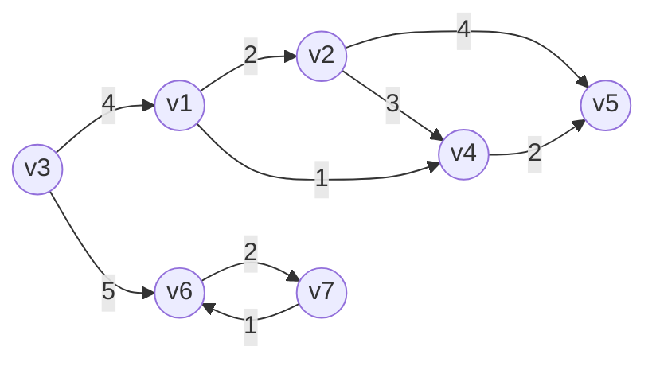

# 最短路径的表示
如：表示以v3为起点，到达其他各顶点的路径

## 邻接表
|vertex|dist|path|
|------|-----|-----|
|v1|4|v3|
|v2|6|v1|
|v3|0|0|
|v4|5|v1|
|v5|7|v4|
|v6|5|v3|
|v7|7|v6|
- vertex：当前顶点
- dist：为v3到达当前顶点的路径长度；
	- 如果是无权图，此项为经过节点数；
	- 如果是有权图，此项为权重和；
- path：为上一个有向连接节点，可以递归出整条路径；

例如：v3到达v4最短路径为5，v4的上一个节点为v1，可以推出 v3-->v1-->v4

# 寻找最短路径算法
无权图：只需要关注连通，找到**节点数最小**的路径；
- [无权图最短路径算法—BiliBili](https://www.bilibili.com/video/BV1qM411n7xR?p=3&spm_id_from=pageDriver&vd_source=ce67cf212f4a949cf75348b5404c5e27)
有权图：需要关注权重，找到**权重和最小**的路径；
- [有权图最短路径算法—BiliBili](https://www.bilibili.com/video/BV1qM411n7xR/?p=4&spm_id_from=pageDriver&vd_source=ce67cf212f4a949cf75348b5404c5e27)
常用算法：[[DS-Algorithm/图搜索算法BFS-DFS]]
