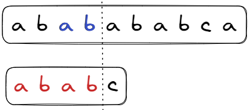

## KMP工作流程



当`c`匹配失败，说明前一个`ab`是匹配成功的，即原串中此时有`ab`组合；

既然这个`ab`不行，就尝试其他的`ab`；


于是找到更前一个`ab`的后一个字母，尝试继续匹配；

这样，省去了从索引0重新找，而是从索引2开始继续匹配；

**KMP就是当匹配失败时，通过一个数组，找之前有没有相同的模式，跳回去可以继续尝试；**

假设数组已经有了，那么KMP就可以找子串的最小起始位置：(Leetcode-28)
```java
public int strStr(String haystack, String needle) {
    int[] next = getNext(needle);
    int i = 0, j = 0;
    while (i < haystack.length() && j < needle.length()) {
        if (j == -1 || haystack.charAt(i) == needle.charAt(j)) {
            // 相同继续匹配
            i++;
            j++;
        } else {
            // 不相同尝试回溯，通过数组找到最近的相同子串，继续while匹配
            j = next[j];
        }
    }
    return j == needle.length() ? i - j : -1;
}
```


**那么问题就是：当`ab`匹配失败，如何知道前面还有一个`ab`；怎么知道跳回哪里？**

## 求解回溯数组


- a、b、a不匹配，都应该从头开始，跳回0；
- b：因为前一个a匹配了，尝试从第一个a的后面一位开始匹配；
- C：前一个b匹配了，从上一个b的后一个匹配；

```java
private int[] getNext(String needle) {
    int[] next = new int[needle.length()];
    next[0] = -1;
    int i = 0, j = -1;  // j指向i该跳回的位置
    while (i < needle.length() - 1) {
        if (j == -1 || needle.charAt(i) == needle.charAt(j)) {
            i++;
            j++;
            next[i] = j;
        } else {
            j = next[j];
        }
    }
    return next;
}
```