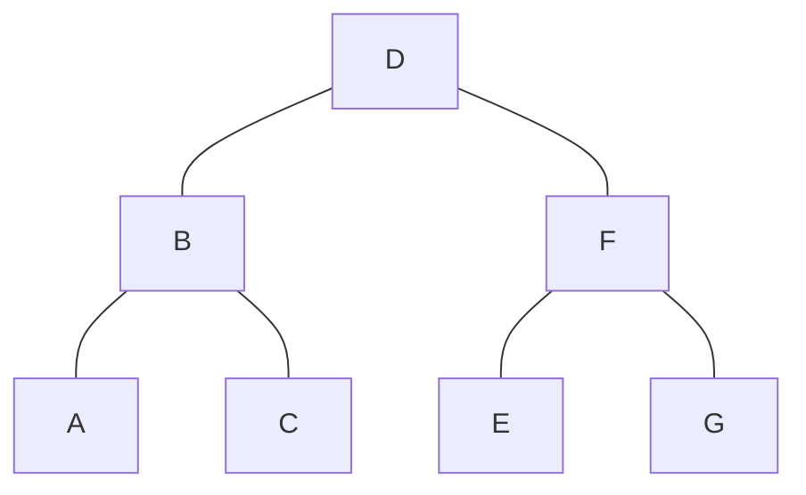

# 遍历

前序遍历：根 → 左 → 右

中序遍历：左 → 根 → 右

后序遍历：左 → 右 → 根

# 根据序列恢复二叉树
序列必须满足：

1、至少两个序列；
2、两个序列中，必须有一个中序序列；

## 中序 + 前序
前序 D B A C F E G（根→左→右）
中序 A B C D E F G（左→根→右）

1、首先前序中第一个是D，D是根节点；再分割中序：ABC D EFG
- ABC是D的左子树
- EFG是D的右子树

2、左子树的前序：BAC，B是根节点；
左子树的中序是：ABC，说明A是B的左子树，C是B的右子树；

3、右子树前序：FEG，F是根节点；
中序是：EFG，说明E是左子树，G是右子树；

## 中序 + 后序

