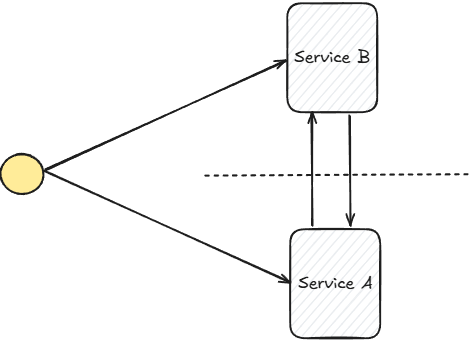
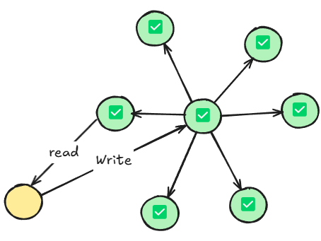

#CAP #Consistency #Availability #Scalability #Throughput #Latency #QPS #TPS #RPS #RT
# CAP

It is not about finding the perfect solution 
It is about finding the best solution for our specific use case.

Partition tolerance is fundamental in distributed systems because network partitions are almost inevitable. 
So when P is reality, system designers are faced with a trade-off between Consistency and Availability.

## Partition Tolerance

Partition tolerance refers to the ability of a distributed system to continue operating despite network partitions.

In actual distributed systems, partition tolerance (P) is often inevitable.

## Consistency

Consistency ensures all nodes in a distributed system have the same data at the same time.

>When a write operation is performed on one node, the effect of that write is immediately visible to all other nodes when a read operation is subsequently performed.

For example, in a database cluster, if a record's value is updated in one database server, any other server in the cluster that accesses that record should return the updated value.

## Availability

In a distributed system, availability means every request received by a non-failing node in the system must result in a response within a reasonable time.

> When we talk about availability we are essentially asking is our system up and running when our users need it. Even if some servers in the cluster fail, the remaining healthy servers should be able to handle the requests and provide the service.

$$
Availability \ Requirement \ Metric=\frac{Total \ Time-Down \ Time}{Total \ Time} \ast 100\%
$$

99.9% Availability => 8.76 hours of downtime
99.99% Availability => 52.6 minutes of downtime
99.999% Availability => 5 minutes of downtime

## Why only AP or CP

CP System: a system emphasizes consistency. These systems need to ensure that all nodes have the same view of data.
- MySQL
- Distributed File System. Like Hadoop
- ETCD, Zookeeper

AP System: a system prioritize availability. These systems are designed to always provide a response to requests.
- NoSQL Database. Like MongoDB, Redis
- CDN

# SLO & SLA

SLO: Service Level Objectives. 

SLA: Service Level Agreements. SLA is an agreement between a service provider and a customer regarding measurable metrics such as uptime, responsiveness and liability.
>SLA（服务级别协议）是提供商和客户之间关于正常运行时间、响应能力和责任等可衡量指标的协议。
# Key Metric

## Reliability (可靠性)

#TODO 

## Scalability (可扩展性)

Scalability refers to the system's ability to handle an increasing amount of work by adding resources, like servers, storage.

If the system is scalable, it can easily add more servers to handle the increased traffic.

Throughput is one way to measure scalability of a system. Throughput is the number of transactions or operations the system can handle per unit of time.

## Consistency (一致性)

Consistency refers to all nodes of the system have the same view of data at a given point in time.

Read-write test is one way to measure the consistency of a system.

## Durability (持久性)

Durability refers to the system's ability to ensure that data is not lost even in the face of various failures. Data is typically stored in a persistent storage. Like hard drive, distributed storage systems.

MTDBL and RPO are two key metrics to measure a system's durability.

MTDBL:  the mean time between data losses. A high-quality distributed system would aim for a very long MTDBL.
RPO: the maximum amount of data that a system can afford to lose. The closer the RPO is to zero, the more durable the system.

## Performance (性能指标)

Better performance usually means it can handle requests faster and support more concurrent users.

Throughput: how much data the system can handle per unit of time. It is a high-level concept. In different systems, there are more precise metrics to describe Throughput.

- RPS: Requests Per Second. Web service Throughput.
- QPS: Query Per Second. DB Throughput. 
- B/s: Bytes Per Second. Kafka Throughput.
- TPS: Transaction Per Second.

Latency: how long it takes the system handle a single request.

- RT: Response Time. RT refers to the time interval from when a client sends a request to when it receives a response from the service provider.

>Optimizing for one can often lead to sacrifices in the other. For example, Batching operations can increase Throughput, but might also increasing Latency.

