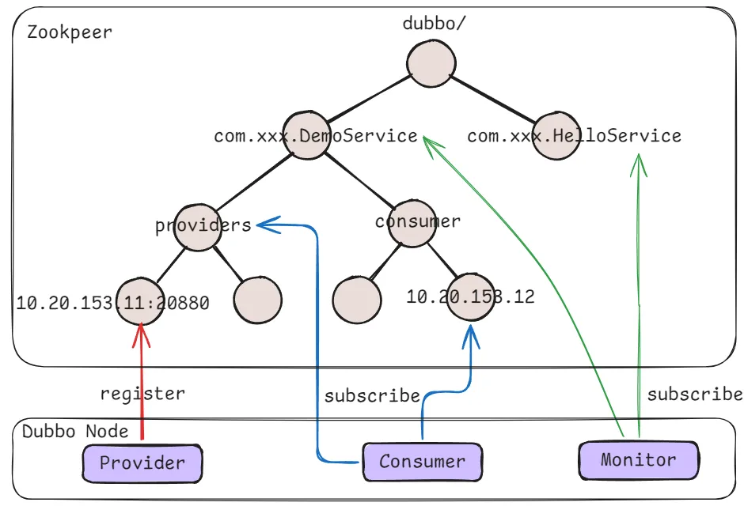
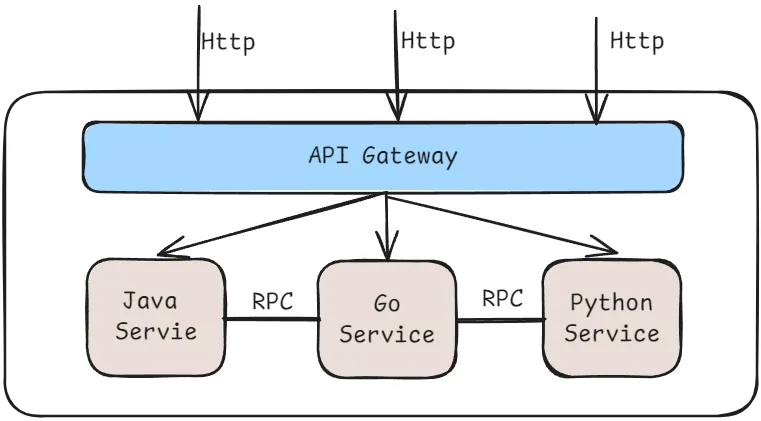

# Registration Center

Popular Registration Center components: 
- Etcd
- Zookeeper
- Nacos

how zookeeper works:

1. When a service provider starts up, it writes its own URL address under the provider directory under the corresponding service.
2. When a service consumer starts up, it subscribes to the provider nodes. And it writes its own URL address to the consumers directory.
3. So that consumers can find out the provider services.

>1. 当服务提供者启动时，在对应服务下的provider目录下写入自己的URL地址
>2. 当服务消费者启动时，订阅服务提供者的节点，并且在consumer目录下写下自己的URL；

# RPC

1. RPC is a technical idea, not a protocol. It provides a higher level of abstraction, shielding the underlying serialization and network communication details.
2. RPC frameworks often provide higher performance serialization methods.(JSON/Protobuf/Thrift/Avro...)
3. RPC frameworks can support multiple transmission protocols to support different communication scenarios.(HTTP/HTTP2/TCP/UPD...)
4. RPC frameworks can have built-in service discovery and load balancing, which is necessary for cluster expansion.
> 1. RPC是一种技术思想，而非协议。它提供了更高级别的抽象，屏蔽底层序列化和网络通信细节。
> 2. RPC框架通常会提供更高性能的序列化方式
> 3. RPC框架通常可以支持多种通讯协议，以支持不同的通信场景
> 4. RPC框架通常可以支持服务发现和负载均衡，对于支持集群扩展很有必要。

The HTTP protocol is a standard protocol that is supported by almost all systems and programming languages. Development and use are simple and convenient. Modern browsers have built-in support for HTTP.

In contrast, RPC is a technical idea, not a protocol. Actually, Http is an implementation of RPC and is already very standardized and universal. RPC protocols may require additional libraries or tools to implement.

when to use HTTP/HTTPS
- Need to communicate with external systems.
- Web service.
when to use RPC
- Node communication within complex distributed systems.
- High-performance communication requirements.

>HTTP协议是一种标准协议，几乎所有的系统和编程语言都支持。开发和使用都更加的简单和方便现代浏览器都内置了对HTTP的支持
>相比之下，RPC是一种技术思想，并非协议。其实，HTTP是RPC的一种实现，并且已经非常标准化和通用，RPC协议可能需要额外的库或工具来实现

# RPC Framework

1. The RPC framework encapsulates the process of RPC communication, allowing developers to use RPC more simply.
2. The mature RPC framework also provides advanced features such as load balancing, fault tolerance, data compression, etc.
3. The RPC framework provides monitoring and management functions, which can monitor the service's operating status, QPS, response time in real time.
4. In microservice distributed services, the RPC framework can also connect to the registration center to realize service discovery capabilities.

> 1. RPC框架封装了底层通信，允许开发人员更简单地使用RPC
> 2. 成熟的RPC框架提供了负载均衡、容错处理、数据压缩等高级功能
> 3. RPC框架可以提供监控和管理功能，可以实时监控系统运行状态、QPS、响应时间等
> 4. 在微服务分布式服务中，RPC框架还可以对接注册中心，实现服务发现的能力。