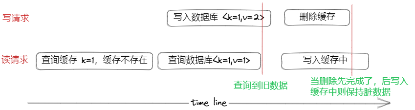
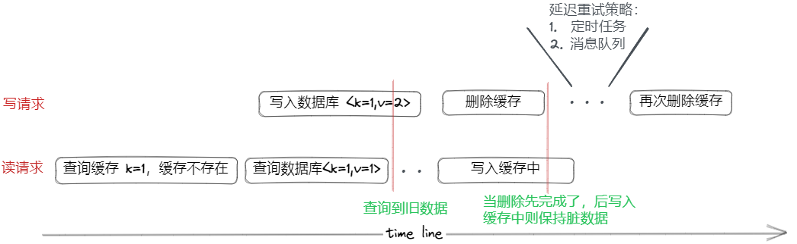

- [缓存一致性原则](#缓存一致性原则)
- [尽量一致性的策略](#尽量一致性的策略)
  - [1. 刷库再刷缓存(❌)](#1-刷库再刷缓存)
  - [2. 刷缓存再刷库(❌)](#2-刷缓存再刷库)
  - [3. 删缓存刷库(❌)](#3-删缓存刷库)
  - [4. 刷库删缓存Cache Aside(✅)](#4-刷库删缓存cache-aside)
    - [不一致性的场景](#不一致性的场景)
  - [5. 延迟双删(✅)](#5-延迟双删)
  - [删除失败的补偿操作](#删除失败的补偿操作)
  - [为什么不可以先删缓存，再刷库](#为什么不可以先删缓存再刷库)
  - [为什么是删缓存，而不直接更新缓存](#为什么是删缓存而不直接更新缓存)
  - [删除缓存失败怎么办](#删除缓存失败怎么办)
- [强一致性策略](#强一致性策略)

# 缓存一致性原则

1、`只要读写不是原子的，就无法完全保证数据一致性；要强制性就加锁`；

2、顺序原则：一定不能先删缓存；一定优先保证数据源是最新的数据(先写数据源)；目的是降低数据不一致概率；

3、缓存使用流程：先查询缓存，查询失败则查询DB，将结果重建缓存；

# 尽量一致性的策略

## 1. 刷库再刷缓存(❌)

并发场景下，不加锁无法保证缓存的值为最新的；

- A线程刷库
- B线程刷库(最新值)
- B线程刷缓存
- A线程刷缓存(脏数据)

## 2. 刷缓存再刷库(❌)

这种方式更不可取，并发下会导致数据源(DB)的数据为脏数据；

- A线程刷缓存
- B线程刷缓存(最新值)
- B线程刷库
- A线程刷库(DB脏数据，相当于丢数据了)

## 3. 删缓存刷库(❌)

- A线程删缓存
- B线程读缓存，读不到，从数据库读取到旧值
- A线程刷库(最新值)
- 缓存中存放脏数据；**且只能等到下一个写操作或缓存失效，才能移除脏数据；**

## 4. 刷库删缓存Cache Aside(✅)

写操作只负责更新数据源的原始数据，数据库可以保证更新顺序；==并且只要有更新，就让缓存失效；==
读操作只负责刷缓存，
**在写操作很少的情况下，不一致的概率很低；**

读请求：

- 先读缓存，有数据，直接返回
- 没有数据，查询数据库，再覆盖缓存，返回；
- 对于数据库也没数据的，可以缓存写空，防止穿透；

写请求：(失效模式)

- **先更新数据库，再删除缓存**
- 需要读到此数据，再写入缓存，读不到可写空；

### 不一致性的场景

触发条件：

- 前提：缓存已经失效，可能是正好过期，也可能是连续两次写；
- 同时有读操作、写操作，并且查库在写库之前，查到了脏数据；然后写操作刷库；
- 写入缓存在删缓存之后，写入了脏数据；

虽然**触发条件苛刻**，但只要读写的时候不加锁，总是有可能出现不一致的情况，读到脏数据，刷入缓存；
这种持续的不一致，只能等到缓存失效、下次写请求删掉，否则一直会不一致；

## 5. 延迟双删(✅)

针对旁路缓存策略的不一致问题，根本就是写入新数据之后，**没能成功的把旧数据删掉**；
因此，通过**延迟一定的时间，再次删除缓存**，强制再刷一边缓存，来进一步降低数据不一致情况的发生；
延迟策略：一般延迟1-3s即可；

- 定时任务：写线程执行完业务逻辑，删除缓存，返回之前开启一个异步线程，睡眠一段时间后再次删除缓存；
- 消息队列：要借助中间件或者本地队列，

## 删除失败的补偿操作

在先更新数据、在删除缓存的方式中，删除缓存操作可能失败；
补偿措施：

- 消息队列重试机制；
  
  > 写操作完成，将要删除的缓存key放入消息队列，由消费者完成删除缓存操作，并且失败重试；
- 订阅binglog;
  
  > 更新缓存成功后，产生变更的binlog，可以拿到binlog后，根据变更数据，删除指定缓存；有update操作，就触发缓存删除；
  > **cannal**模拟MySQL的从节点，向主节点发送dump请求，主节点就会将binlog推送给从节点，解析为结构化数据后，就可以使用了；

## 为什么不可以先删缓存，再刷库

先删缓存，后写数据源，在写入完成前，任意的并发读线程又将脏数据更新到缓存，则缓存和数据源将持续不一致；**并且直到下次缓存失效或再次删除才会更新**；

本身缓存使用场景是**读多写少**，所以这种情况的概率很大；

而先刷库，再删缓存，同样存在这种情况，但是**脏数据仅存在刷库和删缓存之间的这段时间**，删掉之后就一致了，可以容忍；

## 为什么是删缓存，而不直接更新缓存

1、只有先删才能保证
2、懒加载
缓存应对场景是多读少写，
因为写请求，目的是更新数据源，而不是读取缓存；
可能有大量的请求，但是很少有读请求，就没必要每次都更新缓存；
是一种延迟加载的方式；
当然如果是多读场景，也可以直接更新缓存，再写库；

## 删除缓存失败怎么办

只能不断重试，问题就变为了如何重试；
1、队列消费重试；删除失败入队，消费重试，循环执行，可记录次数；
2、删除操作，借助binlog同步组件，监听binlog，有更新则删除；

# 强一致性策略

不一致的根本原因是：数据库、缓存两个操作是非原子的；

强一致性就需要：**更新缓存时加锁，牺牲并发性能**

- 可以采用Redis的分布式锁，降低锁的粒度，如：以用户id作为锁，不同用户间不产生竞争；
- 可以使用读写锁；读读共享；

