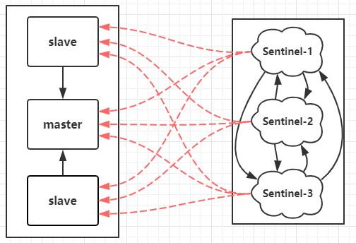
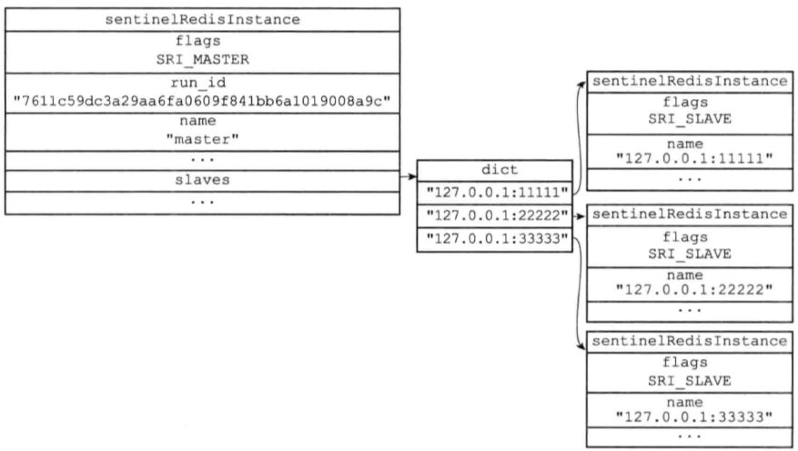

- [高可用演化进程](#高可用演化进程)
- [Redis主从架构](#redis主从架构)
  - [主从同步过程](#主从同步过程)
    - [1. 建立连接](#1-建立连接)
    - [2. 全量同步](#2-全量同步)
    - [3. 命令传播:增量同步](#3-命令传播增量同步)
  - [缺陷](#缺陷)
  - [主从存在的问题](#主从存在的问题)
    - [Master持久化问题](#master持久化问题)
    - [无自动故障转移](#无自动故障转移)
  - [主从配置](#主从配置)
- [Sentinel](#sentinel)
  - [Sentinel功能](#sentinel功能)
  - [架构：](#架构)
  - [Sentinel的启动](#sentinel的启动)
  - [故障转移功能](#故障转移功能)
    - [故障检测](#故障检测)
    - [故障转移](#故障转移)
  - [Sentinel配置](#sentinel配置)
  - [脑裂](#脑裂)
    - [脑裂应对](#脑裂应对)

# 高可用演化进程

1. 数据怕丢失 ➡️ 持久化（RDB/AOF）
2. 恢复时间久 ➡️ 主从副本（副本随时可切，但需要手动切换）
3. 故障手动切换慢 ➡️ 哨兵模式（实现自动故障转移，提升从节点为主节点）
4. 读写存在压力/容量瓶颈 ➡️ 分片集群，横向扩展；

- 分片集群社区方案 ➡️  Twemproxy、Codis（Redis 节点之间无通信，需要部署哨兵，可横向扩容）
- 分片集群官方方案 ➡️  Redis Cluster （Redis 节点之间 Gossip 协议，无需部署哨兵，可横向扩容）
- 业务侧升级困难 ➡️ Proxy + Redis Cluster（不侵入业务侧）

# Redis主从架构

**主从目标：容灾；**

## 主从同步过程

### 1. 建立连接

1、从服务器向主服务器发送`PSYNC同步命令`建立连接，告知主节点要进行全量复制；
- runId：第一次同步设为：?
- offset：第一次同步，设为-1；

2、主服务器会响应`FULLRESYNC`：表示进行全量同步；

### 2. 全量同步

1、主服务器执行`BGSAVE`命令，生成一个RDB文件，发送给从服务器，并**开启一个缓冲区**，记录同步期间主节点执行的写命令；
- RDB文件更小，占用带宽小，数据复制效率高；

2、从节点收到RDB文件，**从服务器会清空所有数据，载入RDB文件**；

3、载入完成，响应主服务器，主服务器开始发送缓冲区内的命令，从服务器执行接受的命令；

4、直到两个服务器达到数据一致，同步完成；

### 3. 命令传播:增量同步
命令传播：全量同步后，主节点每次执行写命令，先将命令写入缓冲区，异步同步给从节点；

1、从节点通过心跳(默认1s)向主服务器，发送同步位置的偏移量；

2、主节点会**判断偏移量是否在缓冲区中**，如果在且有未同步的新数据就发送给从节点，完成同步；

3、**如果偏移量不在缓冲区**：说明从节点长时间未同步数据，主节点缓冲区中老的偏移量已经被覆盖了，则**触发全量同步**；

4、每次同步数据时，主节点会**检查数据是否过期**，如果过期，就不再同步给从节点；

## 缺陷

- 一旦主节点宕机，需要手动将slave提升为master，各个应用要更新主节点地址；（致命）

- 简单的主从，只是备份数据，还是无法达到高可用，需要Sentinal实现自动故障转移；

## 主从存在的问题

### Master持久化问题

Master如果不做持久化，交给Slave，那么就**必须开启Sentinel，并且关闭Master节点的自动重启；**

如果自动重启，将清空数据，并且主从同步也会将从节点数据清空；

### 无自动故障转移
一旦主节点宕机，需要手动将slave提升为master，各个应用要更新主节点地址；（致命）

还是无法达到高可用，需要Sentinal实现自动故障转移；

## 主从配置
```conf
# 从节点
slaveof [master_ip] [master_port]

masterauth [master_account]
requirepass [master_password]
```

# Sentinel

哨兵是一个独立的轻量进程，哨兵会实时监控master节点的状态，当master不可用时会从slave节点中选出一个作为新的master，并修改其他节点的配置指向到新的master；

通常建立哨兵集群，防止单点故障；

## Sentinel功能

- 【**监控**】监控并发现故障：
- 【**选举**】自动故障转移：升级从节点；
- 【**通知**】哨兵模式下，客户端只需要订阅哨兵即可，主节点信息由哨兵通知

## 架构：



- 哨兵节点：哨兵节点是特殊的redis节点，不存储数据，Sentinel之间通过TCP通信；

- 数据节点：redis主从架构，主节点和从节点都是数据节点。

- 每个Sentinel都会监控所有的redis实例，通过TCP通信；

- 客户端会同时连接哨兵，感知主节点；

## Sentinel的启动

1、使用Sentinel的专用代码启动Sentinel服务器

Sentinel本质是一个特殊的Redis服务器，但是启动不会加载RDB、AOF文件；

Sentinel不存数据，所以不需要get、set等命令；

但是需要各种检测Redis服务器状态、通信的代码：

比如：INFO、Ping

2、初始化Sentinel

这里主要是Sentinel的数据结构中的字典，也不再存储数据，而是存储Redis节点和其他Sentinel的节点信息数据；



3、获取主服务器信息

通过向主节点发送`INFO命令`，获取主从信息：

- 主服务器的信息

- 主服务器下的所有从服务器的信息；

## 故障转移功能

### 故障检测

1、检测主观下线

Sentinel每隔1s向所有Redis实例（包括其他Sentinel），发送`Ping命令`，来判断是否下线；

2、检测客观下线

如果一个Sentinel发现存在实例下线了，为了确认是否真的下线，会向其他Sentinel进行询问；

当从其他Sentinel接受到的确定下线的数量超过配置的`<quorum>`个数，那么就确定客观下线；
```shell
# 这里最后是quorum = 2
sentinel monitor mymaster 127.0.0.1 6379 2
```

### 故障转移

3、集群选举：选取领头Sentinel

各个Sentinel进行投票，选举一个领头Sentinel，完成故障转移；（Raft算法：投票超过半数）

4、开始故障转移

（1）领导者Sentinel来选取一个slave作为新的master，选取准则是取相似度最高的slave（偏移量最接近的）
- 选中的优先级考虑：`slave-priority`、偏移量、Id
- `slave-priority`：在配置中可以设置节点的优先级；
- 偏移量：主从同步时，从节点维护的复制偏移量；
- Id：唯一标识，优先小的id；

（2）修改其他slave的复制目标为新的master

（3）所有Sentinel更新主节点信息；

（4）通知所有的客户端，主节点信息的变更；

（5）如果下线的master重新上线，就将其变成一个slave；


## Sentinel配置

在主从的基础上，还需要配置Sentinel：`sentinel.conf`；

```shell
port 26379

sentinel myid a780167ff20ae409c7803e2f7d5d55fbf120018f

daemonize yes

# Generated by CONFIG REWRITE

dir "D:\\Redis-6379"

sentinel monitor mymaster 127.0.0.1 6379 2

sentinel config-epoch mymaster 0

sentinel leader-epoch mymaster 0

sentinel current-epoch 0
```

## 脑裂

脑裂：同时存在了多个Master

可能发生脑裂的场景：

1、sentinel之间存在通信障碍，且部分sentinel无法取得Master的通信，导致提升从节点为Master；出现脑裂；

2、主节点能够正常读写，但是无法正常与从节点、sentinel通信(数据没能完全同步给从节点)，导致被主从切换，主节点降级为从节点，向新的leader同步数据时，会先清空自己的数据，导致数据丢失；

### 脑裂应对
1、通过配置以下参数，提高数据一致性；并不能完全解决脑裂；
```shell
# 从节点至少在线的个数，主节点才对外执行写命令
min-slaves-to-write 3
# 主从延时超过此值，主节点拒绝写数据
min-slaves-max-lag 1
```
两个参数配置效果：**master必须有3个在线slave，并且主从同步延迟不能超过1s，否则master不对外提供写服务；**

2、增加sentinel节点数，减少误判的可能；