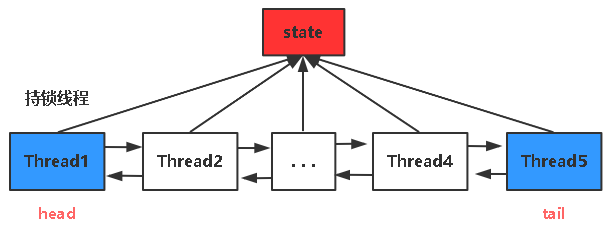
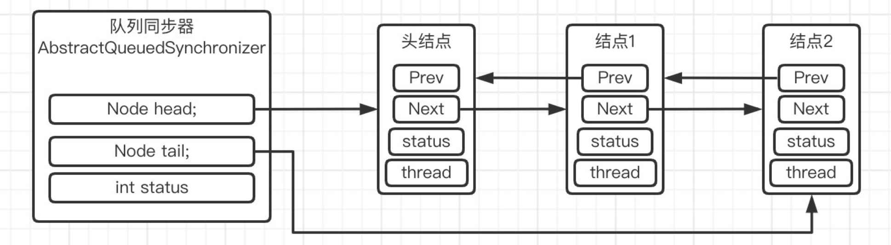
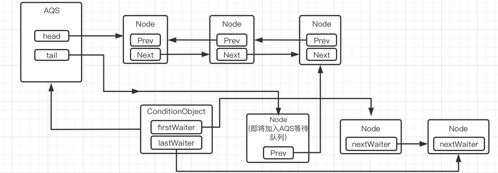

- [AQS](#aqs)
- [AQS重要属性](#aqs重要属性)
- [AQS重要方法](#aqs重要方法)
- [公平锁/非公平锁](#公平锁非公平锁)
  - [如何实现](#如何实现)
  - [特点](#特点)
- [AQS为什么用双向链表](#aqs为什么用双向链表)
- [AQS唤醒节点是从后向前](#aqs唤醒节点是从后向前)
- [Condition是如何线程通信的](#condition是如何线程通信的)

# AQS
AbstractQueuedSynchronizer：抽象队列同步器，是JUC的基石，JUC包下很多内容是基于AQS实现的；

如：
- **ReentrantLock**：基于AQS实现的重入锁；使用state标记资源是否被占用，使用Node队列排队线程实现公平锁；
- **ThreadPoolExecutor**：Worker线程
- **CountDownLatch**：依赖state进行计数；
- **Semaphore**：基于state记录资源数；获取资源、归还资源使用state加减操作记录；




# AQS重要属性
- state：是同步资源的抽象，由volatile修饰的int类型变量；
  - `state>=1`：锁定状态/重入状态；表示已有线程获取锁；大于1则表示锁重入；
  - `state==0`：未锁定状态，线程可以通过CAS修改state状态来尝试获取锁；

- Node节点：线程抽象，并规范了线程的类型、状态；
  - Node类型：
    - `EXCLUSIVE类型`：独占操作；
    - `SHARED类型`：共享操作；
  - Node状态(线程状态 waitStatus)：
    - 初始化时状态为0
    - `CANCELLED`：线程已被取消；可能超时或中断
    - `SIGNAL`：等待状态，后继节点阻塞，需要被唤醒；
    - `CONDITION`：线程正在等待关联的Condition监视器；
    - `PROPAGATE`：不理解 // TODO

- Node双向链表：线程队列：
  - 队列的每一个Node装载一个线程；


# AQS重要方法
- **acquire**：尝试获取锁；
  - 1、获取AQS的state，如果`state==0`尝试使用**CAS的方式**获取锁；
    - 非公平锁：直接尝试一次；
    - 公平锁：队列中有其他线程则不执行，没有则执行；
  - 2、如果持锁线程是当前线程，则直接获取锁；state+1
- **tryRelease**：释放锁，每次state-1，直到为0，锁被释放；当释放锁后，执行unpack方法来唤醒线程；
- **addWaiter**：线程通过**CAS操作**入队；
  - 如果队列存在，则入队；不存在，则初始化队列，再入队；
```java
private Node addWaiter(Node mode) {
    Node node = new Node(Thread.currentThread(), mode);
    // 先指向tail，再将tail指向node
    Node pred = tail;
    if (pred != null) {
        node.prev = pred;
        if (compareAndSetTail(pred, node)) {
            pred.next = node;
            return node;
        }
    }
    enq(node);  // tail为空需要初始化
    return node;
}
```
- **acquireQueued**：线程如果没拿到锁，入队之后执行；
  - 入队之后如果发现，前驱节点为Head头节点，说明此时位置处于第二个线程，则进入循环不断尝试获取锁：`for (;;)`

# 公平锁/非公平锁

## 如何实现
在尝试获取锁的时候，需要先执行：`hasQueuedPredecessors()`，查看队列中是否有其他线程
- FairSync公平锁抽象实现了此方法，则此方法会执行；
- NonfairSync非公平锁抽象，没有实现此方法，为空方法，即不会关注队列是否有线程，会直接尝试获取锁；

## 特点

公平锁：按照队列顺序，依次唤醒；优先唤醒前面的节点；

非公平锁：可以插队，减少上下文的切换开销，不是一定要阻塞的；唤醒时，从后向前唤醒；

# AQS为什么用双向链表
当线程一开始没有竞争到锁，加入队列中时需要做一些操作：
1、需要判断前置节点是否为头节点，如果是需要自选不断尝试获取锁；

2、线程加入队列中时，需要查看前置节点线程的状态，如果是被中断(`lock.lockInterruptibly()`)或CANCELLED，则需要移除不竞争锁的线程；

**使用双向链表可以方便的查询前驱节点，并也可以向后移动；**

# AQS唤醒节点是从后向前

因为Node入队、Node取消操作，都是先操作节点的prev指针，优先级更高；

如果从前往后，就会优先使用next，比从后往前，更容易丢失节点；

比如：新添加一个节点入队，优先设置prev指针，此时从前向后遍历，如果前面的节点被取消，还未设置next指针，这个过程不是原子的，可能会被别的线程抢占，会导致访问不到最后的节点；


# Condition是如何线程通信的

每个Condition在AQS中会创建一个**条件队列**，类似Node队列；

使用同一个Condition的线程，会在**同一个条件队列**中
- 当持锁线程使用`await()`，会释放锁，并重新加入条件队列；
- 当持锁线程使用`signal()`，会唤醒同一个条件队列的其他线程，这些线程就会加入到AQS的等待队列中，去竞争锁；


