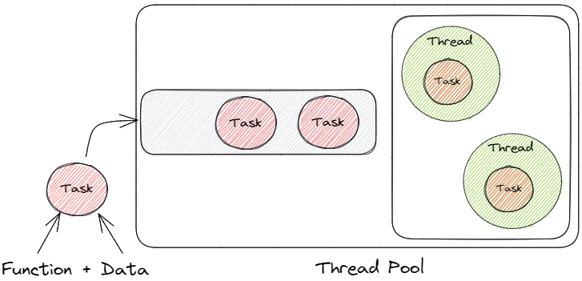
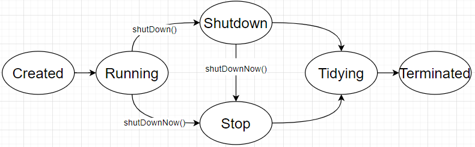

- [线程池模型](#线程池模型)
  - [为什么要线程池](#为什么要线程池)
  - [线程池使用注意事项](#线程池使用注意事项)
    - [1. 区分任务类型](#1-区分任务类型)
    - [2. 不同的线程池处理不同的任务](#2-不同的线程池处理不同的任务)
    - [3. 线程数量的设定](#3-线程数量的设定)
- [ThreadPoolExecutor](#threadpoolexecutor)
  - [ThreadPoolExecutor线程池参数](#threadpoolexecutor线程池参数)
  - [执行流程](#执行流程)
  - [为什么优先放入队列](#为什么优先放入队列)
  - [线程池状态](#线程池状态)
  - [线程池核心方法](#线程池核心方法)
  - [拒绝策略](#拒绝策略)
- [Executors](#executors)
- [线程池监控及动态调整](#线程池监控及动态调整)
  - [线程池监控](#线程池监控)
  - [线程参数动态调整](#线程参数动态调整)
- [ForkJoinPool](#forkjoinpool)


**实现线程池**：[Github: custom pool](https://github.com/huiru-wang/JavaCodeSnippet/tree/main/JavaBaseCode/src/test/java/com/snippet/javacodebase/custompool)


**可视化线程池执行流程**：[Github: ThreadPoolWorkFlowTest](https://github.com/huiru-wang/JavaCodeSnippet/blob/main/JavaBaseCode/src/test/java/com/snippet/javacodebase/ThreadPoolWorkFlowTest.java)

# 线程池模型


线程池是一个**生产者消费者模型**；业务中产生任务，由线程池进行消费；
1、任务：即告知线程如何处理特定数据；**任务 = 函数 + 数据**；
2、队列：缓冲待处理任务；
3、线程：由线程池管理的可以复用的线程，消费队列任务；

## 为什么要线程池

1、创建线程和销毁线程的花销是比较大的；使用线程池提前创建线程，直接用即可，提高运行时效率
  
2、线程不进行管理，设计不当，有可能无休止占用资源；使用线程池方便管理，避免无休止的创建线程，占用系统资源；
  
3、不建议使用`Executors`创建线程池，应该使用`ThreadPoolExecutor`创建
- Executors线程池参数被隐藏，不可控；
- 如：`SingleThreadExecutor`、`newFixedThreadExecutor`都会使用无界队列，存在内存安全问题；

## 线程池使用注意事项
### 1. 区分任务类型
- CPU密集型：不依赖外部IO，仅执行计算任务；
- IO密集型：任务中计算部分占用不多，更多的是磁盘、网络IO等；

### 2. 不同的线程池处理不同的任务
可以对特定任务进行特定的线程池配置，为后期优化提供可能；

### 3. 线程数量的设定
- CPU密集型：这类任务执行中由于不需要等待IO，因此不需要过多的线程；
  - ==线程数 == CPU核数即可==
- IO密集型：需要计算任务中的计算和IO时间占比；得出经验公式：$N * (1 + \frac{WT}{CT})$
  - 其中，N：CPU核数；WT：IO等待时间；CT：CPU计算时间；
  - 当WT==CT，线程数可以设为2N；
  - IO等待时间占比越大，可以适当从2N往上增加线程数；


# ThreadPoolExecutor
## ThreadPoolExecutor线程池参数

```java
// 最多的七参构造器，前五个参数必须
public ThreadPoolExecutor(int corePoolSize, // 核心池大小
                          int maximumPoolSize,  // 最大线程数
                          long keepAliveTime, // 空闲线程等待时间
                          TimeUnit unit,  // 等待时间单位
                          BlockingQueue<Runnable> workQueue,  // 任务队列    
                          ThreadFactory threadFactory,  //线程工厂
                          RejectedExecutionHandler handler) //拒绝策略
```

- **corePoolSize：核心池的大小，并非线程的最大数量**
  
  - maximumPoolSize > corePoolSize
  - 在创建了线程池后，线程池中的线程数为0，当有任务来之后，就会创建一个线程去执行任务，当线程池中的线程数目达到corePoolSize后，就会把到达的任务放到**缓存队列当中**；
- maximumPoolSize：线程池的最大线程数，表示线程池中最多能创建多少个线程
  
  - 非核心线程 = maximumPoolSize-corePoolSize
    
  - 只有队列无法存放更多的任务，才会启用非核心线程；
    
  - 冗余思想设计：核心线程数代表任务执行常态需要的数量，但是对于不好把控的业务，需要设计成冗余的，如果任务过多，需要增加额外的线程；
    
- **keepAliveTime：表示线程没有任务执行时最多保持多久时间会被销毁**
  
  - 默认：只有线程池内线程数大于corePoolSize的线程，keepAliveTime才会对其计时
  - 当一个线程的空闲时间大于keepAliveTime，则会被终止
  - 如果调用了allowCoreThreadTimeOut(boolean)，线程池内线程数小于corePoolSize，keepAliveTime也会起作用
  - 如果任务的执行时间 > 线程的存活时间，线程则不会被复用；
- unit：参数keepAliveTime的时间单位（七种单位）
  
- **workQueue：选择一个阻塞队列**
  
- **threadFactory：线程工厂，线程池用来创建线程的工厂方法**。如果不传此参数
  - 默认：`Executors.defaultThreadFactory()`
  - `NamedThreadFactory`：命名线程池
  
- **RejectedExecutionHandler：表示当拒绝处理任务时的策略（线程池无法再容纳的线程）**
  
  如果不传此参数，默认：ThreadPoolExecutor.AbortPolicy
  
  （**这里的丢弃，都是针对队列的线程任务**）
  
  ```java
  // 丢弃任务并抛出RejectedExecutionException异常。 
  ThreadPoolExecutor.AbortPolicy 
  // 也是丢弃任务，但是不抛出异常。
  ThreadPoolExecutor.DiscardPolicy 
  // 丢弃队列最前面的任务，然后重新尝试执行任务（重复此过程）
  ThreadPoolExecutor.DiscardOldestPolicy
  // 由调用线程处理该任务 
  ThreadPoolExecutor.CallerRunsPolicy
  ```
  

## 执行流程

**可视化线程池执行流程**：[Github: ThreadPoolWorkFlowTest](https://github.com/huiru-wang/JavaCodeSnippet/blob/main/JavaBaseCode/src/test/java/com/snippet/javacodebase/ThreadPoolWorkFlowTest.java)

**提交优先级**：核心 > 队列 > 非核心

1、核心线程未满，直接交给核心线程执行；

2、核心线程已经满，并且正在运行，任务提交到队列；

3、核心满，队列满，任务提交给非核心线程；

4、最大线程数满(核心+非核心)、队列满，则拒绝提交；

**执行优先级**：核心 > 非核心 > 队列

1、先执行核心线程持有的任务

2、执行非核心线程持有的任务

3、最后从队列中获取任务

## 为什么优先放入队列

队列起到缓冲的作用，创建线程代价比较高，如果每次超出核心线程就创建新的线程，为什么不把核心线程数直接设置大一点呢？

理论上，可以没有非核心线程，但是不能没有队列；非核心线程是为队列而服务的，优先级比队列更低；

##  线程池状态

**Running**：正常运行状态；

**ShutDown**：调用`shutdown()`，进入Shutdown状态，线程池进入关闭状态，不再接受任务，继续执行正在执行的任务和队列任务

**Stop**：调用`shutdownnow()`，进入Stop状态，线程池处于停止状态，不再接受新的任务，不处理队列任务，中断正在运行的任务；

**Tidying**：当线程池的任务都结束(执行完或被中断)，进入整理状态，线程池会自动调用`terminated()`方法，进入终止状态；

**Terminated**：线程池完全停止状态；

## 线程池核心方法
1、`submit()`：返回值为Future，可以get运行结果或异常，如果不get，则不会感知异常；

2、`execute()`：没有返回值，可以抛出异常；

3、`shutdown()`：不再接受新的任务，等待正在执行的任务和队列中的任务执行完成，状态变为：shutdown；

4、`shutdownNow()`：在shutdown的基础上，尝试中断运行中的线程，并清空队列，状态变为：stop；返回未完成的任务；

5、`awaitTermination(long timeout,TimeUnit unit)`：阻塞等待线程池终止，或事件结束，返回线程池状态是否为terminate；

6、状态判断：
- `isShutdown()`：线程池是否被shutdown，正在停止/或已经停止都算shutdown
- `isTerminated()`：线程池是否已经停止
- `isTerminating()`：线程池是否正在停止，shutdown之后，真正停止之前都是terminating

```java
@Test
public void shutdown_thread_pool() throws InterruptedException {
    CountDownLatch latch = new CountDownLatch(5);
    for (int i = 0; i < 5; i++) {
        String message = "Thread [" + i + "]+ is running";
        threadPoolExecutor.execute(() -> {
            System.out.println(message);
            try {
                TimeUnit.SECONDS.sleep(5);
            } catch (InterruptedException e) {
                System.out.println("interrupted");
            } finally {
                latch.countDown();
            }
        });
    }
    // 阻止新来的任务提交，对已经提交了的任务不会产生任何影响, 队列也不受影响 会继续执行完毕，仅仅是不再接受新的任务
    // 线程池状态变为：shutdown
    threadPoolExecutor.shutdown();
    logThreadPoolStatus();  // isShutdown:true, isTerminated:false, isTerminating:true,queue size:4
    latch.await();

    boolean res = threadPoolExecutor.awaitTermination(10, TimeUnit.SECONDS);
    logThreadPoolStatus(); // isShutdown:true, isTerminated:true, isTerminating:false,queue size:0
}
```

## 拒绝策略

https://cloud.tencent.com/developer/article/1520860

# Executors

ThreadPoolExecutor的工厂类，提供已经基本配置的线程池；
  
不建议使用`Executors`创建线程池，应该使用`ThreadPoolExecutor`创建
- Executors线程池参数被隐藏，不可控；
- 如：`SingleThreadExecutor`、`newFixedThreadExecutor`都会使用无界队列，存在内存安全问题；

# 线程池监控及动态调整

ThreadPoolExecutor提供了线程池核心参数的set/get方法；

## 线程池监控

ThreadPoolExecutor提供了核心线程数、最大线程数、队列、活跃线程数、池内任务总数(正在运行 + 等待运行)等数据的get方法；

可以对外暴露接口，根据线程池的id，获取线程池，再获取线程池的参数，来监控线程池；


## 线程参数动态调整

```java
public class ThreadPoolExecutor {

  void setCorePoolSize();

}

```


# ForkJoinPool

传统的线程池将平等执行所有任务，依赖于执行队列；

在传统的线程池基础上，增加分叉、合并的操作，实现并行执行，提高执行效率；

适用场景：计算密集型的父子关系任务；具有优先级的任务；

因此，在web服务领域，使用较少，不适合IO密集型场景；
