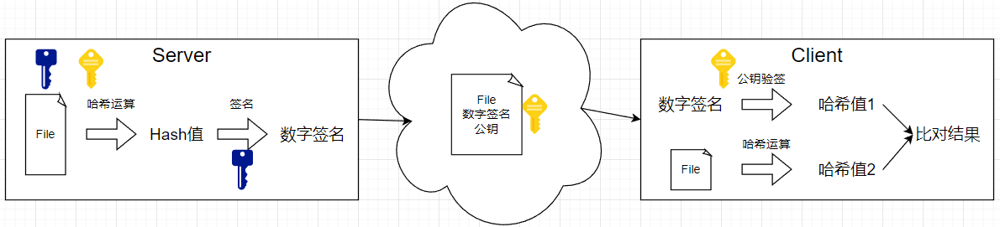
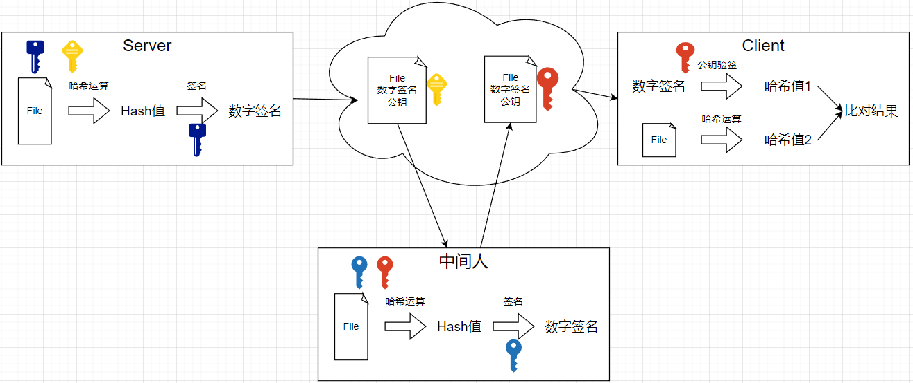
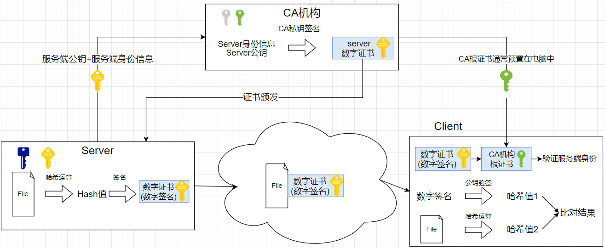

- [安全随机数](#安全随机数)
- [哈希算法](#哈希算法)
- [加解算法](#加解算法)
  - [加密方式](#加密方式)
  - [加密模式](#加密模式)
  - [对称加密](#对称加密)
  - [非对称加密](#非对称加密)
- [数字签名](#数字签名)
  - [中间人](#中间人)
  - [数字签名算法](#数字签名算法)
  - [数字签名方式](#数字签名方式)
- [数字证书](#数字证书)

[加解密工具类：hutool](https://www.hutool.cn/docs/#/crypto/%E6%A6%82%E8%BF%B0)

# 安全随机数
安全随机数：密码学意义上的安全随机数，指随机数具有不可预测性；
能够产生随机数的产生器，根据产生方式分为：物理随机数产生器、非物理随机数产生器；

# 哈希算法
哈希算法：将任意长度的数据数据，映射为固定长度的摘要、哈希值；
- 单向、不可逆算法；
- 主要用于完整性校验、数据比对等；
- 对于相同的输入，输出必须相同；不同的输入，输出相同概率尽可能小；(哈希冲突)

常见散列算法：
- 不安全：MD5、SHA0、SHA1
- 安全：SHA3、SHA256、SHA512

使用场景：
- 数据完整校验
  - 敏感数据比对：对敏感数据进行hash后存储，比对hash值来校验正确性；
  - 数字签名：用于校验数据是否被篡改；
- 用做索引
  - MySIAM使用哈希索引，仅适用于等值查询，范围查询无法使用Hash；
- 用作数据分片

# 加解算法

## 加密方式

- 分组加密(安全性高)：通过每次加密固定长度的明文来完成加密，一般按照bit位(64/128位)长度来进行分组，当不够一组时就需要进行填充，一般有5种填充方式：
- 流加密(安全性低)：不需要分组；连续不断地处理明文中的各个元素，每次加密一个元素；

## 加密模式
加密算法通常与加密模式搭配使用
分组加密有几个主流的工作模式：
- ECB模式(电子密码本模式)：为不安全的加密模式，禁止直接用于加密；相同的明文产生相同的密文；
- GCM模式：是目前业界推荐使用的对称加密算法工作模式；可以并行加密，效率高；并且提供了签名校验，可以校验密文完整性；
- CBC模式：目前比较模糊，不建议使用；串行的块加密模式，效率低；

## 对称加密

**加密解密都使用相同密钥**；
- 算法公开；
- 计算量小，加密速度快，效率高；
- 使用最普遍的加密方式，https在握手完成后，使用对称加密通信

常见算法:

- 安全加密算法：AES
- 不安全的加密算法：RC2、DES(不安全了)、3DES(3次DES，同样不安全)
- **安全的分组加密算法**：**AES-GCM > 128bit**

## 非对称加密

**加密和解密、签名和验签，使用不同的密钥**；
用于非对称加密、数字签名；加密效率比对称加密低；

- 公钥：使用公钥对数据进行加密；（建立连接的双方，公钥互相知道）
- 私钥：使用私钥对数据进行解密；（只有自己持有）

工作方式：

（1）双方互相持有对方的公钥；

（2）每次发送数据，使用对方的公钥进行加密；

（3）拿到数据的一方，用自己的私钥，即可解密；

常见算法
- RSA、DSA(仅用于签名，不可加解密)、ECIES(集成加密方案)

- **安全非对称加密算法**：RSA(≥3072 bits)/ECIES(> 256bits)

# 数字签名
使用数字签名保证数据不被篡改；

签名验签过程：

1、服务端将要传输的文件进行哈希运算 => 文件哈希值；

2、服务端使用私钥对哈希值进行签名运算 => 数字签名；

3、服务端发送文件、数字签名、公钥给客户端；

4、客户端拿到文件和服务端公钥，使用公钥进行验签，得到文件哈希值1；

5、客户端使用相同的哈希运算，得到文件哈希值2；

6、两个哈希值相同，则验签通过，数据未被篡改；否则验签失败；

## 中间人

中间人将数据截获，并使用中间人自己的公私钥进行签名，再使用中间人自己的公钥替换服务端的公钥，仍能保证数据在用户端验签的时候成立；

**数字签名无法保证公钥不被伪造，中间人能够伪造公钥**

**因此仍需要一个机制能够验证用户拿到的公钥，就是所请求的服务方的，即数字证书机制**

## 数字签名算法
- RSA
- DSA
- ECDSA

安全数字签名算法：RSA(≥3072 bits)/ECDSA(>=256 bits)

## 数字签名方式
1、自签名
- openssl
- 在线证书申请
2、CA认证

# 数字证书

数字证书由公认的、可信赖的证书颁发机构进行签名、颁发(CA机构)

1、服务端向CA机构提供身份信息 + 公钥，**由CA机构的私钥进行签名颁发证书**，证书内含有服务端的身份信息 + 公钥 + CA签名；
- 身份信息：公司、网站、域名等等信息；
- 公钥：服务器自己的公钥，CA机构会对其进行加密，放在证书中；

2、客户端在与服务端建立连接时，需要拿到服务端的证书，并使用**提前预置在操作系统**中的CA根证书对其进行验证，证明服务端的身份，保证证书不被伪造，即公钥不被替换；防止了中间人篡改；
- 重点：根证书预置在操作系统中，不需要网络就可以验证服务器证书；
- 根证书可以对服务器证书的公钥进行解密获取；安全的获取公钥；
