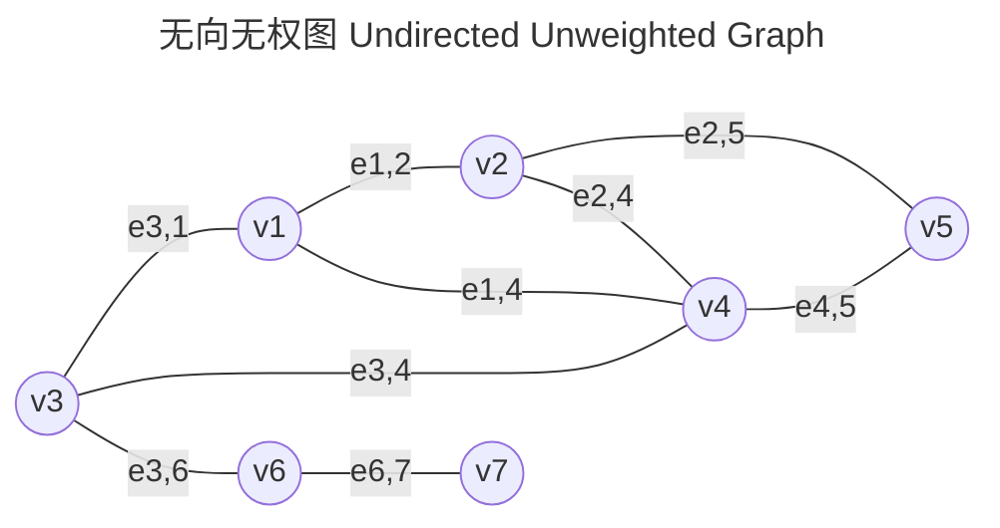
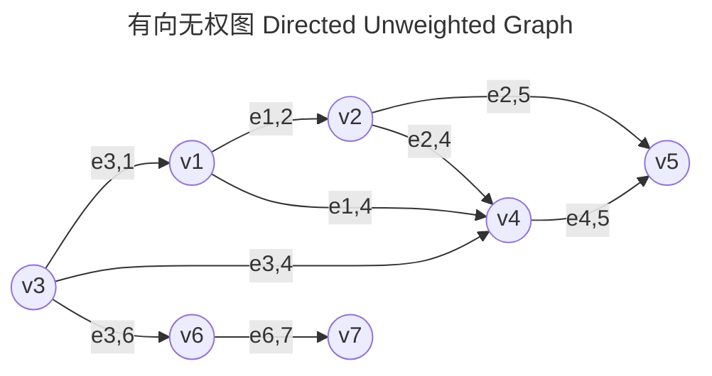
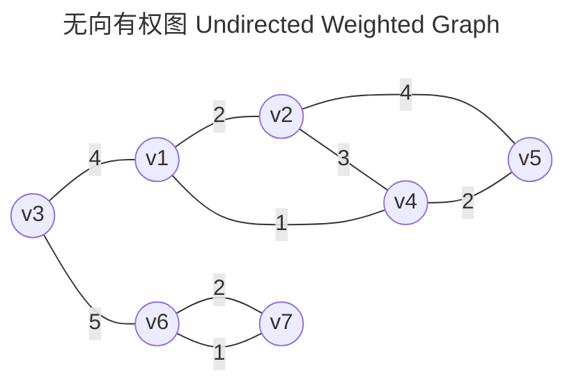
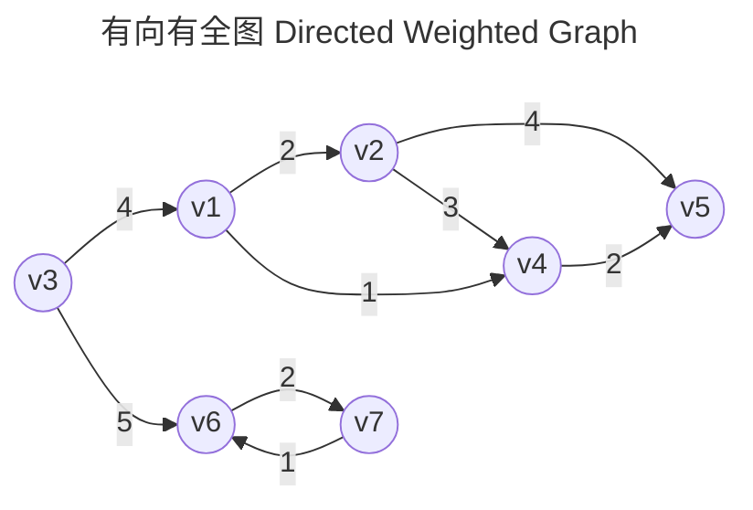
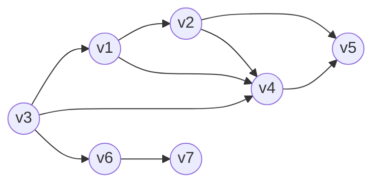

# 图的分类：方向+权重
- 无向：表示**双向**连通；
- 有向：表示**单向**连通；
- 权重：
	- 无向中：表示双向权重；
	- 有向中：表示单向权重；
---

# 图的表示方法
## 邻接表 Adjacency Matrix

每个顶点下用一个 **动态数组** 存储可以连接的其他顶点；
- 无向无权图的邻接表，仅表达连接关系；
- 邻接表可以对不同图，进行扩展，如：[[DS-Algorithm/Graph/1. 最短路径#邻接表|最短路径-邻接表表示]]

| Vertex | Neighbors |
| ------ | --------- |
| v1     | v2,v3,v4  |
| v2     | v1,v4     |
| v3     | v1,v4,v6  |
| v4     | v1,v2,v3  |
| v5     |           |
| v6     | v3,v7     |
| v7     | v6        |

## 邻接矩阵 Adjacency List
通过 **矩阵(二位数组)** 表达任意两个顶点间的连接、权重、方向；
- 对角线一般为0；
- 是否连接可以用：0/$\infty$(不连接)、1(连接)
	- 0/$\infty$的选择根据图的物理意义决定，如$\infty$可以代表两个节点距离无穷远(不连接)
- 权重大小使用大于1的值表示；
$$
\overset{\substack{\text{\large } \\ \text{}}}{
	\begin{array}{c|ll}
	&{v1}&{v2}&{v3}&{v4}&{v5}&{v6}&{v7}\\
	\hline
	{v1}&{0}&{1}&{1}&{1}&{0}&{0}&{0}\\
	{v2}&{1}&{0}&{0}&{1}&{0}&{0}&{0}\\
	{v3}&{1}&{0}&{0}&{1}&{0}&{1}&{0}\\
	{v4}&{1}&{1}&{1}&{0}&{0}&{0}&{0}\\
	{v5}&{0}&{0}&{0}&{0}&{0}&{0}&{0}\\
	{v6}&{0}&{0}&{1}&{0}&{0}&{0}&{1}\\
	{v7}&{0}&{0}&{0}&{0}&{0}&{1}&{0}\\
	\end{array}
}
$$
- 通过设定：col为From，row为To，来定义方向：v1--2-->v2；
$$
\text{From }
\overset{\substack{\text{\large } \\ \text{To}}}{
	\begin{array}{c|ll}
	&{v1}&{v2}&{v3}&{v4}&{v5}&{v6}&{v7}\\
	\hline
	{v1}&{0}&{2}&{0}&{1}&{3}&{0}&{0}\\
	{v2}&{0}&{0}&{0}&{10}&{0}&{0}&{0}\\
	{v3}&{1}&{4}&{0}&{1}&{0}&{3}&{0}\\
	{v4}&{0}&{0}&{7}&{0}&{0}&{0}&{0}\\
	{v5}&{0}&{9}&{0}&{0}&{0}&{0}&{0}\\
	{v6}&{0}&{0}&{1}&{0}&{0}&{0}&{1}\\
	{v7}&{0}&{0}&{0}&{0}&{0}&{2}&{0}\\
	\end{array}
}
$$

## 入度和出度
在有向图中：

- 入度：当前节点被指向的次数；
- 出度：当前节点指向的其他节点个数；

如：v4的入度为3，出度为1；
