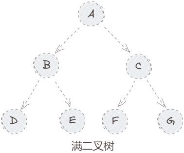
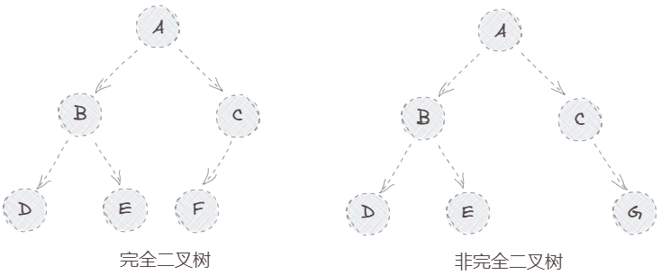
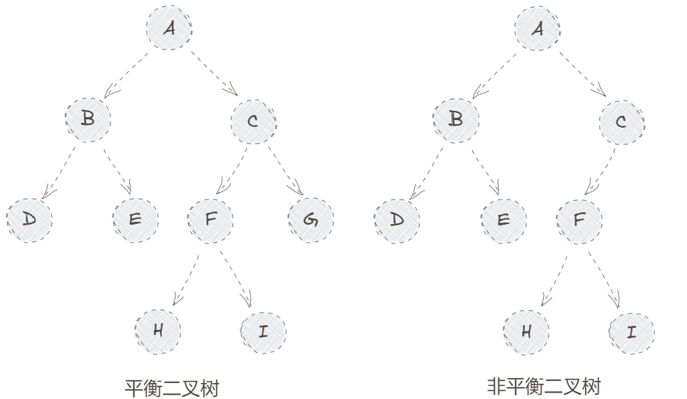
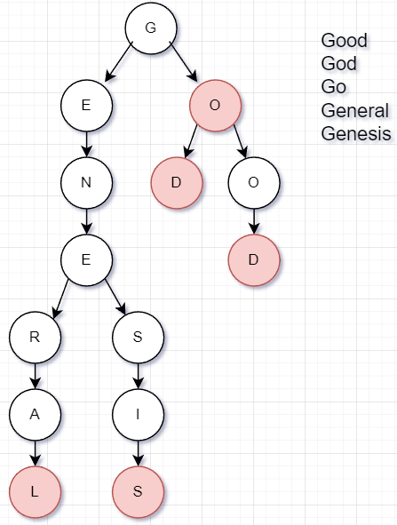

树是一种特殊的图：唯一起始顶点，其余顶点仅有一个前驱节点；
-   二叉树：每个节点有两个子树；
-   多叉树：每个节点可能存在多个子树；

# 二叉树

按照对二叉树的要求，从严格到宽松，可以对二叉树进行分类，拥有不同的特性；

## 满二叉树

## 完全二叉树(Heap)
1、左右子树最大高度差为1，即：除去最后一层节点为一棵满二叉树；
2、最后一层节点需从左到右分布；

堆：增加排序的完全二叉树，极值节点永远在根节点；
-   MaxHeap：每个节点的值大于子节点；
-   MinHeap：每个节点值小于子节点；

## 平衡二叉树
要求：左右子树最大高度差为1，即：除去最后一层节点为一棵满二叉树；
不要求节点分布顺序；

AVL树(自平衡二叉树)：当插入节点导致不平衡，通过左旋/右旋来保持平衡的二叉树；使得查询操作的复杂度稳定；
- 红黑树就是一棵AVL树；

# 多叉树

## Trie/Patricia Tree
`Trie树`：按照字典顺序，特化的多叉树；
- 将单词结尾标记为根节点(图中红色节点)
- 单纯的Trie每个节点保存一个字符，空间浪费，查找效率较低；

`Patricia Tree`：对Trie进行路径压缩后的字典树；
- 当出现某路径只有叶子节点，则进行合并；根节点单独一个字符；
- 节省空间，降低节点数量；
- 增加了插入的复杂度，插入时需要判断是否能够压缩；
- 当数据比较==稀疏==，数据之间重复占比很少，适合构建Patricia Tree；
	- 分叉的地方比较少，就比较稀疏，适合压缩成一个节点；
	- 每个字母都出现分叉，就不适合进行路径压缩；

## B树

## B+树

## B\*树

## 哈希树(Merkle Tree)
