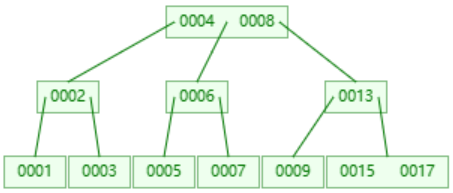
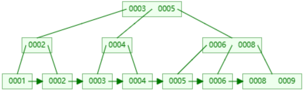

## B-Tree

B-Tree可以有更低的树高，查找效率更高；
但B-Tree有个很问题，**叶子节点不包含所有值**；
1、范围查找需要回溯；
2、同一个范围，可能涉及多个节点，这意味着可能会执行更多的IO；

## B+Tree

了解到前两个结构的痛点，再看B+Tree的特点：
1、**B+树的叶子节点包含全量索引**；意味着范围查询不需要回溯
2、B+树的叶子节点间是顺序关联的；
3、**顺序增加数据，是最高效的**；