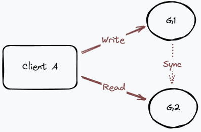

- [C：数据一致性(Consistency)](#c数据一致性consistency)
- [A：服务可用性(Availability)](#a服务可用性availability)
- [P：分区容错性(Partition-tolerance)](#p分区容错性partition-tolerance)
- [分布式系统下AC不可兼得](#分布式系统下ac不可兼得)
- [分布式系统一致性](#分布式系统一致性)
  - [强一致性：CP](#强一致性cp)
  - [弱一致性：AP](#弱一致性ap)
  - [最终一致性：AP](#最终一致性ap)

# C：数据一致性(Consistency)
  客户端，每次读，无论从哪个分布式节点读，都能读到最新的值；就是数据一致；
  
# A：服务可用性(Availability)
  客户端，想要访问服务，读取数据，能够访问，就是服务可用的；
  但是可能存在：在此节点上，访问的数据还未同步完成，服务依然要保证可用，就要放弃数据一致性；
  
# P：分区容错性(Partition-tolerance)
  就是高可用，分布式多节点下，保证高可用；一个节点挂了，还能保证服务可用；
  如果放弃分布式，就可以保证CA，服务可用和数据一致，都可以保障；
  一致性和可用性是不可兼得的：

# 分布式系统下AC不可兼得

就会发生下面的情况：
- G1写入数据完成，但未同步G2；
  - **保证可用性**：依然让ClientA能够从G2读取数据，但是读到旧数据；**损失一致性**；
  - **保证一致性**：让ClientA无法从G2读取数据，因为还没有同步完成；**损失可用性**；
- G1写入未完成，就要从G2读取数据；
  - 同上面两种情况；

如果前提是分布式，也就是说保证了P，就只能取舍C和A
- **CP架构**：一致性优先，强一致性；
  - Zookeeper、Etcd等采用CP架构；
- **AP架构**：可用性优先，弱/最终一致性；
	- 如Redis集群，使用异步来同步数据，是牺牲了数据一致性，优先保证最快响应；

# 分布式系统一致性

在CAP理论下的一致性，通常是指**多节点间的数据的读写一致性**；

## 强一致性：CP

对数据的修改，在任何时间任何节点不允许出现脏数据；必须在尽可能短的时间内，达到一致性，并且在达到一致性之前不能够对外提供服务；降低了可用性；

## 弱一致性：AP

1、对数据的修改，允许读取到脏数据；

2、并且对后续数据达到一致性的时间窗，也不做约束；允许丢数据；保证可用性；

## 最终一致性：AP

1、对数据的修改，在**一定的时间窗口**内，最终所有节点能够达到一致性；

2、如果无法确定时间窗，或无法达到要求，那就是退化成弱一致性；
