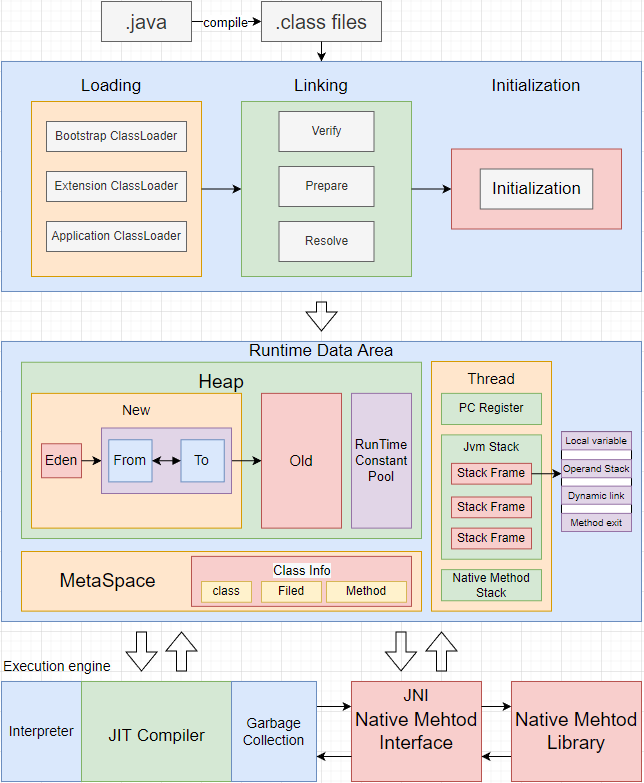
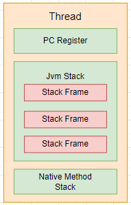
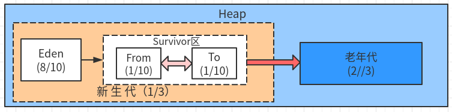
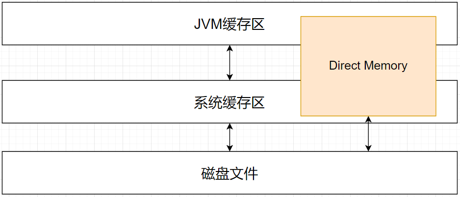

- [JVM整体结构](#jvm%E6%95%B4%E4%BD%93%E7%BB%93%E6%9E%84)

- [线程私有区](#%E7%BA%BF%E7%A8%8B%E7%A7%81%E6%9C%89%E5%8C%BA)

- [线程共享区](#%E7%BA%BF%E7%A8%8B%E5%85%B1%E4%BA%AB%E5%8C%BA)

  - [Heap](#heap)

    - [年轻代](#%E5%B9%B4%E8%BD%BB%E4%BB%A3)

    - [老年代](#%E8%80%81%E5%B9%B4%E4%BB%A3)

    - [字符串常量池](#%E5%AD%97%E7%AC%A6%E4%B8%B2%E5%B8%B8%E9%87%8F%E6%B1%A0)

    - [堆的内存分配方式](#%E5%A0%86%E7%9A%84%E5%86%85%E5%AD%98%E5%88%86%E9%85%8D%E6%96%B9%E5%BC%8F)

    - [老年代空间担保机制](#%E8%80%81%E5%B9%B4%E4%BB%A3%E7%A9%BA%E9%97%B4%E6%8B%85%E4%BF%9D%E6%9C%BA%E5%88%B6)

  - [方法区(Non-Heap)](#%E6%96%B9%E6%B3%95%E5%8C%BAnon-heap)

    - [元空间工作方式](#%E5%85%83%E7%A9%BA%E9%97%B4%E5%B7%A5%E4%BD%9C%E6%96%B9%E5%BC%8F)

    - [元空间特点](#%E5%85%83%E7%A9%BA%E9%97%B4%E7%89%B9%E7%82%B9)

  - [直接内存](#%E7%9B%B4%E6%8E%A5%E5%86%85%E5%AD%98)

    - [直接内存的分配和释放](#%E7%9B%B4%E6%8E%A5%E5%86%85%E5%AD%98%E7%9A%84%E5%88%86%E9%85%8D%E5%92%8C%E9%87%8A%E6%94%BE)

    - [直接内存相关JVM参数](#%E7%9B%B4%E6%8E%A5%E5%86%85%E5%AD%98%E7%9B%B8%E5%85%B3jvm%E5%8F%82%E6%95%B0)

- [相关问题](#%E7%9B%B8%E5%85%B3%E9%97%AE%E9%A2%98)

  - [为什么要分成新生代和老年代？](#%E4%B8%BA%E4%BB%80%E4%B9%88%E8%A6%81%E5%88%86%E6%88%90%E6%96%B0%E7%94%9F%E4%BB%A3%E5%92%8C%E8%80%81%E5%B9%B4%E4%BB%A3)

  - [为什么移除永久代，使用元空间](#%E4%B8%BA%E4%BB%80%E4%B9%88%E7%A7%BB%E9%99%A4%E6%B0%B8%E4%B9%85%E4%BB%A3%E4%BD%BF%E7%94%A8%E5%85%83%E7%A9%BA%E9%97%B4)

执行一个Java进程对应启动一个JVM进程；

Java虚拟机使用的是HotSpot虚拟机；18年oracle公开了GraalVM

# JVM整体结构

栈代表了处理逻辑，而堆代表了数据

# 线程私有区

每个线程运行时所使用的内存结构，包含：程序计数器、多个栈帧对应每次方法调用，其中包含一个活动栈帧，对应正在执行的方法，以及调用Native方法的本地方法栈；

- 垃圾回收不涉及栈内存；

- 且栈内存并不是越大越好；`-Xss 1024k`、`-Xss 1m`

- 栈帧内局部变量是线程安全的；

- **程序计数器**：记录当前线程下一条要执行的指令；

- **虚拟机栈**：用来存储局执行方法执行所需要的数据(生命周期跟随线程)；

  - 存储单元为**栈帧·**，每一个方法执行到结束，对应一个栈帧的入栈出栈

  - 每个栈帧：包含部变量表、操作数栈、动态链接、方法出口等信息

  - **局部变量表**：用来生成此方法所需要的所有局部变量，提前给定内存空间；(编译期确定)

    **操作数栈**：存储方法中的计算过程的中间结果；

    **动态链接**：指向常量池中的符号引用，如需要调用别的方法，就通过动态链接找到方法引用；

    **方法出口**

- **本地方法栈**：与虚拟机栈的作用类似，用于执行Native方法(非Java方法)；

  - 如Unsafe类，用于与操作系统交互；

  - Object下的`wait()`、`notify()`、`notifyAll()`都是Native方法；

# 线程共享区

## Heap

主要用于存放对象实例以及数组；(垃圾回收的主要区域)

- 年轻代

- 老年代

- **字符串常量池(JDK1.8)**：存放编译/运行时创建的字面量:`new String("xx")`

### 年轻代

目标：尽可能快速的收集掉那些生命周期短的对象，减少存入老年代的对象；

结构：Eden、Survivor(两个)

年轻代存储过程：

1、大多数新创建的对象都位于Eden内存空间中；

2、当Eden区满时，触发MinorGC，存活的对象被复制到Survivor区中的一个

(gc年龄初始为1)

3、之后每经历一次MinorGC，gc年龄+1(记录在对象头中)

(复制算法：对象从Survivor一个区移动到另一个区，并回收不可达对象)

4、gc年龄达到阈值仍存活的对象，则可进入老年代；

也可能由于空间不足，提前进入老年代，默认50%

即按照年龄排序后，超出50%的大年龄对象，会在MinorGC时移入老年代

### 老年代

目标：存储生命周期长的大对象(需要大量内存)，不会轻易触发MajorGC

根据使用的垃圾收集器不同，收集算法也不同；通常为FullGC；

如：MajorGC只有CMS收集器有，如果使用G1收集器，还会触发MixedGC；

### 字符串常量池

**字符串常量池(堆中)**：String Pool；专门为字符串开辟的内存空间；

- 当需要创建字符串常量时，先看字符串常量池有没有该字符串；存在则使用；

- 不存在，则实例化要创建的字符串，并放入池中；

- **字符串常量池不会参与GC；常驻内存；**

### 堆的内存分配方式

JVM使用不同的垃圾收集器，堆内存的分配方式也不同：

1、指针碰撞：使用带有整理的算法收集器，采用此分配；堆内存规整；(Serial、Parallel)

2、空闲列表：使用基于清除的算法，采用此分配，有内存碎片，不规整；(CMS)

3、本地线程分配缓存(TLAB)：G1

### 老年代空间担保机制

MinorGC触发时，会检测：

1、老年代空闲内存是否大于年轻代对象总和？

如果大于，则正常执行MinorGC，如果小于，则判断第二个条件：

2、老年代空闲内存是否大于之前每次MinorGC后进入老年代的总对象的平均大小

如果大于，则正常执行MinorGC，如果小于，则执行FullGC

## 方法区(Non-Heap)

方法区是虚拟机规范中定义的一个抽象概念，虚拟机规范中也并没有规定方法区一定要在堆内存中，不同的虚拟机的方法区有不同的实现方式；

Hotspot虚拟机的实现：

- 永久代(JDK7)：堆内存；**包含：类的元信息、常量池、静态变量；**

- 元空间(JDK8)：堆外本地内存；**包含：类的元信息；(常量池、静态变量存放在堆中)**

### 元空间工作方式

**元空间**存储：

**class文件常量池**：已经被虚拟机加载的类的元数据信息：类名、方法、字段信息、字节码；

- [符号引用](./13_%E7%AC%A6%E5%8F%B7%E5%BC%95%E7%94%A8%E5%92%8C%E7%9B%B4%E6%8E%A5%E5%BC%95%E7%94%A8.md#%E7%AC%A6%E5%8F%B7%E5%BC%95%E7%94%A8)就是字符串；

- 直接引用，可以被程序识别的内存地址；

**运行时常量池**：每个类都有一个运行时常量池；从class常量池中构建的运行时使用的**常量引用和符号引用**；

### 元空间特点

- \***不占用JVM内存，占用本地内存**

- 为每一个类加载器分配一块内存，此内存与对应的类加载器生命周期相同

- **元空间默认不会卸载Class，只会通过FullGC来回收元空间中不再使用的class信息**(对应的类加载器已死)

## 直接内存

- 不受JVM管理；

- 回收成本高，读写性能高，少一次内存拷贝；常用于数据缓冲，如NIO的ByteBuffer；

- 直接内存也会内存溢出：`java.lang.OutOfMemoryError: Direct buffer memory`

### 直接内存的分配和释放

直接内存不由GC管理，由`Unsafe`类进行管理

- 直接内存手动分配：`unsafe.allocateMemory()`

- 直接内存手动释放：`unsafe.freeMemory()`

---

当ByteBuffer被GC回收时，其使用直接内存也会被释放，但并不是GC回收了直接内存

直接内存的自动释放，是由一个`Cleaner`虚引用完成的；

`ByteBuffer`内有一个`Cleaner`引用，当GC触发，Cleaner虚引用就会被回收，从而触发直接内存的释放；

### 直接内存相关JVM参数

1、`-XX:+DisableExplicitGC`：禁止显式调用GC

- **禁止使用此参数**，会导致直接内存无法回收，会造成直接内存长时间得不到释放；

- 一定要手动释放内存，请使用`Unsafe`

# 相关问题

## 为什么要分成新生代和老年代？

不同的对象的生命周期是不一样的。因此，不同生命周期的对象可以采取不同的收集方式，以便提高回收效率。

1、如果不考虑GC性能的话，完全不需要新生代，全部对象创建在一个区域，一起回收即可；

2、因为每次回收都需要遍历所有存活对象，对于生命周期长的对象而言，这种遍历是没有效果的，他们依旧存在

## 为什么移除永久代，使用元空间

即：为什么元空间不占用Heap内存？

1、类的元数据内存回收调优困难

2、程序运行过程中，动态加载频繁，如果动态加载类太多，容易OOM；不放入堆区，可以不限制其内存；