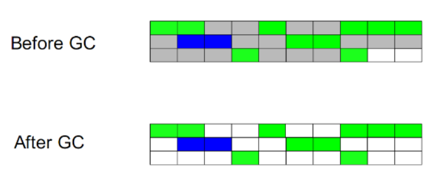
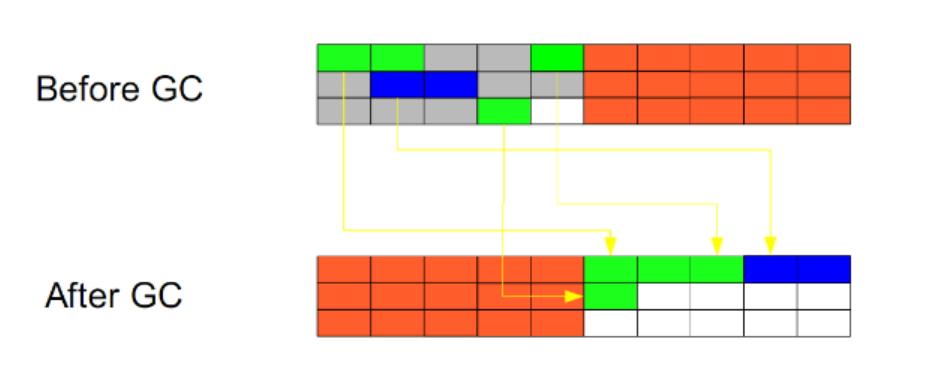
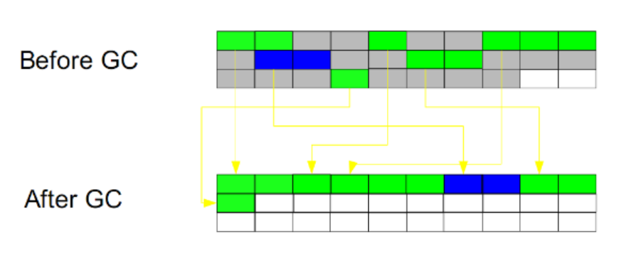

- [内存管理](#内存管理)
  - [空闲列表(堆内存不规整的方法)](#空闲列表堆内存不规整的方法)
  - [指针碰撞(堆内存规整的方法)](#指针碰撞堆内存规整的方法)
  - [TLAB](#tlab)
- [GC分类](#gc分类)
- [判断对象已死](#判断对象已死)
  - [1. 引用计数算法](#1-引用计数算法)
  - [2. 可达性分析算法](#2-可达性分析算法)
  - [GC Roots对象](#gc-roots对象)
- [三色标记算法](#三色标记算法)
  - [三色标记算法缺陷](#三色标记算法缺陷)
- [Java对象的引用类型](#java对象的引用类型)
- [GC算法](#gc算法)
  - [标记-清除](#标记-清除)
  - [复制算法](#复制算法)
  - [标记-整理](#标记-整理)

# 内存管理

## 空闲列表(堆内存不规整的方法)

在不规整的剩余空间中分配内存。如果剩余内存是不规整的，就需要用一个列表记录下哪些内存块是可用的，当需要分配内存的时候就需要在这个列表中查找，找到一个足够大的空间进行分配，然后在更新这个列表。

- CMS垃圾收集器采用这种管理方式，不需要整理内存，
  
## 指针碰撞(堆内存规整的方法)

在连续剩余空间中分配内存。用一个指针指向内存已用区和空闲区的分界点，需要分配新的内存时候，只需要将指针向空闲区移动相应的距离即可。

- 是一种线性分配方式；
- 在分配对象时，计算出对象大小，再使用CAS轻量锁保证多线程下的内存安全(多个线程同时创建对象)；
  
## TLAB
Thread Local Allocation Buffer：线程本地分配缓存区

多线程下使用单一指针分配内存，CAS不断重试，效率比较低；

因此TLAB的分配方式是：为每个线程分配一片内存，每个线程创建对象互不干扰，分配的内存满或者达到阈值，再分配新的内存；

# GC分类

一共四种GC分类：MinorGC、MajorGC、FullGC、MixedGC

- **MinorGC**：年轻代GC，Eden区满触发、FullGC会同时触发MinorGC；

- **MajorGC**：单独的老年代GC，仅CMS收集器有；

- **FullGC**：针对年轻代、老年代、元空间，导致系统卡顿；

- **MixedGC**：G1收集器特有，一旦老年代内存到达45%触发MixedGC。对年轻代、老年代进行垃圾回收；
  
  (-XX:InitiatingHeapOccupancyPercent配置)

# 判断对象已死

要进行垃圾收集，首先需要判断对象是否已经没用，才能进行收集。

在主流的程序语言（Java、C#）中，都是使用**可达性分析算法**来判断对象是否存活，还有一种叫做**引用计数算法**，但是Java没有使用它。

## 1. 引用计数算法

一个对象，增加一个引用，就增加一个计数，删除一个引用，就减少一个计数。

- 此算法效率高，实现简单。Redis使用此方法管理内存；
- 垃圾回收时，只用收集计数为0的对象。此算法最致命的是**无法处理循环引用**的问题。

循环引用：

现在有两个对象objA、objB；都有字段instance，且objA.instance=objB，objB.instance=objA

这样两个对象：objA、objB，互相引用对方的实例，则无法使用此算法进行回收。

## 2. 可达性分析算法

基本思路：通过一系列的称为“GC Roots”的对象作为起始点，从这些节点向下搜索，搜索所走过的路径成为引用链，如果没有引用链到达GC Roots对象，那么就被认为是可以回收的对象。

并发场景下存在多标、漏标问题，因此G1并发收集使用三色标记；

## GC Roots对象
可以作为GC Roots对象：
- 元空间的Class对象
- 方法区中类静态属性引用的对象；
- 方法区中常量引用的对象；
- 虚拟机栈引用的对象；(即线程引用的对象)
- 本地方法栈引用的对象；

以上对象都是正在使用的对象，不可以回收；

即使对象不可达，也不是立即回收；

对象会被执行`finalize()`方法，之后被放入一个队列，触发一个低优先级的线程去执行最终的回收；

# 三色标记算法

- 白色：未被扫描到的对象；GC开始前，所有对象都标记为白色；
- 灰色：被扫描可达的对象，但是其引用还未进行扫描；
- 黑色：被扫描可达的对象，并且其引用都可达(存活)；

1、**GC开始，所有对象标记为白色**；

2、开始从GC Roots遍历；**直接引用的对象标记为灰色**；

3、再判断灰色对象，**是否存在子引用**；
- 不存在，则将其标记为黑色；
- 存在：将其子引用再标记为灰色；

4、递归执行，直到没有灰色对象；清理所有白色对象；

## 三色标记算法缺陷

1、**浮动垃圾**：并发标记过程中，可能黑色、灰色对象再次变成垃圾；无法重新标记为白色；**这个问题只会造成收集不彻底，不会引发程序错误**；

2、漏标问题：并发标记过程中，已经标记为白色的对象，又再次变成被黑色对象引用；**如果将其清除，会引发程序错误**；

因此：漏标问题，需要进行处理；
- CMS：增加一个增量标记操作；
- G1：SATB算法

# Java对象的引用类型

**强引用**：即便内存不足也不能回收这类对象；
- `Object obj = new Object();`

**软引用**：内存充足时，触发GC也不会回收；内存不足时，回收；

**弱引用**：只要GC，就会回收此类对象；即弱引用不会被GC Roots对象关联；

**虚引用**：可以认为是没有引用，唯一作用是回收此类对象时，触发系统通知；虚引用也不会被GC Roots对象关联；

# GC算法

## 标记-清除

此方法分为两个阶段：

- 先标记所有可达的对象
- 遍历整个堆，把没有标记的对象清除

**此方法需要暂停整个应用，不会压缩堆，同时，还会产生内存碎片**

剩余内存是不规整的，就需要用一个列表记录下哪些内存块是可用的，当需要分配内存的时候就需要在这个列表中查找，找到一个足够大的空间进行分配，然后在更新这个列表

## 复制算法

此算法把内存空间划为两个相等的区域，每次只使用其中一个区域。

垃圾回收时，遍历当前使用区域，把正在使用中的对象复制到另外一个区域中。

同时复制过去以后还能进行相应的内存整理，不会出现“碎片”问题。

**缺点：需要两倍的内存空间**

## 标记-整理

此算法结合了“标记-清除”和“复制”两个算法的优点。

分两个阶段：

- 第一阶段从根节点开始标记所有被引用对象
- 第二阶段遍历整个堆，清除未标记对象并且把存活对象“压缩”到堆的其中一块，按顺序排放。

**此算法避免了“标记-清除”的碎片问题，同时也避免了“复制”算法的空间问题**。