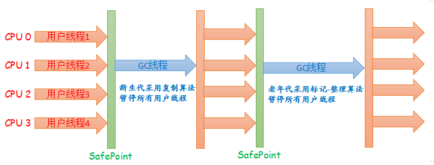
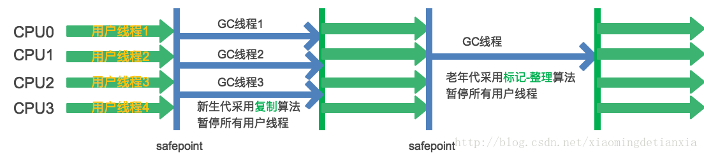
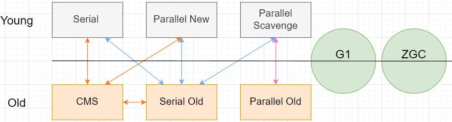

# Serial/SerialOld

单线程串行收集器，简单高效

- Serial：复制算法收集年轻代；
- Serial Old：标记-整理收集老年代；

行为：

1、必须暂停其他所有的工作线程，直到它收集结束(Stop The World)

2、Client模式下，新生代的默认收集器。

在用户场景下，JVM管理的内存不会很大，Serial收集器在整理200M以内的内存，可以控制在100ms以内，可以接受。

# ParallelNew/ParallelOld

多线程收集器

- ParNew：复制算法收集新生代；
- ParallelOld：标记-整理收集老年代；

默认开启的线程数量与CPU核数相同，可以使用`-XX:ParallelGCThreads`参数来设置线程数；

# ParallelScavenge

针对年轻代的多线程收集器，使用复制算法；

目的：与ParallelNew关注点不同，尽可能缩短垃圾收集时用户线程的停顿时间；

吞吐量优先：CPU用于运行用户代码的时间占总时间的比值。

控制最大垃圾收集停顿时间：`-XX:MaxGCPauseMillis`

直接设置吞吐量大小：`-XX:GCTimeRatio`

# 收集器组合搭配

年轻代和老年代的垃圾收集器并不可以随意搭配，如CMS就不能和ParallelScavenge搭配；

以下为一些常用的搭配：

## Parallel GC

并行GC的模式下，有两种搭配方式：

1、`Parallel Scavenge` + `Serial Old(PSMarkSweep)`

开启参数：`-XX:+UseParallelGC`

2、`Parallel scavenge` + `Parallel Old`

开启参数：`-XX:+UserParallelOldGC`

