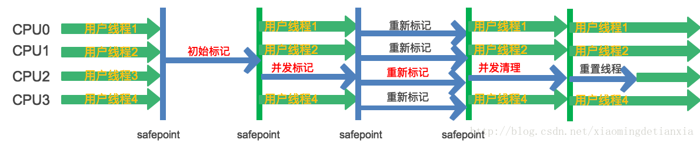

- [CMS](#cms)
- [收集流程](#收集流程)
- [缺点](#缺点)

# CMS
JDK9标记弃用，JDK14正式弃用；

Concurrent Mark Sweep：并发标记—清除算法：并发收集，低停顿；

- CMS仅是老年代垃圾收集器；
- 年轻代会搭配：Parallel New收集器 / Serial收集器；

# 收集流程

1、初始标记：STW；仅仅标记 GC Roots 能直接关联到的对象，速度很快；

2、并发标记：进行 GC Roots Tracing 的过程，它在整个回收过程中耗时较长，不需要停顿；
- 进行[三色标记](./05_垃圾回收.md#三色标记算法)
- **并发标记期间，新晋老年代对象、引用发生变化的对象，都会被标记为Dirty；**
  
3、重新标记：STW；修正并发标记期间用户程序又产生的新的引用、新的对象(即上一步标记的Dirty对象)；
- **只关注Dirty对象，继续使用三色标记进行标记**
- 完成之后，清除Dirty标记；
  
4、并发清除：不需要停顿，耗时略长，直接清理所有的**白色标记对象**；

# 缺点
1、**CMS垃圾收集器在垃圾收集过程中的CPU使用率高**

2、会以抢占的方式执行GC线程，抢占用户线程资源；

- 吞吐量低：低停顿时间是以牺牲吞吐量为代价的，导致CPU利用率不够高；
- 在并发清除时，用户线程仍会产生垃圾，这些CMS无法处理；
- 收集算法导致：会产生内存碎片