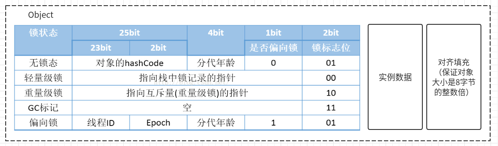

- [对象创建的过程](#对象创建的过程)
    - [1.类加载检查](#1类加载检查)
    - [2.分配内存](#2分配内存)
    - [3.设置初始值(零值)](#3设置初始值零值)
    - [4.设置对象头](#4设置对象头)
    - [5.执行init方法(构造器)](#5执行init方法构造器)
- [对象内存结构](#对象内存结构)
  - [1. 对象头](#1-对象头)
  - [2. 实例数据](#2-实例数据)
  - [3. 对齐填充](#3-对齐填充)
- [对象内存占用](#对象内存占用)

# 对象创建的过程

### 1.类加载检查

虚拟机遇到一条 new 指令时，会检查这个符号引用代表的类是否已被加载过、解析和初始化过。如果没有，那必须先执行相应的类加载过程。

### 2.分配内存

在类加载检查通过后，接下来虚拟机在Heap区域将为新生对象分配内存。

分配方式基于当前使用的垃圾收集器；

[Jvm-内存管理](./05_垃圾回收.md#内存管理)

### 3.设置初始值(零值)

内存分配完成后，虚拟机需要将分配到的内存空间都初始化为零值

### 4.设置对象头

初始化零值完成之后，虚拟机要对对象进行必要的设置，例如这个对象是那个类的实例、如何才能找到类的元数据信息、对象的哈希吗、对象的 GC 分代年龄等信息。

这些信息存放在对象头中。 

### 5.执行init方法(构造器)

在上面工作都完成之后，从虚拟机的视角来看，一个新的对象已经产生了，但从 Java 程序的视角来看，对象创建才刚开始。

继续执行方法，把对象按照程序员的意愿进行初始化，这样一个真正可用的对象才算完全产生出来。

# 对象内存结构

参考：[对象头创建、对象头、对象锁、synchoronized底层实现](https://blog.csdn.net/smileiam/article/details/80364641)

## 1. 对象头

1、第一部分为：**Mark Word** 用于存储对象自身的运行时数据，如哈希吗、GC分代年龄、锁标记位；64位操作系统下占 8 字节，32位操作系统下占 4 字节；

- hash: 对象的哈希码
- age: 对象的分代年龄；4bit，最大15；
- biased_lock: 偏向锁标识位
- lock: 锁状态标识位
- JavaThread: 持有偏向锁的线程 ID
- epoch: 偏向时间戳
  
2、第二部分用于存储指向方法区对象类型数据的指针。即是对象指向它的类的元数据的指针，虚拟机通过这个指针来确定这个对象是哪个类的实例。如果对象是一个Java数组，那在对象头中还必须有一块用于记录数组长度的数据。
     
- 在开启指针压缩的状况下占 4 字节，未开启状况下占 8 字节；
 
3、第三部分只有数组存在，存放数组长度信息；

- 占用4字节；

## 2. 实例数据

实例数据部分存储程序定义的对象的有效信息；

## 3. 对齐填充

用于占位，保持对象大小为8字节的整数倍；
  
> HotSpot虚拟机的自动内存管理系统要求对象起始地址必须是8字节的整数倍，即对象大小必须是8字节的整数倍。而对象头正好是8字节的整数倍，而对象实例数据部分没有对齐，需要通过对齐填充来补全。

# 对象内存占用

https://www.cnblogs.com/rickiyang/p/14206724.html

Java对象内存数据包含：对象头 + 实例数据 + padding填充字节

对象头比较固定：12字节 = 4 + 4 （+ 4）

padding填充看对象是否是8的整数倍；

主要就是对象的实例数据，分为两种：
- 基本数据类型

| 类型    | 占用空间(byte) |
| ------- | -------------- |
| boolean | 1              |
| byte    | 1              |
| short   | 2              |
| char    | 2              |
| int     | 4              |
| float   | 4              |
| long    | 8              |
| double  | 8              |

- 引用类型：32位系统上占用 4 byte，64位系统上占用 8 byte(未压缩的情况下)

一个对象内存占用实例：
```shell
org.example.OrderModel object internals:
 OFFSET  SIZE                    TYPE DESCRIPTION                     VALUE
      0     4                         (object header)                 05 00 00 00 (00000101 00000000 00000000 00000000) (5)
      4     4                         (object header)                 00 00 00 00 (00000000 00000000 00000000 00000000) (0)
      8     4                         (object header)                 42 c1 00 f8 (01000010 11000001 00000000 11111000) (-134168254)
     12     4   org.example.UserModel OrderModel.userInfo             (object)
     16     8                    long OrderModel.orderId              123456456789
     24     4        java.lang.String OrderModel.orderInfo            (object)
     28     4        (loss due to the next object alignment)
Instance size: 32 bytes
Space losses: 0 bytes internal + 4 bytes external = 4 bytes total
```
总大小：32 bytes(未包含引用的UserModel对象的大小)

- 对象头
- 实例数据
  - UserModel对象字段：引用类型，占4byte；
  - orderId：long基本数据类型，占8byte；
  - orderInfo：String引用类型，占4byte；
- 对齐填充：4byte


