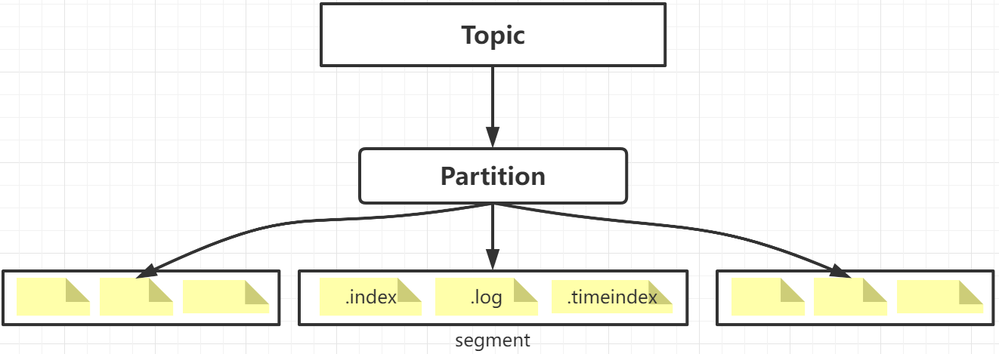
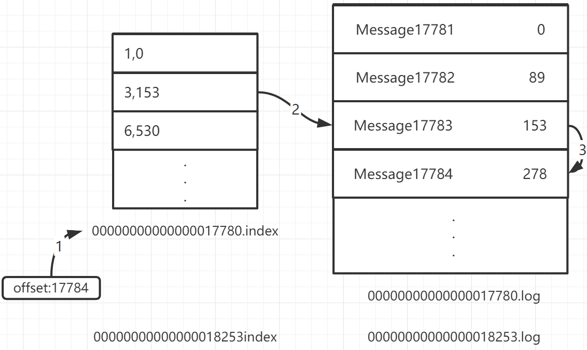

- [存储结构和消息寻址](#存储结构和消息寻址)
  - [segment结构](#segment结构)
  - [消息寻址](#消息寻址)

# 存储结构和消息寻址

## segment结构

Kafka的Topic分多个Partition来提高并行度，每个Partition又由多个Segment构成，实现消息存储；

每个Segment段分为：`.index` + `.log` + `.timeindex`
- `.log`文件：采用**追加写**的方式，追加到1G大小，生产一个新的Segment；
- `.log`文件：记录每一条消息的元数据，包括在此文件内的偏移地址，创建时间，消息存储的物理地址；
- `.index`文件(稀疏索引)：log日志每追加4kb，在index中记录追加的消息起始偏移量、起始position；
- `.index`文件：用于通过offset进行索引消息；会以最小offset命名；
- `.timeindex`文件：用于通过时间戳进行索引消息；

## 消息寻址

寻址主要通过下面几个参数：
- `.index` [消息偏移量，position指针]，position指向.log的position
- `.log`   [消息offset，position指针]

假设查找offset：177854消息寻址过程：(二分搜索)

1. 搜索到17784在[17780-18253]之间，就锁定了以17780为起始的segment(.index文件)
   
2. 根据`.index`记录，找到offset的偏移位置区间，17783在17780+3~6的偏移位置之间，因此锁定指针153
   
3. 在`.log`文件中从153开始向下顺序查找，找到offset 17784消息
   
4. 从磁盘读取并发送此条消息(零拷贝)

