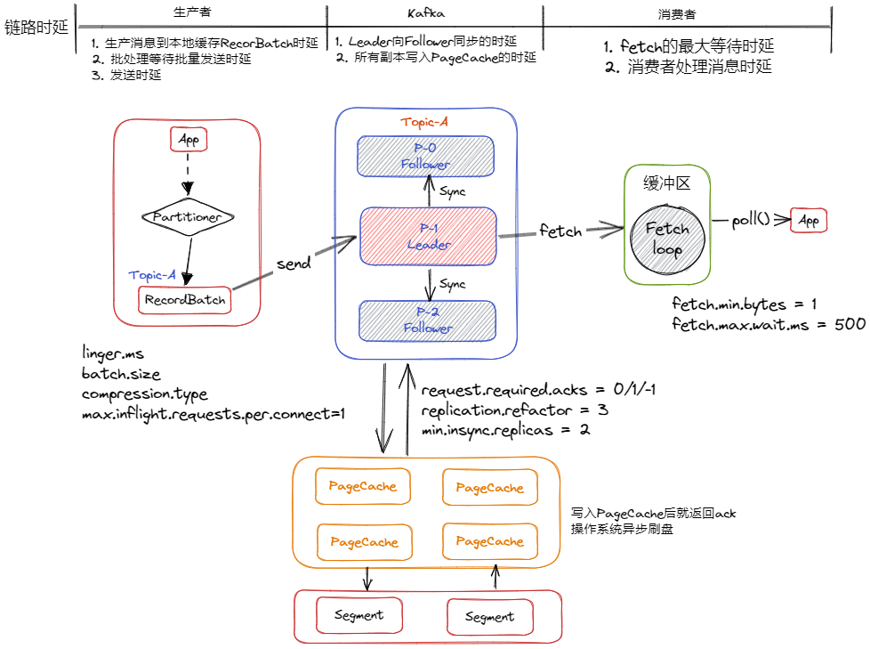

- [全链路读写时延](#全链路读写时延)
- [消息写入过程](#消息写入过程)
- [消息读取过程](#消息读取过程)

# 全链路读写时延


Producer：
- `linger.ms`：发送等待时延，如果缓冲区有数据，超过这个时间，则发送；
- `batch.size`：批量发送个数；超出则发送；
- `compression.type`：消息压缩方式；默认不压缩；有：`gzip`、`snappy`等压缩策略；
- `max.inflight.requests.per.connect=1`：等待Partition响应的请求个数；如果Partition未响应个数超过这个，生产者端需要等待；

Broker：
- `request.required.acks` = 0/1/-1：ACk机制；
- `replication.refactor = 3`：副本个数；
- `min.insync.replicas = 2`：ISR个数；

Consumer：
- `fetch.min.bytes = 1`：如果等待消息过久允许的最小拉取的数据量；
- `fetch.max.wait.ms = 500`：等待消息的最大时延；
- `max.poll.records = 500`：消费者批量拉取消息数量；默认500；
- `enable.auto.commit = true`：自动提交；
- `auto.commit.interval.ms = 5000`：自动提交间隔；

# 消息写入过程
1、生产者将消息封装为`Record`，发送消息到客户端缓冲区，并暂存在`ProducerBatch`的`RecordBatch`中；每个RecordBatch存储==16KB==的消息；通过下面两个配置，决定发送触发时机：
- `linger.ms`：批量发送最大时延；
- `batch.size`：批量发送大小；

```java
public class ProducerRecord<K, V> {
    private final String topic; // 指定Topic
    private final Integer partition;  // 指定partition
    private final Headers headers;
    private final K key;    // 消息key
    private final V value;  // 消息体
    private final Long timestamp;   // 消息时间戳
    // ...
}
```

2、当RecordBatch写满/超时会触发**send()子线程**，**批量**将数据发送到对应Partition的Leader中；

3、Leader再向Follower进行消息同步；同步完成响应生产者ack；此时所有消息都只是再内存中的PageCache(4k)上；

4、脏页的落盘**由操作系统异步定时执行**，**顺序写入磁盘**中；


# 消息读取过程


1、消费者指定要读取的消息offset

2、kafka从**PageCache**读取消息，如果有则直接返回；如果没有，则需要通过磁盘IO读取；

3、从磁盘读取的时候，会发生**磁盘预读**，一次读取更多的页；

4、后续消费者继续消费，就可以直接从PageCache中读取，不发生磁盘IO操作；更高效；

关键点：
- 预读：一次读取多个页，并且消息是顺序写入的，此时就可以顺序读取；
- mmap函数的内存映射空间，减少上下文切换，提高读写效率；
- CPU零拷贝，直接从内核态，将数据拷贝至Socket缓冲区；减少复制到用户态的消耗；

详见：[DMA技术](../../OS/DMA%E6%8A%80%E6%9C%AF.md)
