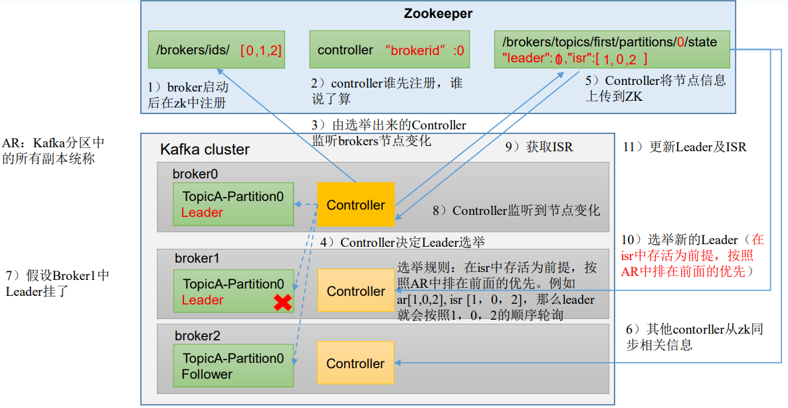

# zookeeper作用
kafka的Partition的副本，都有controller进行监控；
同时zk中对应节点：
```shell
/kafka/brokers/topics/[topic_name]/partition/[partition_id]/state
```
每个副本下都有ISR信息，与zk之间保持心跳，监控ISR和leader信息；
当leader下线，会被zk踢出ISR队列，其他副本的controller通过zk监听到leader下线，会根据选举规则，按照ISR顺序选举靠前的副本作为leader； 

# Broker—Controller

每个kafka集群都有一个Controller，负责管理和协调集群：
- 负责创建、删除和修改Topic，同时跟踪和维护每个Partition的状态；并通过广播通知其他Broker；
- Broker故障检测；
- Partition的Leader选举

Controller的选举发生在：集群启动、Controller下线、Controller数据变更；

## 集群启动
1、集群启动时，所有Broker会在zk上抢占注册Controller；只有一个Broker能够成功在zk上创建临时节点(`/controller`)，此Broker成为集群的Controller；

2、ZooKeeper会将这个信息广播给所有的Broker节点。其他Broker节点接收到消息后，会更新自己的元数据信息，将新Controller的信息更新到对应的数据结构中。

## Controller重新选举

1、集群中的broker会定期通过心跳，检测Controller的健康状态；

2、当发现无法收到Controller的心跳时，会通知zk表明Controller不可用；同时会发起选举请求，尝试创建Controller临时节点；

3、当某个Broker创建成功，zk会广播此消息到其他Broker，并更新元数据；之后恢复集群对外服务；

# Parition-Leader选举过程

Partition的Leader选举由Controller完成；

## 选举过程

0、Follower和Leader在保持连接的过程中，会定期向Leader发送心跳信息，如果Follower在一定时间内未收到Leader的心跳响应，就认为Leader可能失效；Follower会尝试与其他Follower通信，确认Leader是否下线；

1、当Follower确认Leader已经下线，会发起Leader选举，向其他的Follower发起Leader选举请求，并携带自己的最新的副本数据；

2、Broker选举出Leader的条件：
- 候选者必须是ISR队列中的副本；
- 后选择拥有的最新的副本数据；会优先选择数据最新的副本；

3、当Leader选中后，其他Follwer会向新Leader进行数据同步，拉取缺失的消息；

4、当同步到最新数据，Leader就继续读写工作，对外提供服务；


# Zk和Raft

Kafka 2.8之后使用自管理的Quorum代替ZooKeeper管理元数据；
