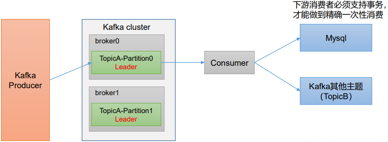

- [消费方式](#消费方式)
- [消费者和Partition数量关系](#消费者和partition数量关系)
- [消费流程](#消费流程)
  - [GroupCoordinator](#groupcoordinator)
  - [可配置的参数](#可配置的参数)
  - [消费分配策略](#消费分配策略)
- [消费者保证不丢失消息](#消费者保证不丢失消息)
- [消费失败处理](#消费失败处理)
- [消费者保证消费幂等](#消费者保证消费幂等)
  - [重复消费场景](#重复消费场景)
  - [避免重复消费](#避免重复消费)
- [精准一次 = 消费者事务 + 幂等](#精准一次--消费者事务--幂等)
- [数据积压](#数据积压)
- [处理积压问题](#处理积压问题)
  - [上线前做好压测](#上线前做好压测)
  - [如果生产中数据积压](#如果生产中数据积压)
  - [事后排查优化](#事后排查优化)
- [消费顺序](#消费顺序)

# 消费方式
Kafka采用**Pull**的方式，消费者主动轮询拉取消息；
- 好处：对消费端更友好，能根据消费能力，拉取消息；
- 坏处：没有消息，也会一直轮询，占用CPU；

# 消费者和Partition数量关系

**一个消费者，可以消费多个Partition；一个Partition只能被同组一个消费者消费，可以被不同组多个消费者消费；**

同组内消费者(C)，与同一个Topic的Partition(P)的数量关系：
- 当C < P，就存在某消费者消费多个Partition；
- 当C = P，效率最高，最大并行度；
- 当C > P，多余的消费者，不会消费这个Topic数据；

# 消费流程

## GroupCoordinator

GroupCoordinator是Kafka多种协调者中的一种，专门用于管理维护消费者组内的offset提交、join_group、syn_group、心跳等消费者相关内容；

以下前提是组管理：(也可以不用组，直接消费者连接)

1、消费者上线，向Coordinator发送JoinGroup请求，加入到群组当中；

2、Server端每个Partition有一个Coordinator协调器，由协调器选出群组的消费者Leader；这个协调过程是由Leader-Partition的协调器完成；

3、选出C-Leader后，Leader-Partition的协调器将消费的Topic信息，发送给C-Leader，C-Leader来指定消费方案；(pull模式)

4、消费方案确定后，返回给Leader协调器，再下发给所有的消费者；

5、至此开始按照方案消费；

6、每个消费者都和Leader-Partition的协调器保持心跳；一旦超时，触发再平衡

## 可配置的参数
`partition.assignment.strategy`：分区策略，多个策略可以组合；
- 如果设置，指定此参数的value为：org.apache.kafka.clients.consumer下的xxxxAssignor；
  
`heartbeat.interval.ms`：心跳间隔；超出则认为下线；触发再平衡，默认3s

`max.poll.interval.ms`：消费者处理消息时长，超出则认为下线，触发再平衡

`session.timeout.ms`：消费者和协调器间的连接超时时间；默认45s

## 消费分配策略
- RangeAssignor：partitions/consumers 按照范围分配；
  - 按照字母顺序，依次分配；
  - 如果不是正好平均，就会数据倾斜；
  - 触发再平衡，则重新计算；
- RoundRobin：依次轮流分配；
  - 触发再平衡，则重新计算；
- Cooperative Sticy：粘性分配；
  - 尽量均匀的分配；
  - 消费者变动时，尽量保留现有的分配方式减少重新分配的Partition数量；
  
由参数：`partition.assignment.strategy`决定，value配置对应的消费分配策略实现：
```
org.apache.kafka.clients.consumer.RangeAssignor
org.apache.kafka.clients.consumer.RoundRobinAssignor
org.apache.kafka.clients.consumer.StickyAssignor
org.apache.kafka.clients.consumer.CooperativeStickyAssignor
```

# 消费者保证不丢失消息
1、==使用手动提交==：`enable.auto.commit = false`
- 同步：commitSync，有自动的重试机制；可靠性高；
- 异步：commitAsync，不管是否提交成功；

保证处理完成，再commit，中间宕机，未commit的消息，还可以继续消费；

# 消费失败处理
首先还是需要关闭自动提交；同时必须做幂等，因为涉及重试操作；

0、首先Spring-kafka的客户端实现了重试的策略，消费失败，可以指定消费失败的消息的offset，从失败的地方，再次进行消费；

1、在重试多次后，仍然消费失败，**可以先落库再提交offset，不要阻塞后续消费**，并记录日志或发出告警，说明业务逻辑上可能存在问题；

2、可以单独的逻辑，处理失败的消息，模拟一个死信队列的场景，将处理失败的消息，投递到另一个队列，专门处理失败消息；


# 消费者保证消费幂等
重复消费情况：消费端处理完消息，提交前宕机，offset未更新，则可能重新消费此消息；

## 重复消费场景
消费者宕机、session超时等导致失联，并且开启了自动提交，已经消费消息，但是未提交offset；

消费者重启后，向`GroupCoordinator`查询消费offset，此时就会查询到已经消费的offset，造成重复消费；

## 避免重复消费
Kafka端是无法解决重复消费问题的，只能业务自行处理消费幂等；

需要结合业务，业务代码中，根据业务的消息唯一Id，在处理消息的业务层面做幂等；重复消费时，进行过滤；

# 精准一次 = 消费者事务 + 幂等

**目标：精准一次消费；**

措施：将业务消费过程 + 提交offset 作为原子操作；

需要借助额外的事务支持：

- 可以借助Spring的事务 + MySQL操作，将方法封装为一个事务；
- 也可以是发送到其他主题，利用生产者事务；



# 数据积压

消息挤压处理核心逻辑：

1、**当消费者小于Partition分区数，可以增加消费者；**

2、增加分区数；并增加消费者；

3、使用批处理，或提高批处理大小，增加消费能力；


4、优化代码，简化业务降低处理时延；
- 消费中有DB操作，检查SQL效率；

# 处理积压问题

## 上线前做好压测

上线之前应该在测试环境，进行压测，对Kafka消息流量有一个预估；
- 确定消费端消费配置(并行度、线程数)所能达到的消费速率；
- 预估线上的大致流量、峰值流量、峰值持续时间等；

## 如果生产中数据积压

第一要务是优先恢复业务：消费端扩容、Kafka分区扩容，提升消费能力；(k8s)

## 事后排查优化
1、**提高消费的并行度，增加Kafka分区，增加消费端节点**；提高消费吞吐量；
  
2、消费方式使用**批量消费**；
  - `fetch.max.bytes`：一次拉取消息的总字节数；默认50Mb
  - `max.poll.records`：一次拉取消息的数量；默认500条；

3、**优化消费端业务代码**，分解业务逻辑，有些逻辑可能不一定非要在消费过程中处理；如果存在复杂的IO操作，考虑是否可异步化；

# 消费顺序
1、首先Kafka的分区中的消息顺序是**按照投递顺序排列**的，可以根据这个特性，只使用一个Partition接收需要顺序消费的消息，然后使用单线程消费；

2、如果一定要多线程消费；也只能是多线程拉取，最终以一定的策略，还是需要单线程处理逻辑；

可以考虑乱序程度、乱序延迟；比如，最多消息乱序不超过5s，我们可以多线程落库，然后单线程批量拉取消息消费，此时应该每次拉取预留5s的时间，保证拉取到的消息都是顺序，且没有落后的消息；