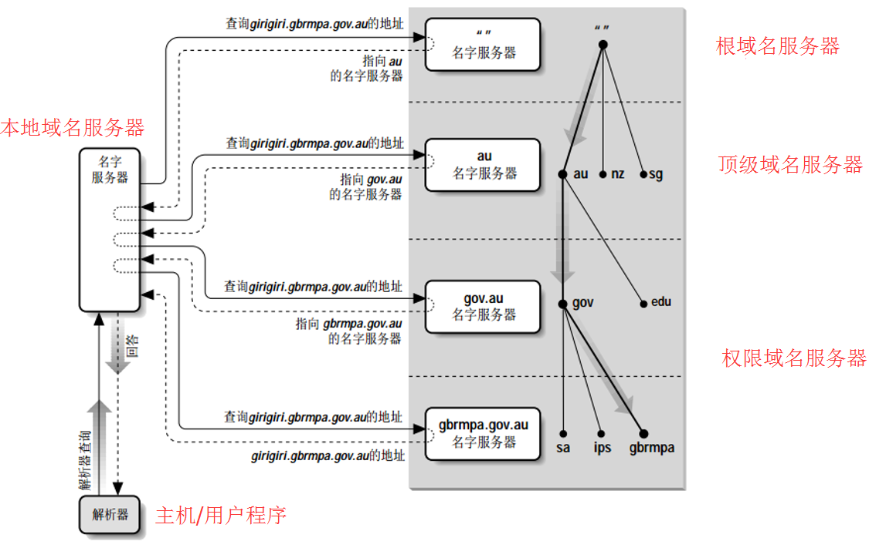

- [DNS工作过程](#dns工作过程)
  - [迭代查询和递归查询](#迭代查询和递归查询)
- [DNS缓存](#dns缓存)
  - [浏览器DNS缓存](#浏览器dns缓存)
  - [DNS服务器](#dns服务器)
- [域名服务器](#域名服务器)
  - [任播](#任播)

# DNS工作过程

1、在浏览器对某个域名发起请求时，需要先进行域名解析，解析为IP；
- 客户端通常不需要解析，会内置ip；省去解析过程；

2、浏览器通常会提供DNS缓存，如果能够直接获取ip，则直接使用；如果不能，则查询OS缓存；

3、当缓存都不存在对应的域名，则会查询本机`host文件`，用户可以在此配置固定的域名ip对；

4、host也不存在，则会请求本地域名服务器，本地域名服务器本质是一个代理，也会具备缓存功能；

5、如果本地域名服务器也不存在此域名缓存，交由他来对上层的域名解析器发起解析请求；

6、本地域名服务器会递归地请求根域名服务器、顶级域名解析器、权威域名服务器；
- 首先请求根域名服务器，获取顶级域名解析器的地址，返回给本地域名服务器；
- 本地域名服务器再请求顶级域名解析器，获取权威域名服务器地址，通常就是`baidu.com`、`bilibili.com`的ip，返回给本地域名服务器；
- 本地域名服务器再请求对应的服务器，得到`map.baidu.com`、`t.bilibili.com`等域名，到此结束；

7、本地域名服务器拿到了IP，则缓存下来，返回给客户端；

## 迭代查询和递归查询

迭代查询：指本地域名服务器自己不断地请求，上层域名服务器；

递归查询：客户端请求本地域名服务器，由本地域名服务器代理，不断执行查询，只需要将最终结果返回给客户端；

# DNS缓存

## 浏览器DNS缓存

为了提高效率，浏览器会对解析完成的域名、ip进行缓存；但通常会设置1min左右过期时间，不同浏览器不同；
- 可以在浏览器解析域名：edge://net-internals/#dns
- 缓存错误或者ip更换但是缓存没有失效，则会导致无法请求对应的ip；

## DNS服务器

操作系统，通常会提供DNS缓存服务；如windows可以通过以下命令：
- `ipconfig /displaydns`：展示DNS缓存；
- `ipconfig /flushdns`：清空DNS缓存；

# 域名服务器

**根域名服务器**：由13个服务器进行管理；每个服务器拥有一个域名，以及多个节点；(13个域名服务器在全球有1000+的节点提供根域名解析服务)
- 由互联网管理机构建立；
- `a.root-servers.net ~ m.root-servers.net`

**顶级域名服务器**：com、cn、net等；
- 也叫二级域名，是在根域名服务器下注册的域名；
- 根域名服务器可以解析所有的二级域名；

**权威域名服务器**：由一些权威机构建立，为用户提供域名解析服务；
- 由顶级域名服务器管理；

**本地域名服务器**：负责转发DNS解析请求给上层域名服务器(权威域名服务器)；只是一个查询代理，可以缓存一些解析结果；
- 可以是个人配置，也可以是局域网统一配置、也可以由网络服务商来提供；
- 电脑上配置公共DNS：如`114.114.114.114`、`8.8.8.8`
- 也可能是路由器IP，意思就是交给路由器向上层转发；

## 任播

同一个根域名服务器，也会存在多个节点，任播技术就是获取最近的节点的技术；