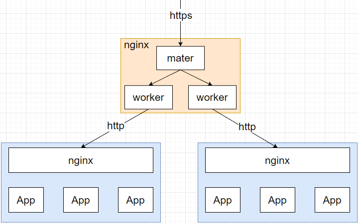

# 概览

[nginx-官网文档](http://nginx.org/en/docs/)

# 为什么需要Nginx

Nginx：开源、轻量、高性能的反向代理服务器；
- 性能好：3-5w并发支持；
- 内存占用小；
- 功能丰富：GZip压缩，节省带宽、插件丰富、内置健康检查避险；
- 静态文件处理能力强，动态处理能力一般；

# 应用场景

1、单独作为HTTP服务器；

2、反向代理；

3、负载均衡：轮询、权重、ip_hash、url_hash(插件)

4、流量控制：支持漏桶算法；可限制并发连接数；

# 网络IO模型

多进程机制 + 事件驱动网络模型，异步非阻塞；

1、服务器每当收到一个客户端时，服务器主进程创建出一个子进程，独立对客户端进行交互；
- 子进程间隔离，相互独立；

2、基于Epoll

# 高可用

