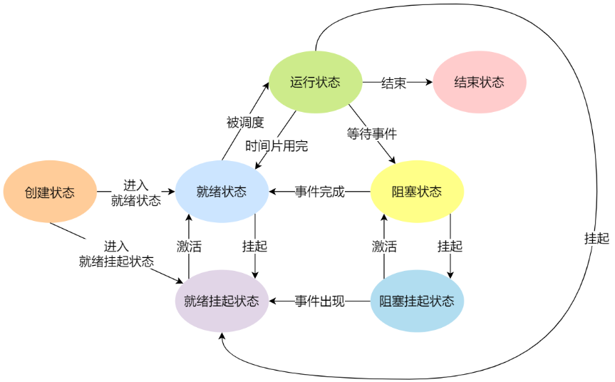

**进程**：应用程序独立分配资源的单位；

**线程**：进程内程序执行的单位；共享进程资源；

**协程**：更轻量级线程，在用户空间执行；
- 仍需要线程调度，可以在一个线程内并发执行；
- 创建成本低，适合IO密集型任务；等待IO挂起时对线程的影响较小；

# 进程

## 进程状态

## 进程的内存模型

典型的进程在内存中的布局可以分为：
- **代码段**：进程的二进制可执行代码；在内存中固定；
- **数据段**：包括程序的全局变量、静态变量；
- **栈**：用于存储函数执行上下文、局部变量等；分配释放速度快；
- **堆**：动态分配程序运行所需内存；分配释放速度较慢；
- **堆外内存**：通常存储持久性数据；如：文件；
- **共享库、动态链接库**：多个进程共享的外部库；

## 进程通信

1、管道：半双工的缓冲区；数据单向流动；
- 默认匿名管道：允许一个进程和另一个与它有共同祖先的进程之间进行通信；缓冲区大小通常受限；
- 命名管道：允许任意进程间通信；在系统中需要有对应的文件名；缓冲区大小通常受限；

> 管道本质是文件，两个进程通信，需要打开两个文件，分别对应管道的两端；

2、信号：进程间通信机制中唯一的异步通信机制，但是传送的信息量有限；
- 如：`kill -12`就是通过信号终止某进程；
- [Java 处理系统信号](https://www.victorchu.info/posts/2177b351/)

3、消息队列：
- `msgget`、`msgctl`、`msgsnd`等函数实现；

4、共享内存：通过访问同一块内存，来达到通信的效果；通常需要结合信号量，保证正确性；

5、信号量：本质是计数器，控制访问共享内存的进程数量，来达到互斥的效果；
- 临界区：访问共享资源的程序片段；
- 临界资源：只能被一个进程访问的资源；

6、socket：基于TCP、UDP通信，可以跨机器通信；通用性更强；

# 线程

分为：用户线程、内核线程、轻量级进程(LWP)；内核、用户线程对应关系：
- 1对1
- 1对多
- 多对多

轻量级进程(LWP)：内核中专门支持用户线程的轻量进程，拥有进程最小的执行上下文；总是跟内核线程一对一；

## 线程间通信
- 共享内存：通常需要加锁通信；
- 消息队列

## 线程切换

线程切换的开销一般在us级别：百ns~几us

# 协程

# 栈和堆

栈：用于函数调用和存储局部变量，速度快，用来临时存储数据；CPU中一个线程执行过程通常涉及多个函数的嵌套调用，需要保存栈帧、中间结果、临时变量等等，栈就是一种先入后出的压栈、弹栈执行方式；
- 内存地址从高向低增长；内存容量一般有限；
- 与线程生命周期有关；分配释放速度很快，由编译器自动管理；
- 栈的数据作用域仅在函数内可见；

堆：
- 内存地址从低向高增长；物理上不一定是连续的内存；
- 动态分配和释放进程的数据；与整个程序的生命周期保持；分配释放效率较低；需要用户自行控制内存的分配和释放；
- 堆上内存数据是共享的，可又多个线程访问；

## 为什么区分堆栈？

1、线程的执行过程，函数的调用是一个很频繁的动作，需要栈这种更高效的数据结构；

2、程序的共享内存，可能需要常驻，并且可能需要更大的内存空间，需要堆这种大内存结构，动态调整；

