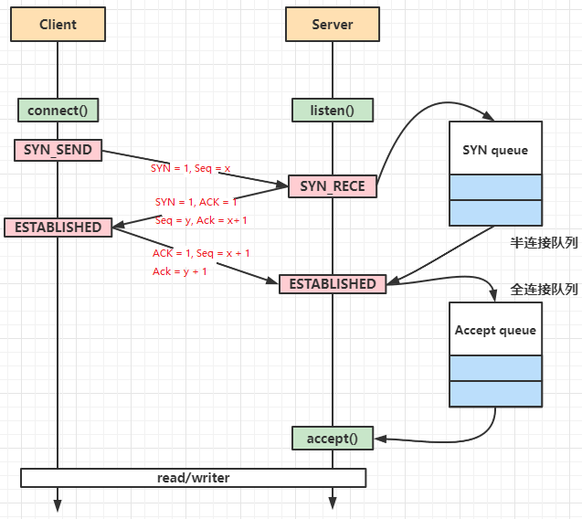

# Socket生命周期

```shell
# 查看linux socket文档
man socket
```

# Socket状态

未初始化（Uninitialized）：Socket对象已经被创建，但还未进行初始化或绑定。

已创建（Created）：Socket对象已经被创建，并且已经初始化，但还未绑定到特定的IP地址和端口号。

已绑定（Bound）：Socket已经绑定到了一个特定的本地IP地址和端口号，可以用于监听连接或进行通信。

监听（Listening）：只适用于服务器端Socket。Socket正在监听传入的连接请求，处于等待连接状态。

连接已建立（Connected）：只适用于客户端Socket。Socket已经成功与服务器端建立连接。

可读（Readable）：Socket接收缓冲区中有数据可供读取。
- 连接建立完成，服务端的Socket即可读；
- 数据到达，服务端的Socket读缓冲区内有数据就可读；

可写（Writable）：Socket发送缓冲区有足够的空间可以写入数据。
- 发送缓冲区空间充足即可写；
- 连接建立后，客户端的Socket即可写；

连接关闭（Closed）：Socket已经关闭，不能再进行读写或通信。

连接中断（Disconnected）：Socket的连接由于某种原因被中断或丢失。


## 1. 创建Socket对象：

```c
int socket(int domain, int type, int protocol);
```

- domain：通信协议族，有很多协议，一般选择IP地址类型：

  - AF_INET（IPV4）

  - AF_INET6（IPV6）

- 数据传输方式：

  - SOCK_STREAM（双向可靠数据流）

  - SOCK_DGRAM（单向不可靠无连接报文）

- 协议：TCP、UDP

创建socket，成功后，返回创建的socket的fd文件描述符

为socket打开一个fd文件，返回一个int，0则打开成功，-1则失败，成功后

## 2. Socket.bind()绑定端口号

```c
int bind(int sockfd,const struct sockaddr *addr,socklen_t addrlen);
```

- sockfd：成功创建的socket文件描述符；

- addr：一个包含绑定IP、端口的结构体sockaddr；

- addrlen：addr结构体的大小；

此时才真正的为创建的socket分配内存；

## 3. listen()监听状态
将socket置于监听状态，等待客户端连接

此时服务端处于listen状态

```c
int listen(int sockfd, int backlog);
```

- sockfd：监听的socket文件描述符

- backlog：连接队列的最大长度；当连接队列满时，有客户端尝试建立连接，则返回ECONNREFUSED，拒绝连接；

此时服务端才算处于监听listen状态，客户端才可与服务端尝试建立连接；

（1）当有客户端尝试建立连接，server则创建一个socket加入半连接队列；

（2）当完成三次握手，server则会取出半连接队列的socket，加入全连接队列；

之后，应用程序，则可通过accept取出全连接队列中就绪的socket；


## 4. socket.accept()

阻塞等待就绪的socket，返回新创建的socket，专门用于特定连接的读写；

```c
 int accept(int sockfd, struct sockaddr *addr, socklen_t *addrlen);
```

TODO：



## 5. 断开连接

## 手动配置socket

```c
int getsockopt(int sockfd, int level, int optname,
                      void *optval, socklen_t *optlen);
```

主动断开连接的一方将处于TIME_WAIT状态，需要等待2分钟；一般server不会主动断开连接，如果服务器想要主动断开连接，应该对socket进行配置：

- SO_REUSEADDE：端口释放后，立即可以再次被利用，不再等待2分钟；
